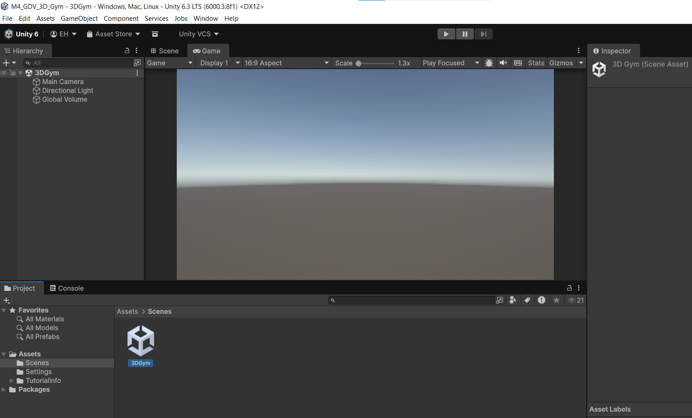
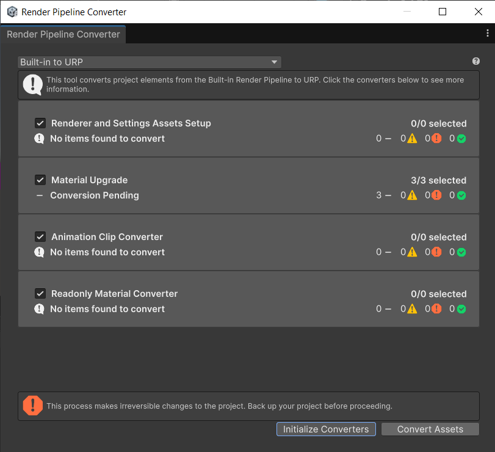
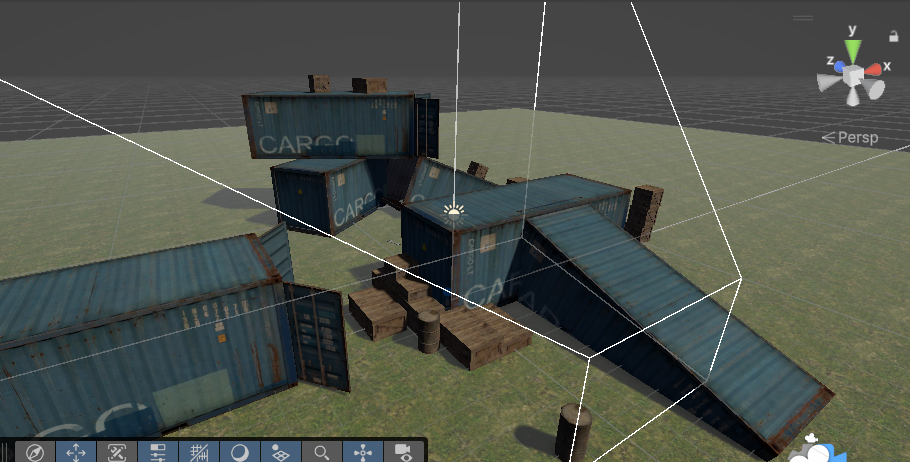
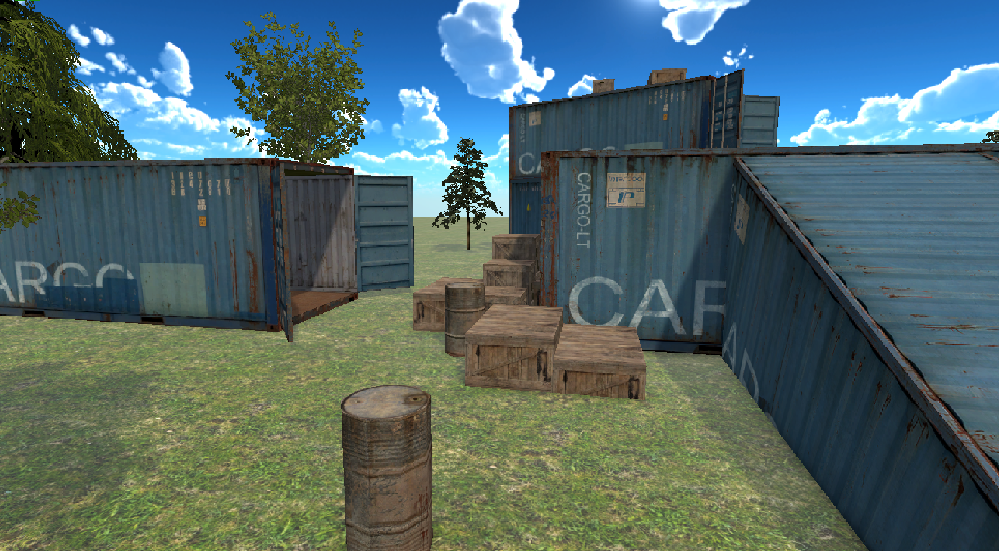

# M4 GDV HNR LES 1: URP 3d Environment

Deze les leren jullie het vologende:

- Je kunt een nieuw Unity URP-project aanmaken
- Je kunt een asset pack importeren via de Assetstore
- Je kunt een .unitypackage downloaden en uitpakken
- Je kunt de Render Pipeline Converter gebruiken om materialen te converteren
- Je kunt een HDRI of 6-sided Skybox integreren

Deze les gaan we aan de gang met het opzetten van een nieuw Unity project voor onze 3d Gym.
De 3d gym is waar we alle mechanics en features deze periode gaan verwerken zodat deze snel en makkelijk te testen zijn.

In deze les zal ik klassiekaal laten zien hoe je de bovenstaande doelstellingen in unity kunt bereiken. Je kunt dus live meedoen of gewoon kijken en aantekeningen maken.

Er is ook een Step By Step instructie die je later nog terug kunt kijken als je ergens niet uit komt of als je onverhoopt de les hebt gemist: [Les01_StepByStep.md](../Uitleg/stepbystep/Les01_ProjectSetup_URP_Skybox.md)

## URP, HDRP vs Builtin renderpipeline

Een **render pipeline** bepaalt hoe Unity objecten, lichten en effecten omzet naar pixels op je scherm.

|                   | **Builtin**                | **URP**             | **HDRP**                      |
| ----------------- | -------------------------- | ------------------- | ----------------------------- |
| Doelplatform      | Alles (legacy)             | Mobiel & PC         | High-end PC & console         |
| Snelheid          | Langzamer                  | Geoptimaliseerd     | Zwaar, realistische kwaliteit |
| Shader support    | Standaard shaders          | URP-shaders vereist | HDRP-shaders vereist          |
| Post-processing   | Apart pakket               | Ingebouwd           | Ingebouwd                     |
| Visuele kwaliteit | Basis                      | Goed                | Fotorealistisch               |
| Toekomst          | Legacy (geen updates meer) | Actief onderhouden  | Actief onderhouden            |

Assets gemaakt voor Builtin werken niet direct in URP — materialen worden paars weergegeven totdat je ze converteert met de **Render Pipeline Converter**.

## Oefening 1: Nieuw 3D URP project aanmaken

Maak zelf een 3d URP project (Universal 3D) aan via Unity Hub noem deze `M4_GDV_3D_Gym` sla het project op in de map `M4_GDV` (dit wordt de repository)

Hernoem deze `SampleScene` naar `3DGym`

## Opdracht 2: Importeren van assets uit de Unity Assetstore

Ga naar in de unity Assetstore naar [deze Assetpagina](https://assetstore.unity.com/packages/3d/environments/industrial/rpg-fps-game-assets-for-pc-mobile-industrial-set-v1-0-87024)

Dit is een assetpack waarin een aantal kratten en containers zitten die we gaan gebruiken in onze 3d Gym.

Zorg dat je bent ingelogd op de assetstore en voeg de gratis assets toe aan je account.

In Unity open je de package manager en download en importeer deze assetpack naar je project.

## Opdracht 3: Converteren van Materials voor URP

De assets zijn niet gemaakt voor de 'Universal Renderpipeline' maar voor de 'Builtin Pipeline'.

Hierdoor worden ze nu paars weergegeven.

Je moet dus eerst de assets converteren met behulp van de `Render Pipeline Converter`

## Opdracht 4: Importeren van Unitypackage

Download en import deze [bomen package](../Assets/Trees.unitypackage) en zet een paar bomen in je scene.

## Opdracht 5: Opzetten van je 3D Gym

Plaats containers en tonnen op een vloer in je scene zodat er eem parcours ontstaat voor de spelers die we later gaan toevoegen.

Geef de vloer ook een tilende texture en zorg dat deze mooi op de juiste schaal wordt herhaald.

## Skybox

Een **skybox** is een grote denkbeeldige kubus (of bol) om je hele scene heen, met een afbeelding van de lucht erop. De camera staat altijd in het midden, waardoor de hemel er altijd even ver weg uitziet.

Unity ondersteunt twee veelgebruikte typen:

- **Panoramic (HDRI)** — één 360°-foto in hoge resolutie, ook geschikt als lichtbron (Image Based Lighting).
- **Cubemap (6-sided)** — zes losse afbeeldingen (voor, achter, links, rechts, boven, onder) die samen een kubus vormen.

De skybox stel je in via **Window → Rendering → Lighting → Environment → Skybox Material**.

## Opdracht 6: Instellen van een Skybox

Er zijn meerdere soorten Skyboxes waaronder:

- Panoramic (HDRI)
- Cubemap (6 vlakken)

Skyboxes kun je vinden op de [Unity Assetstore](https://assetstore.unity.com/search#q=skybox) of bijvoorbeeld op [polyhaven.com](https://polyhaven.com/)

## Huiswerk: Maak je 3d scene af

Importeer en verwerk extra 3d assets in je project. Denk aan:

- bomen
- gebouwen
- buizen
- voertuigen
- etc

Maak het een leuke eigen scene die je zelf mooi vind.

Zorg ervoor dat de scene een goed parcours bevat met muren trappen en platforms waar een game character zich later doorheen moet bewegen.

Maak een repository aan voor je 3d Gym en pubiceer deze op je github account.

Lever de link naar je repo in op simulise.

Maak een mooi gifje van of screenshot van je scene vanuit de gameview en presenteer deze op je readme.
Geef met text een korte omschrijving van je parcours. Wat kan een speler straks allemaal doen in het level?

Lever de link naar je repo en readme in op simulise

