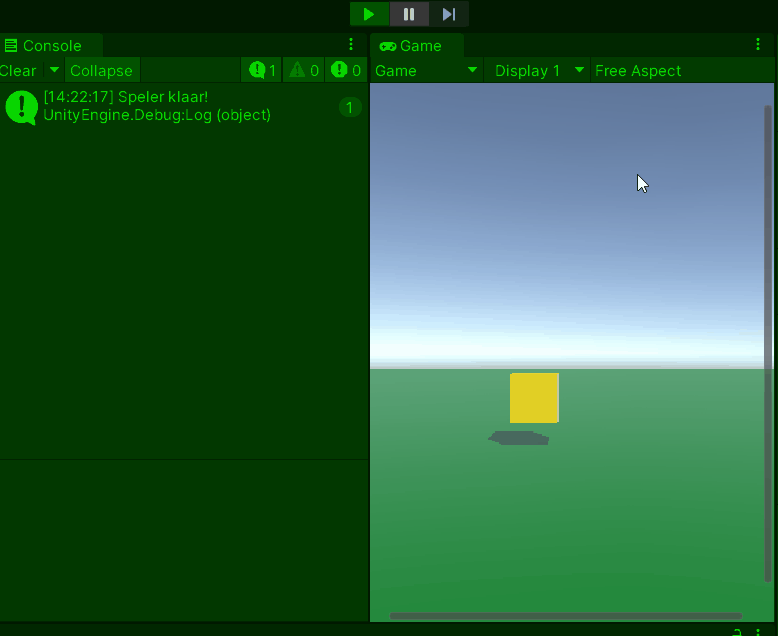

# GD M4 PROG Les 2: Unity-specifieke basisvaardigheden

#### Doel

Studenten leren Unity-specifieke basisvaardigheden: `MonoBehaviour` begrijpen, `GameObjects` manipuleren, componenten gebruiken, en input verwerken. Na de les kunnen ze deze vaardigheden toepassen in een Unity-opdracht om een bewegende speler te maken.

#### Werkvorm

Klassiekale instructie en een demo in de les. Daarna verwerken met behulp van de volgende opdracht.

### Opdracht 2: "Bewegende Speler" (1,5 uur)

#### Doel

Studenten maken een Unity-scène met een speler die beweegt en springt, met gebruik van de vaardigheden uit deze les.

#### Opdrachtbeschrijving

Maak een Unity-scène met een speler (cube) die kan bewegen met pijltjestoetsen en springen met de spatiebalk. Gebruik een `Rigidbody` voor physics en zorg dat de speler op een vloer blijft.

#### Stappen

1. **Setup (15 min)**

   - Maak een nieuwe Unity-scène.
   - Voeg een cube toe als "speler" en een plane als "vloer".
   - Voeg een `Rigidbody`-component toe aan de cube en een nieuw script `PlayerControl.cs`.

2. **Script schrijven (60 min)**

Er zijn 2 niveaus voor de opdracht om te differentieren: (beginner en gevorderd)

Open het script op je eigen niveau en voer de opdracht uit met de instructies in de comments:

[beginner script](SCRIPT_beginner.md)
[gevorderde script](SCRIPT_gevorderd.md)

- Test in Unity: gebruik pijltjestoetsen om te bewegen en spatie om te springen.

3. **Uitbreiding (15 min)**

   - Maak `moveSpeed` en `jumpForce` public en pas ze aan in de Inspector (probeer bijv. 7f en 10f).
   - Voeg een `Debug.Log("Springen!");` toe bij de sprong om te zien wanneer het werkt.

4. **Inleveren**
   Lever de opdracht in door een readme te maken met daarin de volgende onderdelen verwerkt:
   - Titel van de opdracht
   - Omschrijving van de opdracht en wat je gedaan hebt
   - Gifje van de screencapture van je opdracht in unity
   - Afzonderlijke links naar de bijhorende scripts

Lever de link naar je readme in via de opdracht op simulise.

#### Beoordeling

- Beweegt de speler soepel met pijltjestoetsen?
- Werkt de sprong met de `Rigidbody`?
- Wordt `Start()` correct gebruikt (zie console)?
- Reageert de input goed?
