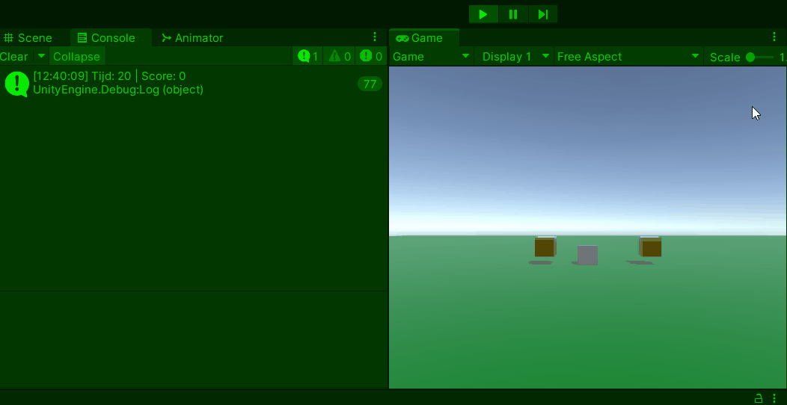

# GD M4 PROG Les 3: Beweging, Collisions, Score en Timers

#### Doel

Studenten leren objecten te bewegen met `Vector3`, botsingen te detecteren met collisions en triggers, scores bij te houden met variabelen, en timers te maken met `Time.deltaTime`. Na de les kunnen ze een bewegende speler maken die munten verzamelt binnen een tijdslimiet.

#### Werkvorm

Klassiekale instructie en een demo in de les. Daarna verwerken met behulp van de volgende opdracht.

### Opdracht: "Timed Muntjacht" (1 uur en 15 minuten)

#### Doel

Maak een spel waarin een speler beweegt met `Vector3`, munten verzamelt met triggers, scores bijhoudt, en een timer aftelt.

#### Opdrachtbeschrijving

Maak een scène met een speler (cube) die beweegt met pijltjestoetsen, twee munten verzamelt (triggers), en een timer van 20 seconden. Toon score en tijd in de console, en "Game Over" als de tijd op is.

#### Stappen

1. **Setup (15 min)**

   - Nieuwe scène:
     - Speler-cube op `(0, 0, 0)` met `Rigidbody` en `Collider`.
     - Vloer-plane met `Collider`.
     - Twee munt-cubes op `(2, 0, 0)` en `(0, 0, 2)` met `Collider`, `Is Trigger` aan.
   - Maak script `GameManager.cs` en attach aan speler.

2. **Script schrijven (60 min)**

Er zijn 2 niveaus voor de opdracht om te differentieren: (beginner en gevorderd)

Open het script op je eigen niveau en voer de opdracht uit met de instructies in de comments:

[beginner script](SCRIPT_beginner.md)
[gevorderde script](SCRIPT_gevorderd.md)

- Test: Beweeg speler, pak munten, zie score stijgen en timer aflopen.

3. **Uitbreiding (10 min)**

   - Maak `speed` en `timeLeft` `public` en pas aan in Inspector.
   - Voeg een derde munt toe op `(2, 0, 2)` en test.
   - Gebruik `CompareTag` en tag munten als "Coin".

4. **Inleveren**
   Lever de opdracht in door een readme te maken met daarin de volgende onderdelen verwerkt:
   - Titel van de opdracht
   - Omschrijving van de opdracht en wat je gedaan hebt
   - Gifje van de screencapture van je opdracht in unity
   - Afzonderlijke links naar de bijhorende scripts

Lever de link naar je readme in via de opdracht op simulise.

#### Beoordeling

- Beweegt de speler met pijltjestoetsen (`Vector3`, `Time.deltaTime`)?
- Stijgt de score bij muntcontact (`OnTriggerEnter`)?
- Telt de timer af en verschijnt "Game Over" bij 0?
- (Gevorderd): Gebruikt het tags en `normalized` beweging?
