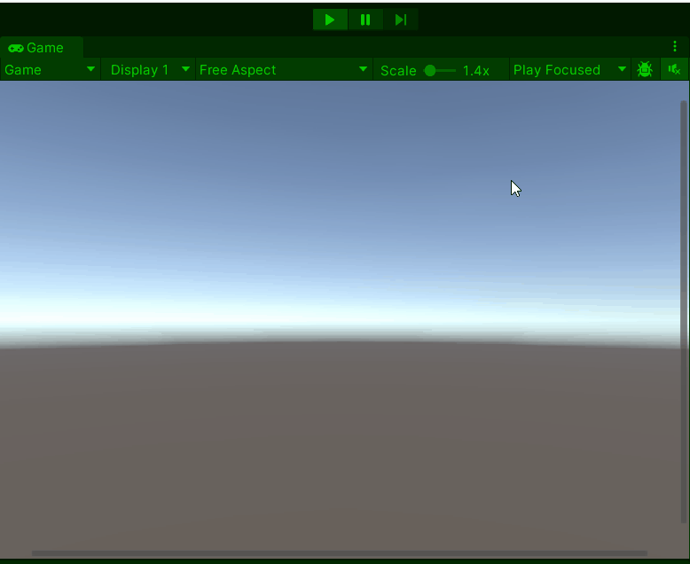

# GD M4 PROG Les 4: Samenwerking met Unity’s Editor

#### Doel

Studenten leren hoe ze Unity’s Editor effectief gebruiken met `public variabelen` en de `[SerializeField]` attribuut voor tuning, `prefabs` voor herbruikbare objecten, en `SceneManager` voor scènebeheer. Na de les kunnen ze een scène maken met instelbare objecten en een overgang.

#### Werkvorm

Klassiekale instructie en een demo in de les. Daarna verwerken met behulp van de volgende opdracht.

### Opdracht 4: "Start en Spel" (1,5 uur)

#### Doel

Maak een project met twee scènes: een startscherm en een gamescène met een speler en een spawnende munt-prefab, met aanpasbare variabelen.

#### Opdrachtbeschrijving

Maak een "StartScene" die naar "GameScene" wisselt met spatie. In "GameScene" beweegt een speler en spawn je een munt-prefab met een aanpasbare snelheid.

#### Stappen

1. **Setup (15 min)**

   - Maak twee scènes: "StartScene" (leeg met een script `SceneSwitcher` op de camera) en "GameScene" (plane, speler-cube met script `PlayerControl`, munt-cube als prefab).
   - Voeg scènes toe aan Build Settings (File > Build Settings).

2. **Script schrijven (60 min)**

Er zijn 2 niveaus voor de opdracht om te differentieren: (beginner en gevorderd)

Open het script op je eigen niveau en voer de opdracht uit met de instructies in de comments:

[beginner script](SCRIPT_beginner.md)
[gevorderde script](SCRIPT_gevorderd.md)

- Test: Start in "StartScene", druk spatie, zie speler en munt in "GameScene".

3. **Uitbreiding (15 min)**

   - Pas `speed` aan in de Inspector (probeer 3f en 8f).
   - Spawn 30 munten.

4. **Inleveren**
   Lever de opdracht in door een readme te maken met daarin de volgende onderdelen verwerkt:
   - Titel van de opdracht
   - Omschrijving van de opdracht en wat je gedaan hebt
   - Gifje van de screencapture van je opdracht in unity
   - Afzonderlijke links naar de bijhorende scripts

Lever de link naar je readme in via de opdracht op simulise.

#### Beoordeling

- Wisselt de scène met spatie?
- Beweegt de speler met aanpasbare snelheid?
- Spawnt de munt-prefab correct?
