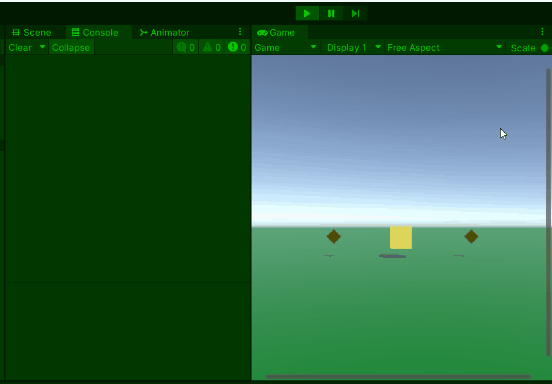
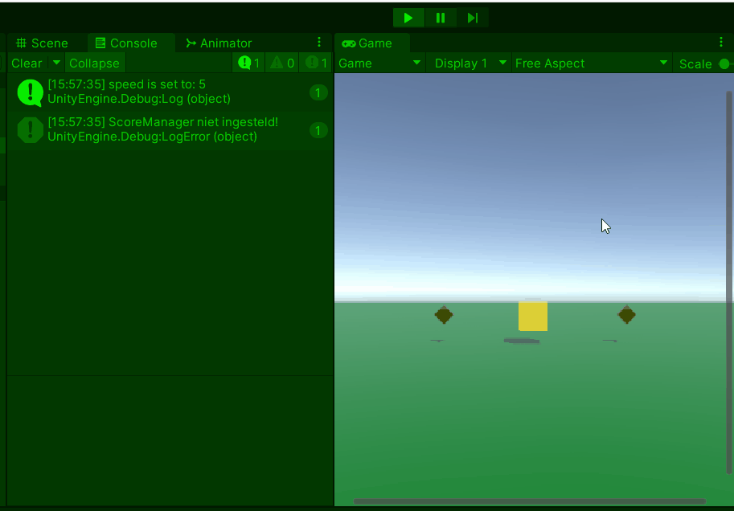

# GD M4 PROG Les 5: Probleemoplossing en structuur

#### Doel

Studenten leren hoe ze fouten opsporen en oplossen met `Debug.Log` en foutmeldingen, code netjes structureren, en gegevens delen tussen scripts. Na de les kunnen ze een gestructureerd systeem maken met meerdere scripts die samenwerken.

#### Werkvorm

Klassiekale instructie en een demo in de les. Daarna verwerken met behulp van de volgende opdracht.

### Opdracht 5: "Gestructureerde Muntjager" (1,5 uur)

#### Doel

Maak een scène met een speler die beweegt en munten verzamelt, met een apart score-script dat via referenties werkt, goed gestructureerd en met debug-hulpmiddelen.

#### Opdrachtbeschrijving

Maak een scène met een speler (cube) die beweegt en een munt (cube) verzamelt. Gebruik twee scripts: één voor beweging en één voor score, met comments en debug-outputs.

#### Stappen

1. **Setup (15 min)**

   - Nieuwe scène: speler-cube (met `Collider`), vloer-plane, munt-cubes (met `Collider`, `Is Trigger` aan).
   - Maak twee scripts: `PlayerMove.cs` (op speler) en `ScoreManager.cs` (op een leeg GameObject "ScoreSystem").

2. **Script schrijven (60 min)**

Er zijn 2 niveaus voor de opdracht om te differentieren: (beginner en gevorderd)

Open het script op je eigen niveau en voer de opdracht uit met de instructies in de comments:

[beginner script](SCRIPT_beginner.md)
[gevorderde script](SCRIPT_gevorderd.md)

- Test: Sleep `ScoreSystem` in het `scoreManager`-veld van de speler in de Inspector. Beweeg, pak munt, zie score stijgen.

3. **Uitbreiding (15 min)**

   - Voeg een `Debug.Log` toe in `Start()` van `PlayerMove` om te checken of `speed` goed is ingesteld (bijv. `Debug.Log("Snelheid: " + speed);`).
   - Maak een fout (verwijder `scoreManager` in Inspector) en los op, op basis van de foutmelding.

4. **Inleveren**
   Lever de opdracht in door een readme te maken met daarin de volgende onderdelen verwerkt:
   - Titel van de opdracht
   - Omschrijving van de opdracht en wat je gedaan hebt
   - Gifje van de screencapture van je opdracht in unity
   - Afzonderlijke links naar de bijhorende scripts

Lever de link naar je readme in via de opdracht op simulise.

#### Beoordeling

- Werkt de beweging en muntverzameling?
- Wordt de score correct bijgehouden via een apart script?
- Zijn er nuttige comments en debug-outputs?
- Wordt een foutmelding opgemerkt en gefixt?
