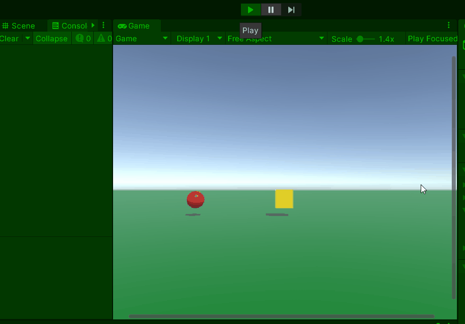
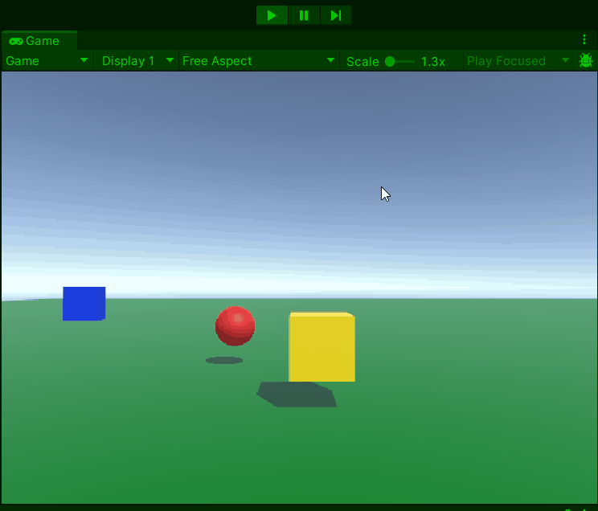

# GD M4 PROG Les 6: Vector3 verdieping

#### Doel

Studenten leren hoe `Vector3` werkt in Unity voor posities, richtingen en beweging, met focus op `Lerp` (soepele overgangen), `Distance` (afstand meten), `magnitude` (vectorlengte), en `Normalize`/`normalized` (eenheidsvectoren). Na de les kunnen ze een object verplaatsen, meten, en richting normaliseren.

#### Werkvorm

Klassiekale instructie en een demo in de les. Daarna verwerken met behulp van de volgende opdracht.

### Opdracht 6: "Volger" (1,5 uur)

#### Doel

Met deze opdracht zorg je dat je iets een ander object kan laten volgen en met een soepele beweging ook weer terug naar het startpunt beweegt.

#### Opdrachtbeschrijving

Maak een scène waarin een "volger" (sphere) de "speler" (cube) volgt met `Vector3.Lerp`. Als de speler bereikt is beweegt de volger weer terug naar zijn start positie met een constante snelheid.

Laat de speler met pijltjestoetsen bewegen over de x- en z-as.

De afstand tussen de volger en de speler en de afstand tussen de volger en het startpunt wordt opgemeten. Zo kan er geschakeld worden tussen volgen en teruggaan.

#### Stappen

1. **Setup (15 min)**

   - Nieuwe scène: speler-cube op `(0, 0, 0)`, volger-sphere op afstand bijvoorbeeld `(5, 2, 0)`, vloer-plane.
   - Maak script `PlayerMove.cs`attach aan speler (cube)
   - Maak script `FollowAndReturn.cs` attach aan volger (sphere).

2. **Script schrijven (60 min)**

Er zijn 2 niveaus voor de opdracht om te differentieren: (beginner en gevorderd)

Open het script op je eigen niveau en voer de opdracht uit met de instructies in de comments:

[beginner script](SCRIPT_beginner.md)
[gevorderde script](SCRIPT_gevorderd.md)



- Test: Loop rond met de Speler. Beweegt de follower achter je aan? beweegt de follower weer terug als hij de speler heeft bereikt?

3. **Uitbreiding (15 min)**
   - Plaats een blok in je scene (dummy)
   - Maak een schript dat levens voor de dummy bijhoud (-1 bij elke hit)
   - Zorg dat de speler kogels af kan vuren die vanzelf achter de dummy aangaan. (homing missles)



4. **Inleveren**
   Lever de opdracht in door een readme te maken met daarin de volgende onderdelen verwerkt:
   - Titel van de opdracht
   - Omschrijving van de opdracht en wat je gedaan hebt
   - Gifje van de screencapture van je opdracht in unity
   - Afzonderlijke links naar de bijhorende scripts

Lever de link naar je readme in via de opdracht op simulise.

#### Beoordeling

- Beweegt de speler met pijltjes
- Volgt de volger de speler via `Lerp`?
- beweegt de volger weer terug met een vaste snelheid?
- Worden `Distance` of `magnitude`, en `normalized` correct gebruikt?
- Is er ook nog een homing missle?

---

---

---

---

---

**Uitwerking:**

- **PlayerMove.cs**:

```csharp
using UnityEngine;

public class PlayerMove : MonoBehaviour
{
    [SerializeField] private float speed = 20f; //Snelheid van de speler
    void Update()
    {
        //bereken de beweging over de x en z as nav de horizontale en verticale input
        float moxeX = Input.GetAxis("Horizontal") * speed * Time.deltaTime;
        float moxeZ = Input.GetAxis("Vertical") * speed * Time.deltaTime;
        Vector3 move = new Vector3(moxeX, 0f, moxeZ);
        //beweeg het gameobject
        transform.Translate(move);
    }
}
```

- **FollowAndReturn.cs**:

```csharp
using UnityEngine;
public class FollowAndReturn : MonoBehaviour
{
    public float returnSpeed = 5f;       // Constante snelheid naar de startpositie terug
    public float lerpSpeed = 0.1f;      // Lerp-snelheid percentage van de afstand
    public Transform target;            // Doel (sleep in Inspector)
    private Vector3 startPosition;      // Startpositie van het volger object
    private bool isResetting = false;   // Schakelaar voor resetten

    void Start()
    {
        // Sla de startpositie op
        startPosition = transform.position;
    }
    void Update()
    {
        //check wat er moet gebeuren
        if (isResetting) ReturnToStart();
        else FollowTarget();
    }
    private void FollowTarget()
    {
        // Beweeg een object vloeiend achter een beweegbaar target aan
        transform.position = Vector3.Lerp(transform.position, target.position, lerpSpeed);

        // Toon afstand in de console
        float distance = Vector3.Distance(transform.position, target.position);

        // check of de target is bereikt
        if (distance < 0.1f) isResetting = true;
    }
    private void ReturnToStart()
    {
        // Reset het object naar startpositie met Lerp
        Vector3 direction = (startPosition - transform.position).normalized;
        transform.Translate(direction * returnSpeed * Time.deltaTime);

        // Bereken de afstand tot de startpositie
        float distToStart = Vector3.Distance(transform.position, startPosition);
        // Stop resetten als de speler bijna op de startpositie is
        if (distToStart < 0.1f) isResetting = false;
    }
}
```
