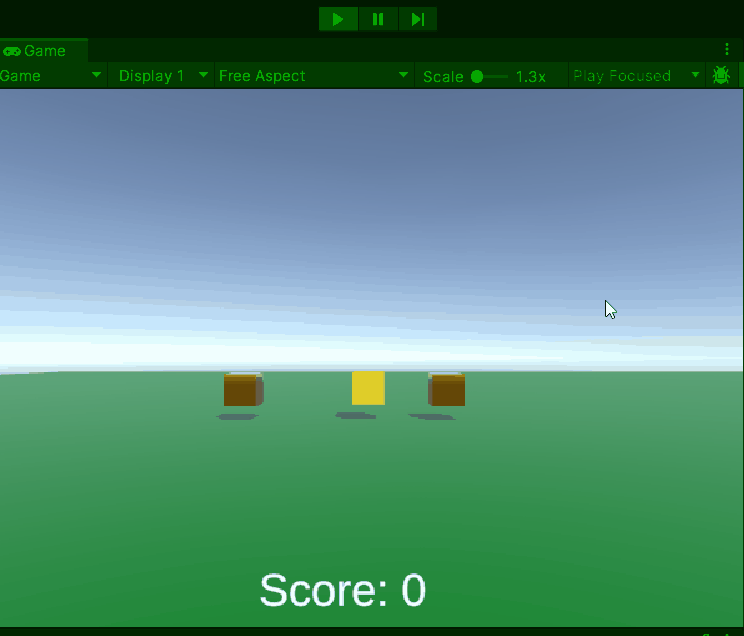

# GD M4 PROG Les 7: UI met TextMeshPro (35 minuten)

#### Doel

Studenten leren hoe ze Unity’s UI met TextMeshPro gebruiken om informatie zoals score weer te geven. Na de les kunnen ze een score-UI updaten via code met `TMP_Text`.

#### Werkvorm

Klassiekale instructie en een demo in de les. Daarna verwerken met behulp van de volgende opdracht.

### Opdracht 7: "Muntenscore met TMP" (1,5 uur)

#### Doel

Maak een scène met een speler die munten verzamelt en een UI-score bijhoudt met `TMP_Text`.

#### Opdrachtbeschrijving

Maak een scène met een speler, een munt, en een UI-tekst (TextMeshPro) die de score toont. Update de score bij muntcontact.

#### Stappen

1. **Setup (15 min)**

   - Nieuwe scène: speler-cube, munt-cube (trigger), Canvas met TextMeshPro - Text (bovenaan scherm).
   - Maak scripts `ScoreManager.cs` (op leeg GameObject) en `PlayerMove.cs` (op speler).

2. **Script schrijven (60 min)**

Er zijn 2 niveaus voor de opdracht om te differentieren: (beginner en gevorderd)

Open het script op je eigen niveau en voer de opdracht uit met de instructies in de comments:

[beginner script](SCRIPT_beginner.md)
[gevorderde script](SCRIPT_gevorderd.md)



- Test: Beweeg speler naar munt, score stijgt in UI.

3. **Uitbreiding (15 min)**

   - Voeg een tweede munt toe op `(2, 0, 0)`.
   - Verander tekstkleur van `scoreText` in rood via Inspector (in TMP-eigenschappen).

4. **Inleveren**
   Lever de opdracht in door een readme te maken met daarin de volgende onderdelen verwerkt:
   - Titel van de opdracht
   - Omschrijving van de opdracht en wat je gedaan hebt
   - Gifje van de screencapture van je opdracht in unity
   - Afzonderlijke links naar de bijhorende scripts

Lever de link naar je readme in via de opdracht op simulise.

#### Beoordeling

- Toont UI de score met `TMP_Text`?
- Stijgt score bij muntcontact?
- Wordt de munt verwijderd?

---

---

---

---

---

### Uitwerking

- **ScoreManager.cs**:

  ```csharp
  using UnityEngine;
  using TMPro;

  public class ScoreManager : MonoBehaviour
  {
      public TMP_Text scoreText;
      private int score = 0;

      void Start()
      {
          scoreText.text = "Score: " + score;
      }

      public void AddScore(int points)
      {
          score += points;
          scoreText.text = "Score: " + score;
      }
  }
  ```

- **PlayerMove.cs**:
  ```csharp
  public ScoreManager scoreManager;
  void OnTriggerEnter(Collider other)
  {
      if (other.name == "Coin")
      {
          scoreManager.AddScore(10);
          Destroy(other.gameObject);
      }
  }
  ```
