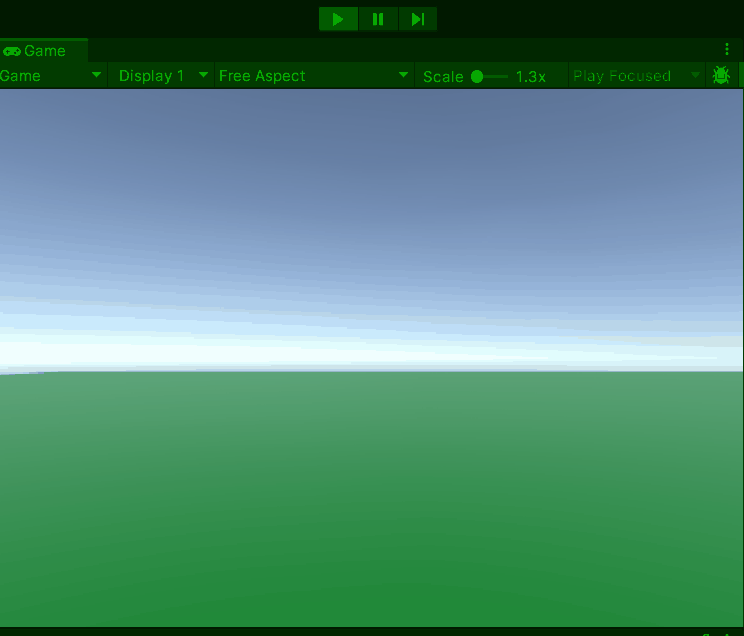
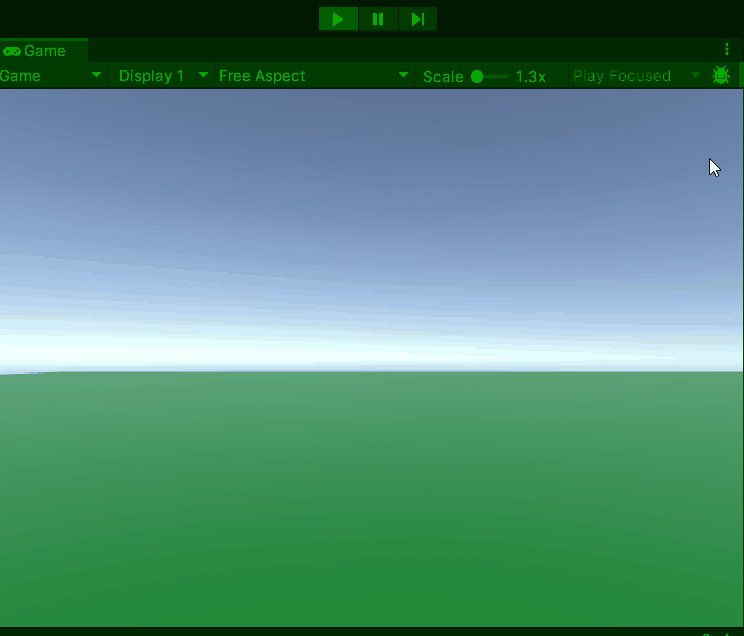

# GD M4 PROG Les 8: Coroutines

#### Doel

Studenten leren hoe ze `Coroutines` in Unity gebruiken voor tijdgebaseerde acties als alternatief voor `Update()`. Na de les kunnen ze een vijandspawn-systeem maken met vertragingen.

#### Werkvorm

Klassiekale instructie en een demo in de les. Daarna verwerken met behulp van de volgende opdracht.

### Opdracht 8: "Vijandgolf" (1,5 uur)

#### Doel

Maak een scène waarin vijanden in golven spawnen met `Coroutines`.

#### Opdrachtbeschrijving

Maak een scène met een spawnpoint. Spawn 5 vijanden met een wachttijd van 2 seconden tussen elke spawn, gebruikmakend van een coroutine.

#### Stappen

1. **Setup (15 min)**

   - Nieuwe scène: spawnpoint (leeg GameObject), vijand-prefab (cube).
   - Geef de prefab een Rigidbody
   - Maak script `SpawnManager.cs` en attach aan spawnpoint.

2. **Script schrijven (60 min)**

Er zijn 2 niveaus voor de opdracht om te differentieren: (beginner en gevorderd)

Open het script op je eigen niveau en voer de opdracht uit met de instructies in de comments:

[beginner script](SCRIPT_beginner.md)
[gevorderde script](SCRIPT_gevorderd.md)

- Test: Vijanden spawnen om de 2 seconden op een rij.

3. **Uitbreiding (15 min)**

   - Voeg een tweede golf toe na 5 seconden met `yield return new WaitForSeconds(5f)` na de eerste loop.
   - Zorg dat de 2e rij recht achter de eerste spawnt.

   

4. **Inleveren**
   Lever de opdracht in door een readme te maken met daarin de volgende onderdelen verwerkt:
   - Titel van de opdracht
   - Omschrijving van de opdracht en wat je gedaan hebt
   - Gifje van de screencapture van je opdracht in unity
   - Afzonderlijke links naar de bijhorende scripts

Lever de link naar je readme in via de opdracht op simulise.

#### Beoordeling

- Spawnen vijanden met een coroutine?
- Is er een wachttijd van 2 seconden?
- Werkt de golf correct?
