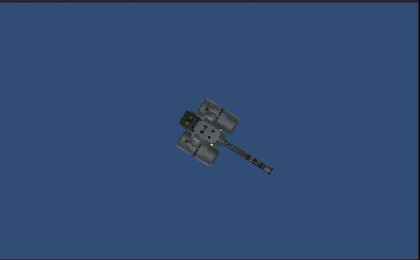
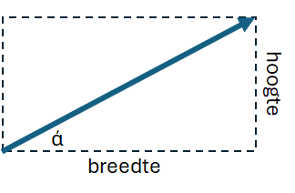
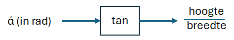
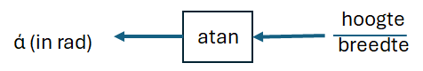

# M4.1 Aim and shoot 2D

## Doelstelling
Deze oefening richt zich op het gebruik van het gebruik van de arctangens van een hoek 
 
## Context
Op een 2d-scherm staat in het midden een draaibare geschutskoepel (turret) die projectielen af kan vuren. Als je met de muis ergens op het scherm klikt, richt de turret zich naar de muis en schiet een projectiel af naar deze positie
 
## De opdracht

## Basis Setup
1. **Maak een nieuwe 2d-scene**
2. **Zoek op het internet een afbeelding van een turret (topview)**
3. **Maak de afbeelding bruikbaar** Verwijder van de afbeelding van de turret de achtergrond m.b.v. bijvoorbeeld Photoshop
 
## De werking van de tangens
Ga uit van een Vector met breedte en hoogte $\vec{v} = {hoogte \over breedte}$. Dan heeft 

De tan of tangens is een functie die de hoek van de diagonaal van een rechthoek omzet naar een verhouding van  hoogte en breedte van de rechthoek

de inverse atan-functie doet het omgekeerde en zet de verhouding $hoogte \over breedte$ om in een hoek (in radialen)

[Back](../README.md)