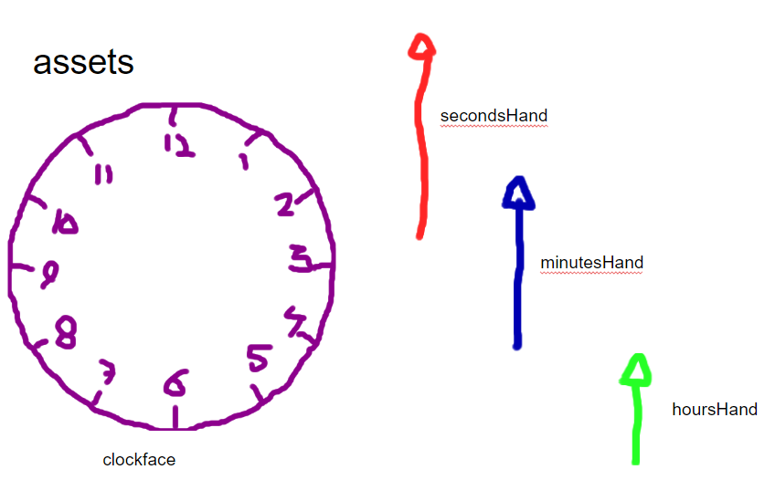
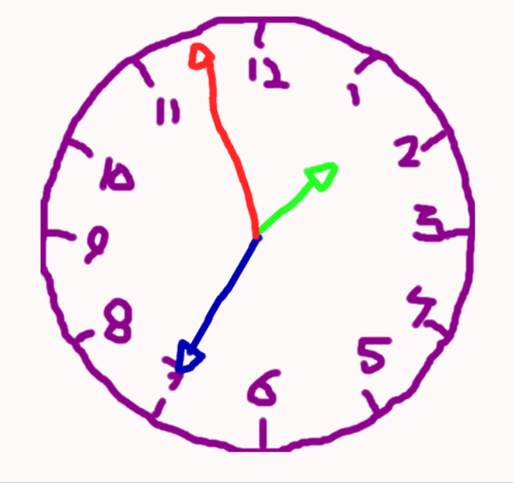

# M4.6 My Clock

## Doelstelling
Leren werken met Euler-hoeken in graden
 
## De opdracht
Maak met behulp van deze assets

Een werkende analoge klok

Je mag natuurlijk ook zelf andere assets zoeken, maken en/of ontwerpen voor jouw eigen ontwerp klok

## Assets
myClock.zip