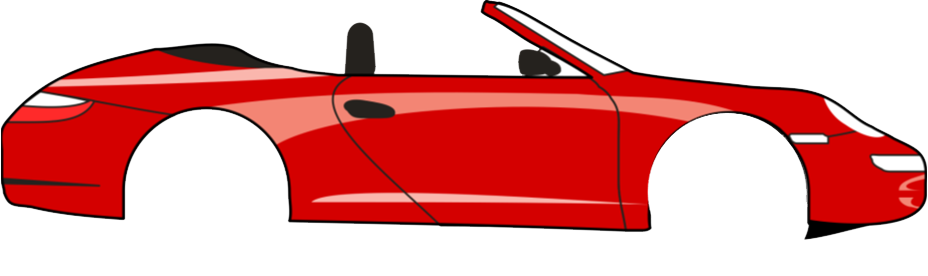
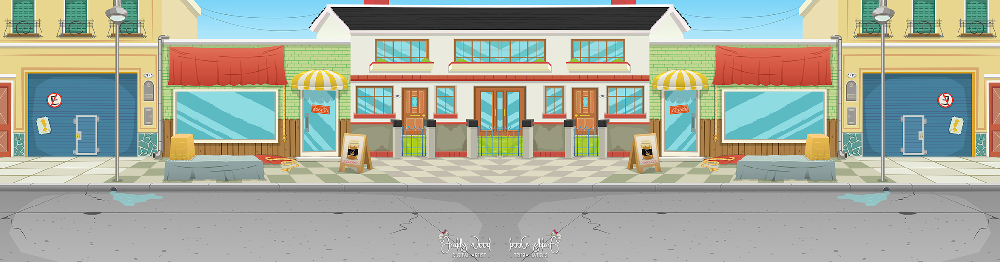

# M4.7 Rolling

## Doelstelling
Werken met rotaties in Radialen
 
## De opdracht
Laat het wiel rollen met de juiste snelheid.

## Assets

## Uitleg

<a href="uitleg/myCar.pptx" target="_blanc">Powerpoint</a>