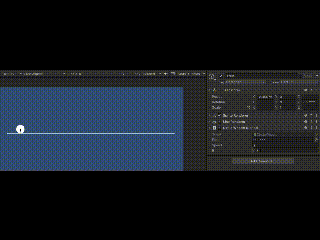

# M4.7 Rolling

## Doelstelling
Leren werken met rotaties in Radialen
 
## De opdracht
Laat een cirkel rollen. Teken een lijn op de cirkel, zodat je de rotatie goed kan zien. Geef de cirkel een constante hoeksnelheid, maar geef de cirkel diverse groottes 

## Een hoek in radialen

De radiaal staat voor de omtrek van een cirkel met een straal van 1. 

Een volledige cirkel heeft een omtrek van 
$$ Omtrek~cirkel = 2 \pi $$

De **Radiaal** legt de hoek vast die hoort bij een bepaalde booglengte van een cirkel met straal 1

Bij een hoek in radialen is het dus eenvoudig om de bijbehorende omtrek te vinden met

$$ Omtrek~segment = \theta (in~radialen) \cdot r $$
