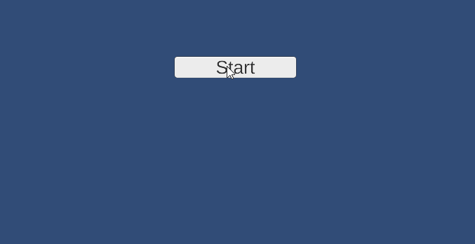

# 💡 Instructie: Reactiespel maken in Unity

---

## 🌟 Doel
Je maakt een klein spelletje waarbij de speler zo snel mogelijk moet reageren nadat een willekeurige wachttijd is verstreken, zodat je de reactietijd van een speler kan meten. 


We gebruiken knoppen (Buttons), event listeners, timers en `SetActive()` om de UI dynamisch aan te passen en leren hoe wij de tijd kunnen meten tussen twee gebeurtenissen

---

## voorbeeld
De gemiddelde reactietijd van een mens op een eenvoudige visuele prikkel (bijvoorbeeld een lampje dat oplicht waar je op een knop moet drukken) ligt meestal rond de 200 tot 250 milliseconden (0,2–0,25 seconde).

Dit kan sterk variëren afhankelijk van:

✅ Type prikkel — visueel is meestal langzamer dan auditief (geluid) of tactiel (aanraking).

✅ Leeftijd — jonge volwassenen reageren gemiddeld sneller dan kinderen of ouderen.

✅ Conditie — vermoeidheid, alcohol, medicijnen of afleiding vertragen de reactietijd.

✅ Complexiteit — als je moet kiezen tussen meerdere knoppen of beslissingen, duurt het langer (soms 300–500 ms of meer).



---

## 🛠 Benodigdheden
- Unity (2020 of nieuwer)
- De package **TextMeshPro** (standaard bij Unity)
- Scene met een Canvas en 3 Buttons + 1 Text (voor de stopwatch)

---

## 🔶 Stap 1: Project en Canvas voorbereiden

1. Open Unity en maak een nieuw 2D-project.  
2. Voeg een **Canvas** toe (als die er nog niet is).  
3. Binnen de Canvas, voeg toe:
   - **Button** → hernoem naar `StartButton`.
   - **Button** → hernoem naar `StopButton`.
   - **Button** → hernoem naar `ContinueButton`.
   - **TextMeshPro - Text (UI)** → hernoem naar `Stopwatch`.

> **Belangrijk:** Vergeet niet de TextMeshPro Essentials te importeren als Unity dat vraagt.

---

## 🔶 Stap 2: Script aanmaken

1. Maak een nieuw script in de projectmap, noem het `ReactieTest.cs`.  
2. Open het script en plak de basiscode:

   ```csharp
   using UnityEngine;
   using UnityEngine.UI;
   using TMPro;
   ```

---

## 🔶 Stap 3: Variabelen en Enum maken

1. Voeg een **enum** toe bovenaan in de class, om de toestanden bij te houden:

   ```csharp
   enum State { idle, wait, play, stop };
   State myState = State.idle;
   ```

2. Maak **serialized fields** (zodat je de knoppen in de editor kan koppelen):

   ```csharp
   [SerializeField] Button StartButton;
   [SerializeField] Button StopButton;
   [SerializeField] Button ContinueButton;
   [SerializeField] TextMeshProUGUI Stopwatch;
   ```

3. Voeg timer-variabelen toe:

   ```csharp
   float time = 0;
   float startTimeThreshold = 0;
   ```

---

## 🔶 Stap 4: Buttons koppelen via event listeners

1. In de `Start()`-methode voegen we listeners toe:

   ```csharp
   void Start()
   {
       StartButton.onClick.AddListener(ClickStartButton);
       StopButton.onClick.AddListener(ClickStopButton);
       ContinueButton.onClick.AddListener(ClickContinueButton);

       UpdateUI();
   }
   ```

> **Wat gebeurt hier?**  
> We zeggen: “Als op de knop wordt geklikt, voer dan deze functie uit.”

---

## 🔶 Stap 5: De Update-methode maken

1. In de `Update()`-methode controleren we welke toestand actief is:

   ```csharp
   void Update()
   {
       if (myState == State.wait)
       {
           time += Time.deltaTime;
           if (time > startTimeThreshold)
           {
               time = 0;
               myState = State.play;
               UpdateUI();
           }
       }

       if (myState == State.play)
       {
           time += Time.deltaTime;
           Stopwatch.text = time.ToString("F3");
       }
   }
   ```

> **Wat gebeurt hier?**  
> - In de `wait`-fase wacht het script een willekeurige tijd.  
> - In de `play`-fase toont het de reactietijd (stopwatch).

---

## 🔶 Stap 6: Button-functies schrijven

1. Voor de startknop:

   ```csharp
   private void ClickStartButton()
   {
       myState = State.wait;
       time = 0;
       startTimeThreshold = Random.Range(4, 10);  // willekeurige tijd tussen 4–10 sec
       UpdateUI();
   }
   ```

2. Voor de stopknop:

   ```csharp
   private void ClickStopButton()
   {
       myState = State.stop;
       UpdateUI();
   }
   ```

3. Voor de continueknop:

   ```csharp
   private void ClickContinueButton()
   {
       myState = State.idle;
       time = 0;
       Stopwatch.text = "";
       UpdateUI();
   }
   ```

---

## 🔶 Stap 7: UI updaten met `SetActive()`

1. De `UpdateUI()`-methode bepaalt welke knoppen zichtbaar zijn:

   ```csharp
   private void UpdateUI()
   {
       StartButton.gameObject.SetActive(myState == State.idle);
       StopButton.gameObject.SetActive(myState == State.play);
       ContinueButton.gameObject.SetActive(myState == State.stop);
   }
   ```

> **Wat doet `SetActive()`?**  
> Hiermee kun je een GameObject (bijvoorbeeld een knop) **aan** of **uit** zetten in de scene, zonder het te verwijderen.

---

## 🔶 Stap 8: Koppelen in Unity

1. Selecteer het GameObject waaraan je het script hebt toegevoegd.  
2. Sleep de juiste Buttons en de TextMeshPro Text naar de velden in het script (in de Inspector).  
3. Zorg dat alle knoppen goed ingesteld zijn (bijvoorbeeld met duidelijke tekst: Start, Stop, Continue).

---

## ✅ Test het spel!

Klik op **Play** en test:  
- Start → wachten → stopwatch begint.  
- Stop → stopt het meten.  
- Continue → reset en klaar voor een nieuwe ronde.
