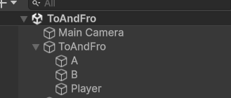

# To and Fro (Heen en weer)

Opdracht: plaats in een nieuwe 2D-scene
- GameObject A
- GameObject B
- GameObject player

laat de player beginnen op de positie van A en met een constante snelheid bewegen naar B. Als de player bij B is aangekomen, beweegt de player weer met een constante snelheid terug naar A. Als de player bij A is aangekomen, wordt dit algoritme weer herhaald

## Stap1 plaats de objecten in de hierarcy



plaats GameObject A op positie (-2,-4,0)
plaats GameObject B op positie (4,2,0)
plaats de player op een willekeurige plek in jou scene

noem de positie van A: $` \vec{a} `$ en de positie van B:$` \vec{b} `$

## Berekening snelheid

we gaan de player van A naar B laten bewegen. dit doen we door middel van een zogenaamde differencevector of verschilvector


Geef differencevector kun je berekenen met:

$$ \vec{ab}  = \vec{b} - \vec{a}$$

In dit geval

$$ \vec{ab}  = \begin{pmatrix}
    4 \\
    2 \\
    0
\end{pmatrix} -
\begin{pmatrix}
    -2 \\
    -4 \\
    0
\end{pmatrix}
$$

$$ \vec{ab} =
\begin{pmatrix}
    6 \\
    6 \\ 
    0
\end{pmatrix}
$$

controleer dit met unity: 
````csharp
// bij de declaratie van de variabelen 
Vector3 differenceVectorAB;

// in de start()
differenceVectorAB = B.position - A.position;
Debug.Log(differenceVectorAB)
````

De afstand tussen A en B kunnen we berekenen met behulp van de verschilvector. 

Dit kun je uitrekenen met de stelling van Pyhthagoras

in de wiskunde wordt de lengte van een vector aangegeven met 
$` || \vec{v}||`$

dus 

$$ ||\vec{ab}|| = \sqrt{x_{ab}^2 +y_{ab}^2 + z_{ab}^2}$$

In dit geval dus

$$ ||\vec{ab}|| = \sqrt{6^2 +6^2 + 0^2} = \sqrt{ 72} \approx 8.485$$ 

Test dit in Unity

````csharp
distance = differenceVectorAB.magnitude;
Debug.Log(distance);
````
## de snelheid
Zet de player naar de positie van gameObject A. Je kan nu van de verschilvector een direction of richting maken (een vector met lengte 1 die alleen de richting aangeeft) met de eigenschap  **.normalized**
````csharp
direction = differenceVectorAB.normalized; 
````

om de player van A naar B te laten bewegen:
```` csharp
player.position += direction * Time.deltaTime;
````
## de tijd
Maak een stopwatch die de tijd bijhoudt hoe lang het duurt voor de player om van A naar B te bewegen. 

Hoe lang duurt dit

je kunt gebruik maken van de formule

$$ tijd = \frac{afstand}{snelheid}$$

De snelheid (speed) is nu nog 1 m/s

## de toggle

De player begint bij A, beweegt naar B met een constante snelheid van 1 m/s Wij weten hoe lang dit duurt (8.485 seconden) dus we kunnen deze beweging precies zo lang laten duren. Als de player bij B is aangekomen bij B, kunnen wij de differenceVector omdraaien, zodat de Player nu van B naar A beweegt. 
Hiervoor hebben we een zogenaamde toggle nodig. Een toggle heeft twee waarden. Deze moet je dus boven in jouw script declareren
````csharp
bool omAToB = true;
````
ALs de player van A naar B beweegt is deze variabele true, als de player van B naar A beweegt is deze false;


````csharp
    duration = distance / speed;

    if (FromAToB)
    {
        direction = (B.position - A.position).normalized;
    } else
    {
        direction = (A.position - B.position).normalized;
    }

    if(time > duration)
    {
        time = 0;
        //inverteer de variabele FromAtoB
        FromAToB = !FromAToB;
    }
````

# het Eindproduct

maak nu het eindproduct en lever het eindresultaat in via GitHub


