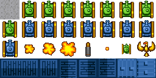
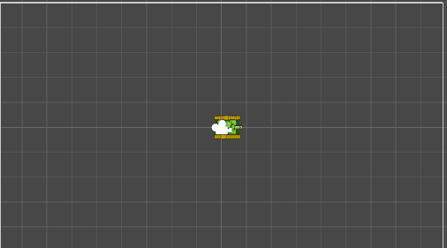

# 🛠️ Unity-les: Bouw een bestuurbare tank

## 🎯 Doel van deze les
Je gaat een script bouwen waarmee een tank:
- Kan draaien en bewegen via toetsen
- Sneller of langzamer kan rijden
- Verdwijnt aan de ene kant van het scherm en terugkomt aan de andere

Je werkt stap voor stap. Elke stap bouwt verder op de vorige.

---

## 🔹 Stap 1: Opzetten van de basis
1. Maak een nieuwe 2d-scene aan met als naam TankGame
2. Maak een map aan met als naam Graphics en plaats daar onderstaand tanksheet in



3. maak een animatie van de groene tank
4. De animatie staat verkeerd georienteerd en is te klein. 
   1. In een Unity 2d-omgeving is de standaard beweging naar rechts, maar de tank staat naar boven gericht. Hoe kan je dit oplossen?
   2. Ook is de sprite erg klein. Hoe kan je het beste deze sprite grote maken?
5. Plaats de op de goede manier georienteerde en grotere Tank in de Hierarchy en noem dit gameobject **Tank**
6. Voeg aan dit gameobject een nieuw script toe, noem het `Tank`.
7. Schrijf het script Tank zodat deze van het midden van deze scene rechts jouw beeld uitrijdt. Gebruik daarbij de variabelen
```` csharp
Vector3 velocity;
Vector3 direction;
float speed;
````



## 🔹 Stap 2: Sturen
**Doel:** De tank kan draaien met de pijltjes of A/D

1. Probeer de tank te sturen met de toetsen. Let op hoe `transform.right` bepaalt waar hij naartoe rijdt.

📌 **Tips:** 
- gebruik ```` float horizontal = Input.GetAxis("Horizontal"); ````
- gebruik ```` transform.Rotate(x-as, y-as, z-as) ```` om de tank te draaien
- Draait hij de verkeerde kant op? Voeg `-` toe voor de rotatie

---

## 🔹 Stap 3: Versnellen en vertragen
**Doel:** De tank versnelt en vertraagt met pijltjes omhoog/omlaag of W/S

1. Voeg bovenin deze regel toe:
```csharp
private float acceleration = 0.1f;
```

2. Pas je `Update()` aan:

```csharp
float vertical = Input.GetAxis("Vertical");
speed += vertical;
```


✅ **Test opnieuw**. Je kunt nu gas geven en afremmen!

---

## 🔹 Stap 4: Terugkomen aan andere kant van scherm
**Doel:** Je tank wrapt rond het scherm als hij eraf rijdt

1. Voeg deze regels toe aan `Start()`:
```csharp
Vector2 min = Camera.main.ScreenToWorldPoint(Vector2.zero);
Vector2 max = Camera.main.ScreenToWorldPoint(new Vector2(Screen.width, Screen.height));
```

2. Voeg dit toe aan het einde van `Update()`:

```csharp
Vector3 pos = transform.position;
if (pos.x > max.x) pos.x = min.x;
if (pos.x < min.x) pos.x = max.x;
if (pos.y > max.y) pos.y = min.y;
if (pos.y < min.y) pos.y = max.y;
transform.position = pos;
```

✅ **Test** door de tank buiten beeld te sturen – hij moet aan de andere kant terugkomen.
---

# Stap 5
ontwerp en bedenk hoe je een Bullet met de tank kan afschieten. Probeer het zoveel mogelijk met jouw huidige kennis te proberen, dus zonder AI en tutorials.

## 📢 Reflectie
Beantwoord voor jezelf (of bespreek klassikaal):
- Wat is het belangrijkste dat je vandaag hebt geleerd?
- Wat was moeilijk of nieuw voor jou?
- Waar kun je dit nog meer voor gebruiken?