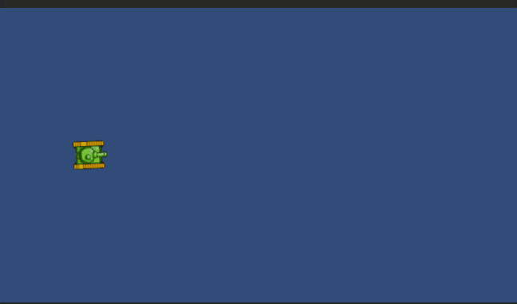
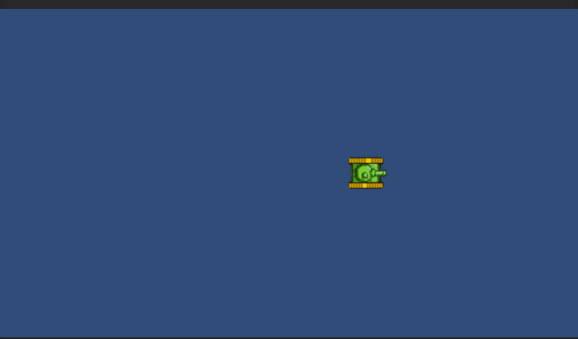

# Shoot

Voor deze les moet je een werkende topdown bestuurbare Tank hebben uit de vorige les



# Bullet

**Creeer een Bullet.**
1. Plaats hiervoor een 2d sprite van een Circle in de hierarchy, noem deze Bullet en verklein deze zodat deze in verhouding tot de afmeting van de sprite van de Tank zijn
2. Koppel Bullet aan een nieuw Script met dezelfde naam (Bullet)
3. Maak van het GameObject Bullet en het Script Bullet een Object (GameObject + gekoppeld script)
4. Ontwikkel het script voor de Bullet.

De Bullet moet de volgende variabelen hebben

````c#
    Vector3 direction = Vector3.right;
    Vector3 velocity;
    float speed = 15.0f;
````

we laten de Bullet in de Update bewegen met

````C#
   velocity = direction * speed * Time.deltaTime;
   transform.position += velocity;
`````

Als het goed is, beweegt de Bullet naar rechts uit het scherm

5. Plaats de Bullet in de folder Prefab (als die er niet is, maak je er een)  en verwijder de Bullet uit de Hierarchy
6. De Bullet als prototype bij de Tank toevoegen. Ga naar het script van de Tank en voeg hier aan toe:
````C#
[SerializeField] Bullet bullet; 
`````
Sleep de prefab Bullet in dit veld

7. Roep in de Update() een nieuwe functie aan met als naam Shoot en maak deze nieuwe functie
8. Gebruik in de functie Shoot een **Factory methode** om bij in indrukken van de spatiebalk een instantie van de Bullet te maken

```` C# 
if (Input.GetKeyUp(KeyCode.Space))
{
    Bullet InstanceOfBullet = Instantiate(bullet, transform.position, Quaternion.identity);

}
````

9 Maak in het Bullet-script de variabele direction toegankelijk door middel van een Getter/Setter

````C# 
public Vector3 Direction
{
    get { return direction; }
    set { direction = value; }
}
````

10. Voeg in de Shoot-functie de **direction** toe

````C#
 InstanceOfBullet.Direction = direction; 
````

11. geef de PreFab Bullet een trailRenderer, waarbij de Alpha van 1 naar 0 verloopt

# eindproduct
