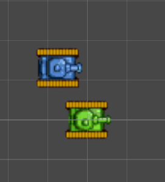
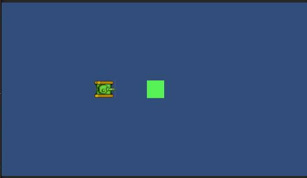

# 1.4.skill.stem.6 Hit

Voor deze opdracht moet je beschikken over 
1. een bestuurbare tank: <a href="https://github.com/djsjollema/lessen-gamedevelopment/tree/main/M4/stem/4-TankSheet">Les 1.4 Tanksheet</a>
2. Een Bullet-factory pattern: <a href="https://github.com/djsjollema/lessen-gamedevelopment/tree/main/M4/stem/5-Shoot">Les 1.5 Shoot</a>

# Opdracht
1. Gebruik de spritesheet om een animatie van een EnemyTank te maken. 
   - Zorg dat de voorkant van de EnemyTank naar rechts wijst
   - Maak en Enemy van vergelijkbare grootte als de Tank

2.  Koppel de Enemy aan een script dat de beweging van de EnemyTank regelt.
- De EnemyTank Spawnt op (0,0,0)
- De EnemyTank kiest een willekeurig punt binnen het speelveld
- De EnemyTank bepaalt de afstand naar dit punt en de tijd dat dit kost 
- De EnemyTank beweegt naar dit punt en houdt de tijd bij dat dit kost
- Als de EnemyTank bij de target is aangekomen, kiest het een nieuw willekeurig punt en beweegt weer daarheen
- ALs de Tank de EnemyTank met een Bullet raakt, verdwijnen zowel de EnemyTank als de Bullet

