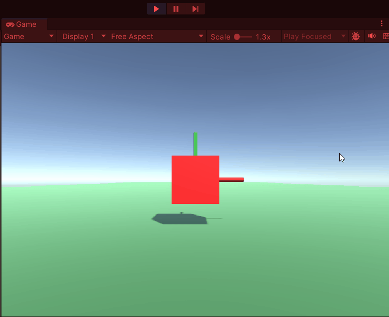

# PROG les 1: Herhaling Functions, Classes en Arrays

Vorig schooljaar hebben jullie allemaal uitleg gehad over [functions](#functions), [classes](#classes) en [arrays](#arr).

Echter is het balangrijk om dit te herhalen zodat je er zeker van bent dat je dit goed begrijpt en deze principes kunt toepassen als je een game bouwt.

<a name = "functions"></a>

## Functions, Methods, Parameters & return type

Wat was ook alweer een function?

Wat is het verschil tussen een **Function** en een **Method**?

Een **Method** is een **Function** maar een **Function** niet altijd een **Method**.

Wat zijn **Parameters** en **Arguments** en hoe kunnen deze je functions flexibel maken?

Wat is een **return value** en hoe kun je hiermee je functions gebruiken om andere code te ondersteunen?

Onderzoek nog eens deze termen en check of je ze nog kent. Zo niet vraag het nog eens even aan je klasgenoten of aan je docent. Het wordt nu tijd dat je ze goed kent.

<a name = "opdracht1"></a>

### Opdracht 1 Functions, Methods, Parameters & return type

Maak een function **CreateBall** waarmee je een 3d bol (prefab) met een rigidbody in de scene plaatst.

```
    public GameObject prefab;
    private void CreateBall(){
        Instantiate(prefab);
    }
```

Zorg dat je deze function elke seconde aanroept zodat er elke secode een bal verschijnt en valt.

```
    private float elapsedTime = 0f;
    Update(){
        elapsedTime += Time.deltaTime;
        if(elapsedTime > 1f){
            CreateBall();
            elapsedTime = 0f;
        }
    }
```

Geef je function nu een **Paramater** voor de kleur. En zorg dat je hiermee de kleur van de material verandert.

```
    private void CreateBall(Color c){

        GameObject ball = Instantiate(prefab);
        Material material = ball.GetComponent<MeshRenderer>().material;
        material.SetColor("_Color", c);
    }
```

zorg dat je in je update random een kleur genereert die je meegeeft aan de function CreateBall() als **Argument**. Een Color object bevat 4 eigenschappen: float red, float green, float blue en float alpha. Dit zijn de verschillende kleurkanalen van de pixels in je schem. alpha is de zichtbaarheid. Al deze waarden gaan van 0f tot 1f (0% tot 100%)

```
 Update(){
        float r = Random.Range(0f,1f);
        float g = Random.Range(0f,1f);
        float b = Random.Range(0f,1f);
        Color randColor = new Color(r,g,b,1f);

        elapsedTime += Time.deltaTime;

        if(elapsedTime > 1f){
            CreateBall(randColor);
            elapsedTime = 0f;
        }

    }

```

Het resultaat is elke seconde een bal met een random kleur.

Zorg dat je bij het aanroepen van **CreateBall** ook een argument voor de position (Vector3) mee kunt geven.

Laat zo elke bal op een andere random position binnen je scherm verschijnen.

Maak een 2e function **DestroyBall** zorg dat je als argument een **Gameobject** mee kunt geven.

Zorg dat deze functie het meegegeven gameobject vernietigt na 3 seconden.

Laat je **CreateBall** een referentie naar het gameobject (de bal) returnen nadat deze is aangemaakt.

Geef na het aanmaken van de bal met CreateBall de referentie door als argument in de DestroyBall function zodat de bal na 3 seconden wordt verwijderd.

```
    private GameObject CreateBall(Color c, Vector3 position){

        GameObject ball = Instantiate(prefab, position, Quaternion.identity);
        Material material = ball.GetComponent<MeshRenderer>().material;
        mat.SetColor("_Color", c);

        ...

        return ball;

    }

    Update(){
        float r = Random.Range(0f,1f);
        float g = Random.Range(0f,1f);
        float b = Random.Range(0f,1f);
        Color randColor = new Color(r,g,b,1f);

        elapsedTime += Time.deltaTime;
        if(elapsedTime > 1f){

            GameObject ball = CreateBall(randColor);
            DestroyBall(ball);

            elapsedTime = 0f;

        }

    }
```

Maak nu ook in 1 keer in je Start method 100 ballen aan met een willekeurige kleur en positie.

Dit is het eindresultaat:


Zet de code voor het genereren van een random kleur en voor het genereren van een random position beiden in een aparte functie en gebruik deze functies in je start en update methodes. Zodoende hoef je maar op 1 plek in de code je kleur en positie te randomizen.

Je **Start** en **Update** moeten er dan ongeveer zo uitzien:

```
void Start()
{
    for (int i = 0; i < 100; i++){
        Color color = RandomColor();
        Vector3 randPos = RandomPosition(-10f, 10f);
        CreateBall(color, randPos);
    }
}

// Update is called once per frame
void Update()
{
    elapsedTime += Time.deltaTime;
    if (elapsedTime > 1f) {
        Color color = RandomColor();
        Vector3 randPos = RandomPosition(-10f, 10f);
        GameObject ball = CreateBall(color, randPos);
        DestroyBall(ball);
        elapsedTime = 0f;
    }
}
```

Klaar met de opdracht?

- **_Push je code naar github en maak een screen capture van je werkende prototype._**
- **_Lever een link je code en je gifje in via Simulize._**

<a name = "classes"></a>

## Class, Object, Constructor & Instantiate

Wat is ook alweer een **Class**? en wat is dan ook alweer een **Instance** van een class?

Is dit een vliegtuig? ...


Nee!

Kan een blauwdruk vliegen? ...
Nee!

En als je met die blauwdruk nu eerst een vliegtuig maakt? ...
Ja dan wel

Dan heb je een **Instance** van de Vliegtuig Class gemaakt. Oftewel een Vliegtuig **Object**


Wat zijn in deze code de **Classes** en wat zijn de **Objecten**?
Hoe herken je ze?

```

      Color color = new Color(r,g,b,1f);
      //Color   de Class
      //color   het Object
      //new Color() instantieren van de class naar een Object

```

Je kunt ook je eigen Class schrijven. Elke script bevat een of meer Classes. De definitie van een class ziet er zo uit.

```
public class Plane
{

}
```

Een class kun je eigenschappen (fields) en functies (methods) geven:

```
public class Plane
{
    int numPassengers = 100;    //field
    public void TakeOff(){      //method
        //Make it fly!
    }

}
```

Je hebt nu dus nog geen vliegtuig **Object** maar wel de **Blauwdruk**

Met een ander script kun je nu van deze **Class** een **Object** maken (**Instantieren**)

```
    public class Game:Monobehaviour{
        void Start(){
            Plane player = new Plane();
            //Maak van de class Plane nu een Object player

        }
    }
```

Of meerdere objecten, zoveel als je maar wilt

```
public class Game:Monobehaviour{
        void Start(){
            List<Plane> fleet;
            for(int i = 0; i < 500; i++){
                fleet.Add(new Plane());
                //Maak van de class Plane nu 500 Objecten in de lijst fleet
            }
        }
    }
```

Door **_new_** voor de **Class** te zetten roep je de zogenaamde **Constructor** aan. Dat is een functie die je zelf kunt definieren die dezelfde naam heeft als de **Class**. Dus in het geval van de class **_Plane_** is de constructor ook **_Plane_**. Een constructor heeft geen return value en kan alleen maar Public zijn dus hoef je er verder niets voor te zetten. De code in de constructor wordt altijd 1x uitgevoerd als er van de Class een Object wordt aangemaakt.

```
public class Plane
{
    int numPassengers = 100;    //field
    Plane(){                    //constructor
        Debug.Log("Hallo ik ben een nieuw vliegtuig!");
    }
    public void TakeOff(){      //method
        //Make it fly!
    }
}
```

Voor de consructor kun je ook net als bij alle functions **parameters** maken. Je kunt dan bij het aanmaken van een nieuw object en dus het aanroepen van de constructor, **argumenten** meegeven:

```
public class Plane
{
    int capacity = 0;
    Plane(int passCap){       //constructor
        capacity = passCap;
        Debug.Log("Hallo ik ben een nieuw vliegtuig! waar "+capacity+ " mensen in kunnen.");
    }
}
public class Game{
    void Start(){
        Plane jumbo = new Plane(400);
    }
}
```

Binnen Unity kun je met de Instantiate functie prefabs instantieren een prefab wordt dus ook behandeld als een class in de zin dat deze pas bestaat nadat hij geinstantieerd is. Eigenlijk maken we binnen Unity dus geen gebruik van constructors zoals je dan normaal in C# wel zou doen.

Het instantieren van prefabs kun je zo doen:

```
public class Game:Monobehaviour{
    public GameObject towerPrefab;
    void Start(){
        GameObject tower = Instantiate(towerPrefab);
    }
}


```

<a name = "opdracht2"></a>

### Opdracht 2 Class, Object, Constructor & Instantiate

Maak een class **TowerSpawner** en zet deze op je Camera of een ander leeg gameobject in je scene.

Maak ook een prefab van een toren (dit mag ook een cylinder zijn). Zorg dat de base van de toren de zelfde positie heeft als de prefab.


Zorg voor een **Tower** class als script op je prefab. In de Start method van de **Tower** class geef je de toren een randomized Scale.

Elke toren die je plaatst moet dus een andere size hebben.

Laat de **TowerSpawner** class elke keer als je in het scherm klikt een toren Instantieren op een willekeurige positie.


Klaar met de opdracht?

- **_Push je code naar github en maak een screen capture van je werkende prototype._**
- **_Lever een link je code en je gifje in via Simulize._**

### Bonus:

Zorg dat de toren op de plek komt waar je op de vloer klikt.

Zet een plane in je scene en gebruik de **ScreenPointToRay** functie om te bepalen waar de toren moet komen als je op de plane klikt.

Neem [deze tutorial](https://gamedevbeginner.com/how-to-convert-the-mouse-position-to-world-space-in-unity-2d-3d/#ray_to_plane) door om erachter te komen hoe je de aangeklikte positie op een **Plane** kunt krijgen:

**Let op!** In de tutorial wordt er gesproken over een **Plane** dit is een [wiskundige oneindig vlak](https://docs.unity3d.com/ScriptReference/Plane.html) en niet hetzelfde als het gameobject **Plane** met een platte vierkante mesh binnen unity.

[](https://gamedevbeginner.com/how-to-convert-the-mouse-position-to-world-space-in-unity-2d-3d/#ray_to_plane)

Dit zou dus ongeveer het resultaat moeten zijn:


Klaar met de opdracht?

- **_Push je code naar github en maak een screen capture van je werkende prototype._**
- **_Lever een link je code en je gifje in via Simulize._**

<a name = "arr"></a>

## Array, List & Loops

Ook het kunnen gebruiken van Arrays en Lists is een belangrijke skill om te hebben.
Als je boodschappen moet doen schrijf je ook niet elk product op een apart briefje toch?

Je maakt gewoon een lijst waar alles op staat.


Zeker bij het maken van games waarbij je niet van te voren weet hoeveel kogels de speler gaat afvuren of hoeveel monsters de speler gaat tegenkomen zijn lijsten van groot belang.

Een Array kun je bijvoorbeeld als volgt maken:

```
    string boodschappen[] = {
        "melk",
        "boter",
        "vlees",
        "rijst",
        "eieren",
        "sap",
        "brood",
        "fruit",
        "uien"};

```

Er zijn ook [andere manieren](https://www.w3schools.com/cs/cs_arrays.php), bijvoorbeeld als de array nog leeg moet zijn.


Het voordeel van een Array of List is dat je in 1 keer logica kunt uitvoeren voor de inhoud van de gehele verzameling.

Je hoeft dus niet meer voor elke enemy in je game code te schrijven om te kijken of hij wordt geraakt door een kogel. Je doet dat dan in 1 keer voor de gehele verzameling enemies. Hiervoor kun je bijvoorbeeld een [foreach](https://www.w3schools.com/cs/cs_foreach_loop.php) loop gebruiken.

```
    public GameObject enemies[] = new GameObject[10];
    //enemies kun je via de inspector toevoegen

    Update(){
        foreach(GameObject enemy in enemies){
            if(enemy.IsHit){
                if(enemy.GetLife() <= 0)
                {
                    enemy.Die();
                }
            }
        }
    }
```

Een for each loop is speciaal voor het werken met verzamelingen. Deze gaat automatisch door de gehele verzameling heen.

Een alternatief is werken met andere loops zoals een [while](https://www.w3schools.com/cs/cs_while_loop.php) of een [for](https://www.w3schools.com/cs/cs_for_loop.php) loop. Echter is de combinatie van foreach en verzamelingen (Arrays en Lists) het meest efficient om te gebruiken.

De beperking van het gebruiken van een Array is dat de inhoud van de verzameling wel kan worden aangepast maar de grootte niet. In het bovenstaande vorbeeld zijn er 10 enemies. Dit kunnen er tijdens de game dan dus niet meer worden.

De **List** is wat dat betreft een stuk dynamischer en daar kun je **"at runtime"** dan ook objecten aan je lijst toevoegen of de lijst verkleinen zodat er geen lege plekken in de lijst ontstaan.

Een List maak je zo:

```
    public List<GameObject> enemies = new List<GameObject>();
    //enemies kun je via de inspector toevoegen

    CreateWave(int waveSize){
        for(int = 0; i< waveSize;i++){
            enemies.Add(Instantiate(enemyPrefab));
            //At runtime kun je objecten aan je lijst toevoegen met de List.Add() methode
        }
    }


```

In de code hierboven zie je dat je via de methode **Add()** items aan je list kunt toevoegen.

De list bevat [nog veel meer handige methodes](https://learn.microsoft.com/en-us/dotnet/api/system.collections.generic.list-1?view=net-8.0) waaronder **Remove()**, **Sort()**, **Reverse()**, **Insert()** en nog veel meer.

<a name = "opdracht3"></a>

### Opdracht 3 List en loop:

Maak een script met een **EnemySpawner** class en zet deze op een leeg game object in je scene.
plaats dit gameobject op de locatie waar de enemies moeten spawnen.

Maak een script met een **Enemy** class en zet deze op de prefab van een enemy dit mag een rode kubus zijn.
Zorg er in de Update methode van je Enemy voor dat deze over de z-as van je camera wegloopt.

Maak in je **EnemySpawner** een List aan voor je enemies.

Gebruik de **Add** methode om je enemies aan de lijst toe te voegen. Gebruik **Instantiate** om je enemies te creeren. Gebruik de **Clear** methode om je lijst te legen. Gebruik **Destroy** om je enemies te verwijderen.

Laat de **EnemySpawner** in 1 keer 100 enemies spawnen als je op **"W"-toets** drukt.

Laat de **EnemySpawner** elke seconde 3 enemies spawnen.

Laat de **EnemySpawner** alle enemies verwijderen als je op de **"Q"-toets** drukt.


Klaar met de opdracht?

- **_Push je code naar github en maak een screen capture van je werkende prototype._**
- **_Lever een link je code en je gifje in via Simulize._**

### Bonus: Coroutine

Verwijder 1 voor 1 alle enemies als je de **"X"-toets** indrukt. Je kunt hiervoor een [Coroutine](https://docs.unity3d.com/Manual/Coroutines.html) gebruiken.



### Bonus 2: Object Pooling

Wat je wellicht ook is opgevallen is dat je bij het aanmaken van 100 enemies in 1 keer een flinke lag krijgt in je game. Dit komt omdat het instantieren erg zwaar is en dat doe je dus 100 keer in 1 frame. Dit kun je oplossen door gebruik te maken van [Object Pooling design pattern](https://learn.unity.com/tutorial/introduction-to-object-pooling#).

Probeer dit voor de bonus opdracht ook te doen.

Klaar met de opdracht?

- **_Push je code naar github en maak een screen capture van je werkende prototype._**
- **_Lever een link je code en je gifje in via Simulize._**
