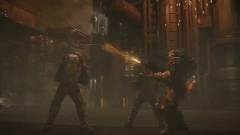
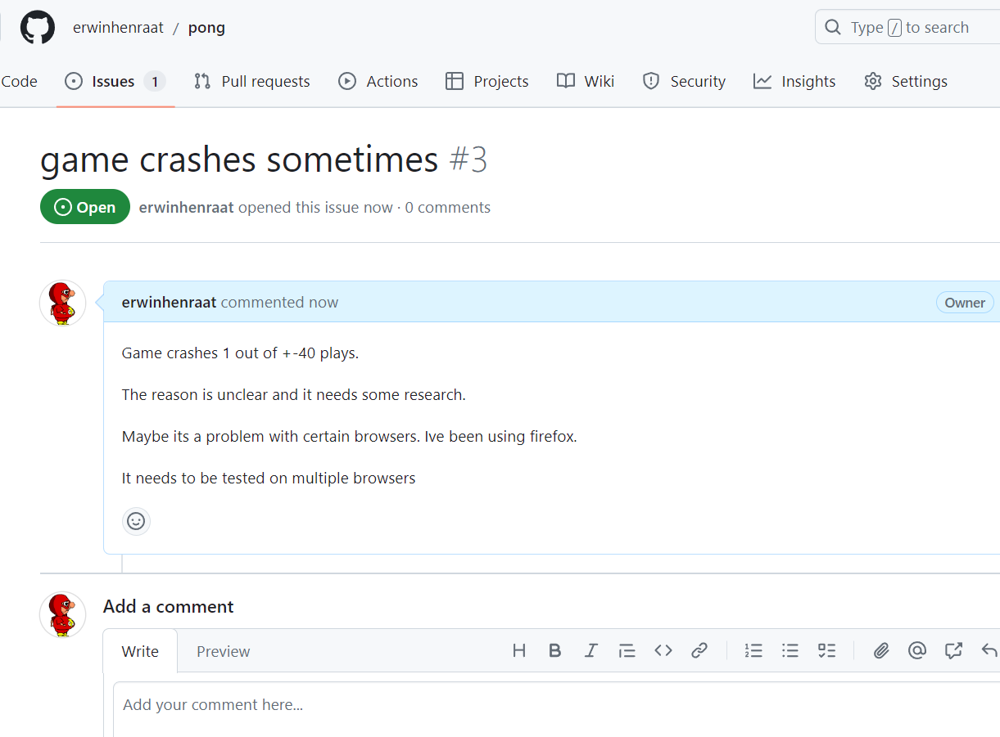
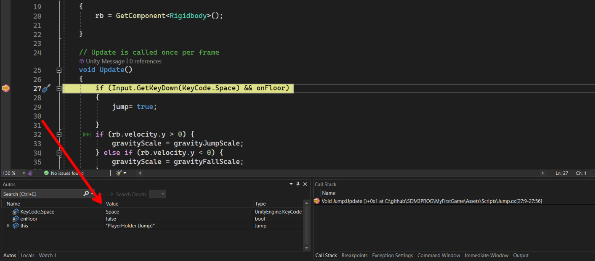
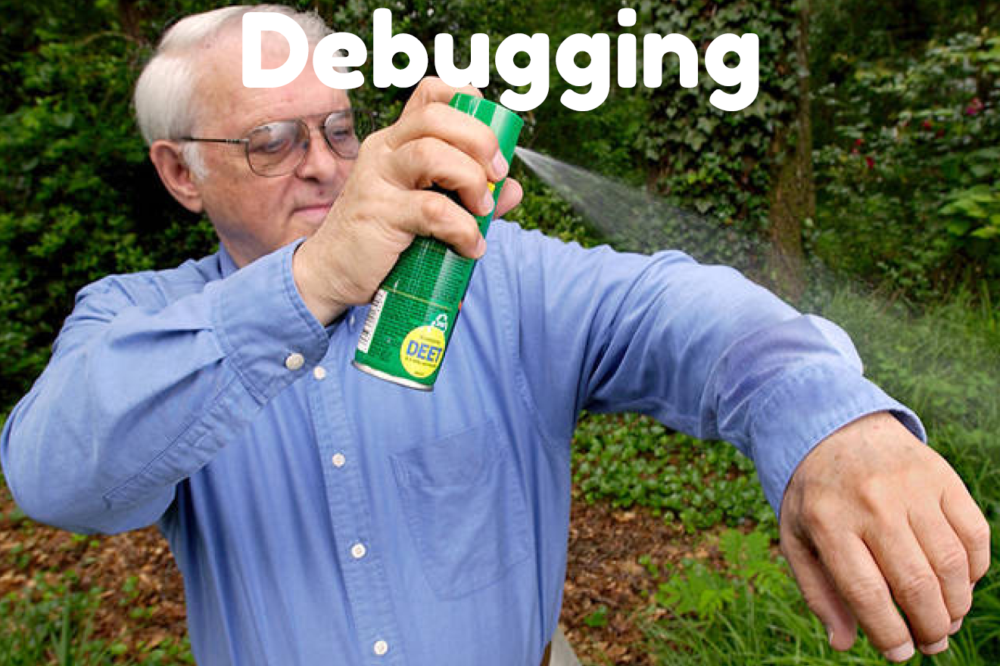
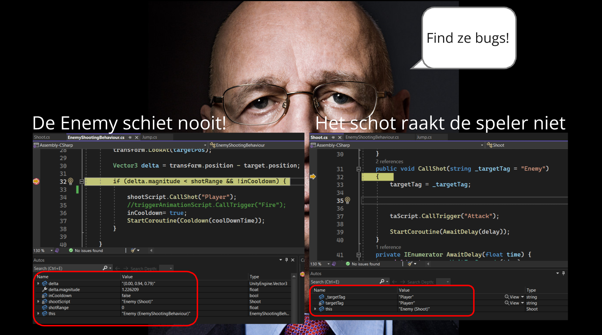

# PROG les 3: Debugging

## Documenteren van bugs

Bij het maken van games is snel, op tijd en effectief debuggen van cruciaal belang.
Ook het vroeg herkennen en goed vastleggen van bugs hoort hierbij.

Bugs die genegeerd worden kunnen later in het project voor vreemde situaties leiden. Het wordt na verloop van tijd steeds lastiger om deze op te lossen omdat ze door je project verweven zitten. Deste langer je wacht hoe meer schade ze dus op kunnen leveren aan je project.

Wat betreft het snel vastleggen van je Bugs is het belangrijk om dat gelijk te doen als je deze tegenkomt. Probeer de bug te reproduceren maak een of meer screenshots en een duidelijke beknopte omschrijving van wat er eigenlijk moet gebeuren en wat er fout gaat. En eventueel de oorzaak als je dit denkt te weten en eventueel een mogelijke oplossing.

Spreek binnen je team af waar de bugs vastgelegd worden en houd je daaraan. Een goede plek is bijvoorbeeld in een trello of op github onder de **Issues** van je project.

**Doe dit altijd voor alle bugs die je tegenkomt!** Ook als je denkt dat ze wel even snel op te lossen zijn. Oplossingen zijn nl niet altijd goede of echte oplossingen. Je wil dat je altijd overzicht hebt van wat er allemaal geprobeerd is en wat de problemen zijn. Ook is het fijn om later terug te kunnen zien wat voor oplossingen gewerkt hebben.

## Tools om te debuggen

1 van de simpelste tools om te debuggen is natuurlijk de console in Unity. Met het commando Debug.Log() hebben jullie al vaker gezocht naar de oorzaak en oplossing van een probleem in je game of code.

### Debug Class

Wist je dat er nog veel meer handige tools in de [Debug class](https://docs.unity3d.com/ScriptReference/Debug.html) zitten? Waaronder voor het geven van warnings of errors en het maken van **assertions** (testen van bepaalde voorwaarden).

Je kunt in Unity zelfs gameobjecten die gelogd worden laten highlighten in de hierarchy.

### Breakpoints

Toch is het zo dat het best omslachtig kan zijn om steeds maar code aan je scripts te moeten toevoegen om te debuggen. Hierom geven alle fatsoenlijke code editors je de mogelijkheid om zogenaamde breakpoints toe te voegen.

Met deze break points kun je snel alle informatie ophalen over states van je verschillende variabelen en gameobjecten. Dit kun je heel snel doen door een "breakpoint" naast een regel code te plaatsen. Unity pauzeert dat de game als je deze regel code hebt bereikt. Je kunt dan regel voor regel door de code uitvoeren en de states (waarden) van alle betrokken variabelen en objecten teruglezen. Ook de flow van je code wordt duidelijk omdat je er stap voor stap doorheen gaat.

### Voorbeelden

In [deze PDF](Debugging.pdf) kun je voorbeelden zien van hoe je de een aantal Debug functies en Breakpoints kunt gebruiken met Unity en Visual Studio.

### Opdracht 5A : Wat veroorzaakt de bugs?

Noteer de oorzaken van deze 2 bugs gebruik notepad om dit in een .txt bestand te zetten.
Lever je .txt bestand in op simulize

### Opdracht 5B : Vastleggen van Mythe bugs

Pak je project Mythe erbij en noteer minimaal 3 verschillende bugs. Zorg voor een duidelijke Omschrijving van:

- wat er eigenlijk zou moeten gebeuren.
- wat er verkeerd gaat. Maak gebruik van screenshots.
- wat je denkt dat de oorzaak kan zijn.
- evt hoe je denkt dat dit opgelost kan worden.
- welke vervolg acties nodig zijn.

Doe dit door 3 nieuwe issues aan te maken op de repo van je Mythe project. Lever van elke gemaakte issue een screenshot in op simulize.

### Opdracht 5C : Breakpoints

Koppel voor je Towerdefense project Unity aan je Editor en plaats een breakpoint. Laat zien dat je de breakpoints kunt gebruiken en dat de states van je variabelen objecten te zien zijn in het Autos window.

Maak een screenshot van je editor terwijl je breakpoint actief is. Lever je screenshot in via simulize.
