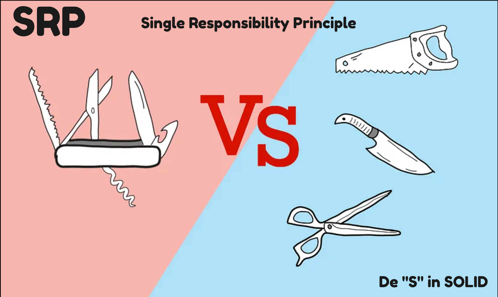
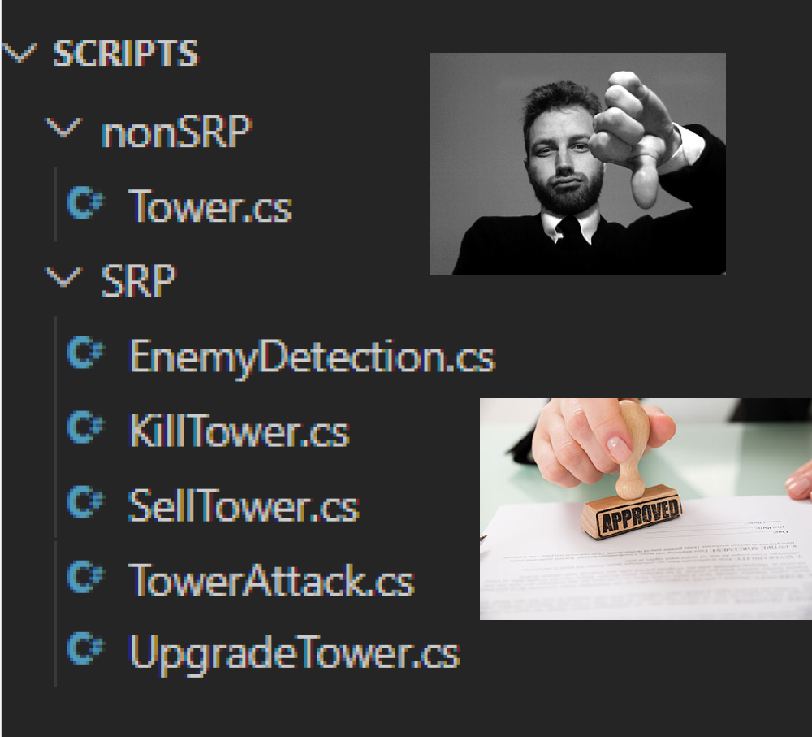
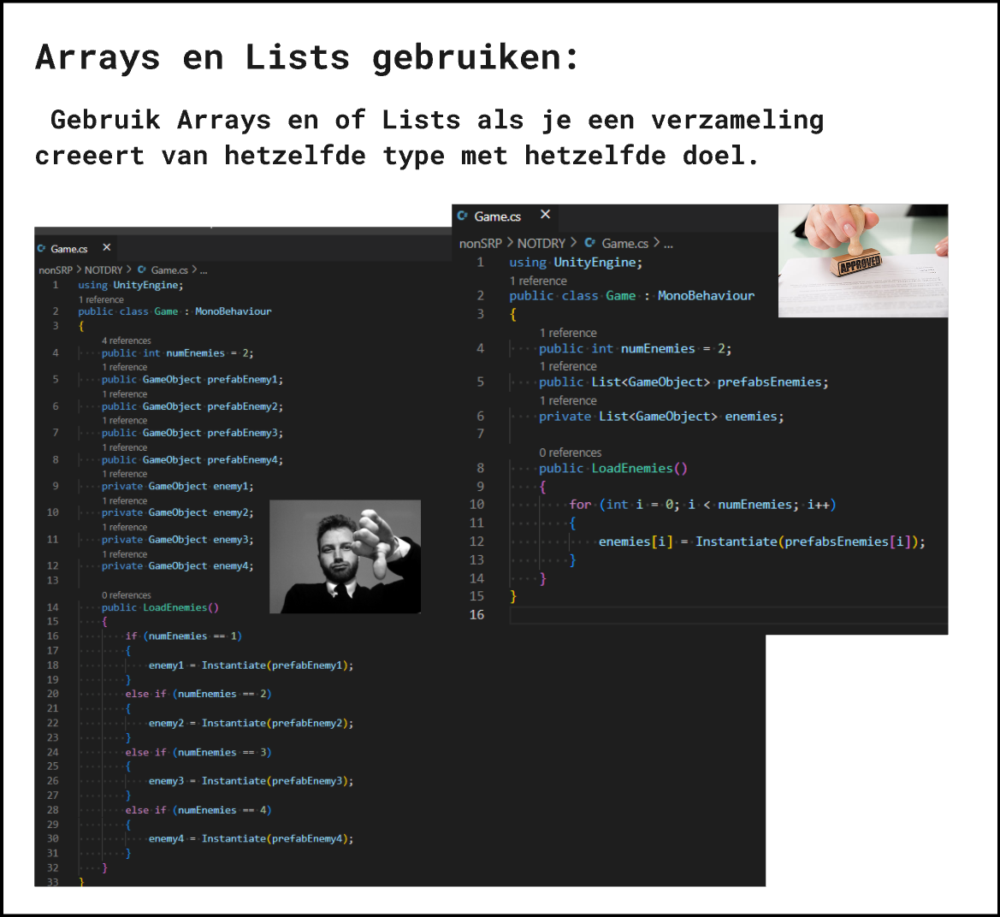
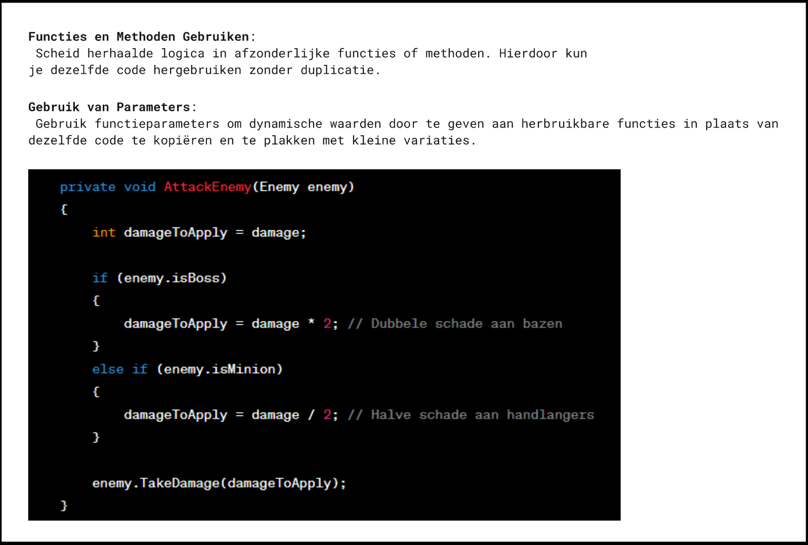
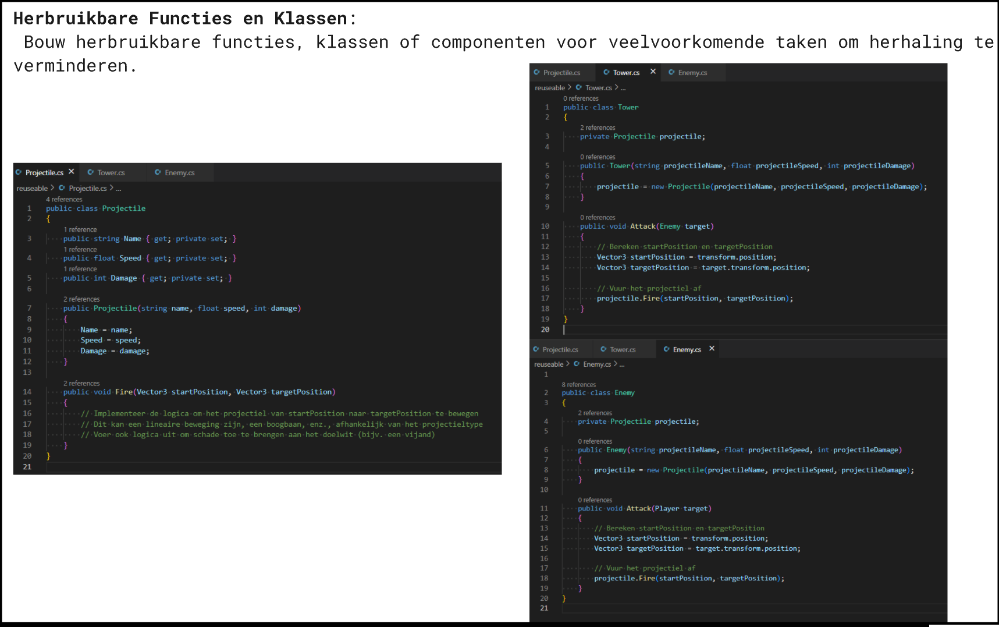
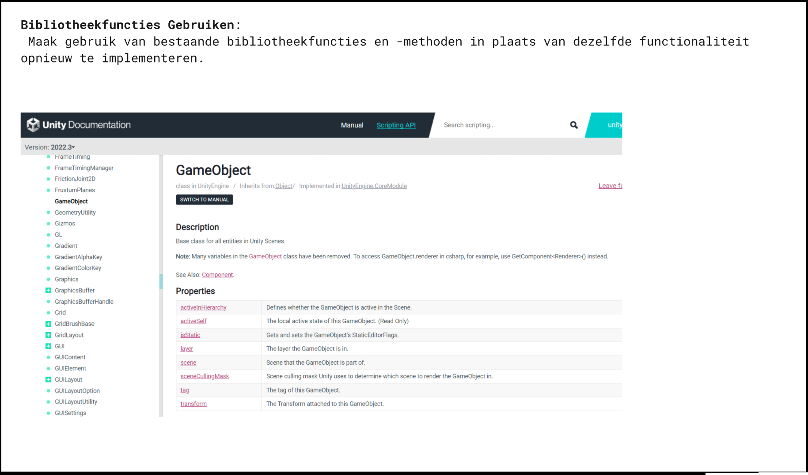
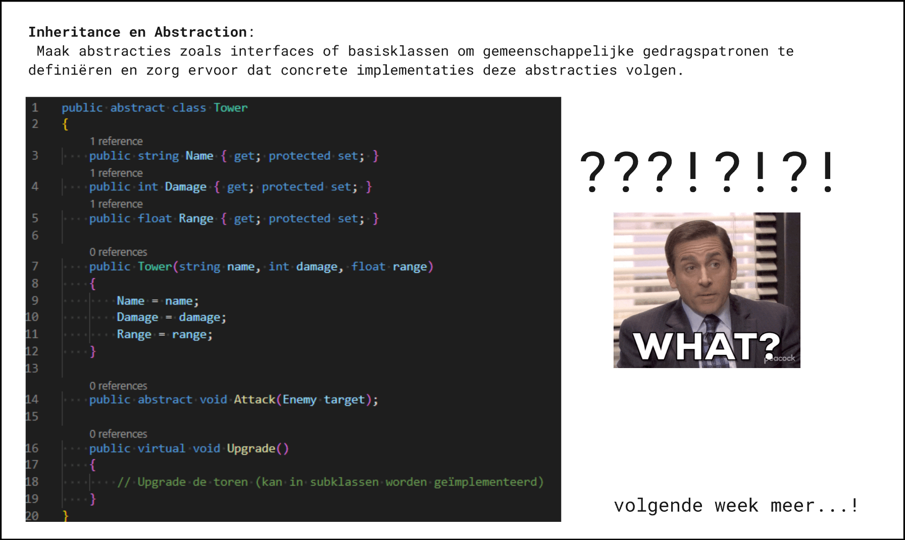

# PROG les 4: Single Responsibility (SRP) en Don't Repeat Yourself (DRY)

[Zie ook de slides over SRP en DRY](SRPenDRY.pdf)

Naast de het voorkomen van Tight Coupling ([behandeld in les 2](../02_Herhaling_Action_Events/README.md))zijn er nog meer best practices binnen het programmeren. 2 belangrijke best practices zijn Single Responcibility Principle en Don't Repeat Yourself.

## Object GeOrienteerd Programmeren / Object Oriented Programming - OOP

Het Single Responsibility Principle is onderdeel van de [SOLID](https://www.digitalocean.com/community/conceptual-articles/s-o-l-i-d-the-first-five-principles-of-object-oriented-design) principles. Dit zijn basisprincipes die programmeurs altijd moeten aanhouden om robuuste en makkelijk uitbreidbare en onderhoudbare code te kunnen schrijven. De SOLID principes zijn weer een belangrijk onderdeel van het Object GeOrienteerd Programmeren (OOP).

Daarnaast bestaat OOP in de basis uit een 4 tal basisonderdelen die we in deze lessenreeks ook nog zullen behandelen:

- Overerving / Inheritance
- Abstractie / Abstraction
- Inkapseling / Encapsulation
- Polymorfisme / Polymorphism

Ook deze basis elementen zijn ervoor bedoeld om robuuste , uitbreidbare en onderhoudbare code te schrijven.

## Single Responsibility Principle

De naam dekt al erg goed de lading.

Elke class mag volgens het SRP principe maar 1 verantwoordelijkheid hebben oftewel maar 1 ding doen. Door dit aan te houden kun je deze code later heel makkelijk aanpassen zonder dat dit verder effect hoeft te hebben op andere functionaliteit in je systeem.



Bijvoorbeeld in je towerdefense game kun je een script voor het schieten met je toren apart houden van het script waarmee je de toren kunt upgraden. Hierdoor kun je het schieten aanpassen zonder dat het upgrade systeem hier last van heeft.

Code die SRP niet aanhoudt is herkenbaar aan grote classes en ook komt hier vaak het woord **"manager"** voor in de naam.

De programmeur wist immers niet zo goed meer hoe alle verschillende functies van de class samengevast moesten worden.

Het goed toepassen van SRP zorgt ervoor dat je scripts ook mooi en makkelijk kunt hergebruiken op andere objecten.

Bijvoorbeeld een upgrade script dat werkt voor alle torens die dat zouden moeten kunnen. I.p.v voor elk type toren deze functionaliteit weer opnieuw te moeten programmeren.


Het gebruik van SRP zal leiden tot losse herbruikbare scripts die een duidelijk herkenbare en afgeschermde functionaliteit hebben.



## Don't Repeat Yourself

Code moet compact en herbruikbaar zijn. OP het moment dat je stukken herhalende code schrijft wordt het later erg lastig om aan te passen. elke aanpassing zal dan op heel ververschillende plekken moeten worden doorgevoerd.

Ook maakt herhaling je code gewoonweg lastig leesbaar. Herhalende code noemen me ook wel eens spaghetti code omdat de functionaliteit allemaal met elkaar verweven is en een aanpassing op de ene plek ook weer gevolgen heeft voor code op een andere plek. Het wordt dan al snel een soort speurtocht om kleine veranderingen te maken. Herkenbaar?!

Om dit te voorkomen is de vuistregel dus dat je code nooit mag herhalen.

Bijvoorbeeld variabelen van hetzelfde type en met dezelfde functie zoals enemy1 , enemy2 , enemy 3 etc..

Of algoritmes die vaker hetzelfde doen met verschillende objecten.

```
    if(enemy1.lives == 0){
        Destroy(enemy1);
    }
    if(enemy2.lives == 0){
        Destroy(enemy2);
    }
```

Of verschillende classes die gebruik maken van dezelfde functies die allemaal opnieuw zijn geschreven.

Op de volgende manieren kun je je code verbeteren op gebied van SRP:

- Arrays en Lists gebruiken
- Functies en Methoden gebruiken
- Gebruiken van parameters in je functies
- Herbruikbare functies en classes schrijven
- Bibliotheek functies gebruiken
- Inheritance en Abstraction (OOP principes) gebruiken

### Arrays en Lists gebruiken



### Functies en Methoden gebruiken

### Gebruiken van parameters in je functies



### Herbruikbare functies en classes schrijven



### Bibliotheek functies gebruiken



### Inheritance en Abstraction (OOP principes) gebruiken



<a name = "opdracht6"></a>

### Opdracht 6: SRP

Download dit project en probeer het script van de player op te delen in losse herbruikbare scripts volgens het SRP principe.

- **_Push je code naar github en maak een screen capture van je werkende prototype._**
- **_Lever een link je code en je gifje in via Simulize._**

<a name = "opdracht7"></a>

### Opdracht 7: DRY

Download dit project en probeer zoveel mogelijk de herhaling van code uit alle scripts te halen.

Doe dit door zoveel mogelijk van de bovenstaande technieken te gebruiken.

- **_Push je code naar github en maak een screen capture van je werkende prototype._**
- **_Lever een link je code en je gifje in via Simulize._**
