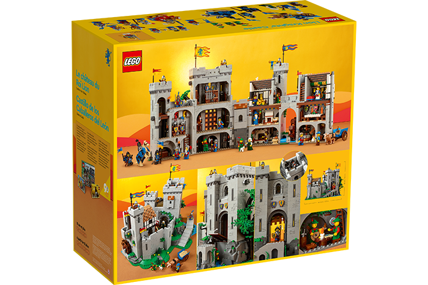
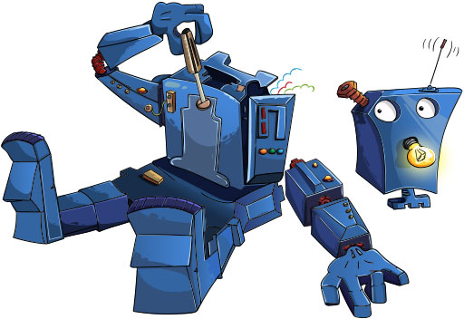

# PROG les 5: OOP Inheritance

## Object GeOrienteerd Programmeren / Object Oriented Programming - OOP

Object Georiënteerd Programmeren (OOP) is een manier van programmeren dat is ontwikkeld om softwareontwikkeling te vereenvoudigen en efficiënter te maken. Het belangrijkste idee achter OOP is het modelleren van software rond objecten in plaats van functies en logica. Een object is een entiteit die zowel data (attributen) als functies (methoden) bevat die op die data kunnen werken.

Object Georiënteerd Programmeren biedt veel voordelen bij de ontwikkeling van alle soorten software (Dus ook games). Het maakt programma's flexibeler, schaalbaarder en gemakkelijker te onderhouden, wat leidt tot efficiëntere ontwikkelingsprocessen en robuustere eindproducten.

OOP bstaat in de basis uit 4 basisonderdelen:

- Overerving / Inheritance
- Abstractie / Abstraction
- Inkapseling / Encapsulation
- Polymorfisme / Polymorphism

## Waarom OOP?

De belangrijkste redenen / voordelen zijn:

- Modulariteit
- Herbruikbaarheid
- Flexibiliteit en Schaalbaarheid
- Beheersbaarheid
- Onderhoudbaarheid

### Modulariteit:

OOP bevordert de modulariteit van de code door deze op te splitsen in afzonderlijke objecten die onafhankelijk van elkaar kunnen worden ontwikkeld en onderhouden. Dit maakt het makkelijker om de code te begrijpen, testen en debuggen. Denk aan verschillende lego blokken die altijd op elkaar passen.



### Herbruikbaarheid:

Door gebruik te maken van klassen en objecten kunnen programmeurs code hergebruiken in verschillende delen van een programma of in andere projecten. Dit vermindert de hoeveelheid dubbele code en maakt het onderhoud eenvoudiger.


### Flexibiliteit en Schaalbaarheid:

OOP maakt gebruik van polymorfisme en overerving, waardoor objecten kunnen worden aangepast en uitgebreid zonder de bestaande code te veranderen. Dit zorgt voor een flexibele en schaalbare architectuur.


### Beheersbaarheid:

Softwareprojecten worden steeds complexer. OOP helpt bij het beheren van deze complexiteit door de data en de methoden die op die data opereren in één object te groeperen. Dit weerspiegelt vaak de manier waarop mensen de wereld zien en begrijpen, wat bijdraagt aan de begrijpelijkheid van de code.


### Onderhoudbaarheid:

Omdat objecten in OOP duidelijke grenzen en verantwoordelijkheden hebben, wordt het eenvoudiger om veranderingen door te voeren en fouten op te sporen. Dit leidt tot een hogere onderhoudbaarheid van de software.



## Inheritance / Overerving

Inheritance geeft je als programmeur de mogelijkheid om de data en functionaliteit van een bestaande class te hergebruiken in een nieuwe class (een child class van een parent class)

Alles wat er mogelijk is met de parent class kan nu ook met de child class. variabelen en methoden uit de parent class zijn beschikbaar in de child class (tenzij ze een **private** scope hebben)

In het onderstaande voorbeeld zie je de overerving van de **Tower** class (parent) door de **CannonTower** class (child).

De **parent** class:

```
using UnityEngine;

public class Tower : MonoBehaviour
{
    public float range = 15f;
    public float fireRate = 1f;
    public GameObject projectilePrefab;

    void Initialize()
    {
        Debug.Log("Tower is ready with range: " + range + " and fire rate: " + fireRate);
    }

    // De Shoot-methode die door alle torens kan worden gebruikt
    public void Shoot(Vector3 targetPosition)
    {
        Debug.Log("Tower shooting at: " + targetPosition);
        SpawnProjectile(targetPosition);
    }

    // Methode om een projectiel te maken
    protected void SpawnProjectile(Vector3 targetPosition)
    {
        if (projectilePrefab != null)
        {
            GameObject projectile = Instantiate(projectilePrefab, transform.position, transform.rotation);

            Projectile proj = projectile.GetComponent<Projectile>();
            if (proj != null)
            {
                proj.Seek(targetPosition);
            }
        }
    }
}
```

De **Child** class:

```
using UnityEngine;

public class CannonTower : Tower
{
    public float explosionRadius = 5f;

    void Start()
    {
        // Aanroep van de Initialize methode van de basisklasse
        Initialize();
        Debug.Log("CannonTower has an explosion radius of: " + explosionRadius);

        // Gebruik de geërfde Shoot-methode
        Vector3 targetPosition = transform.position + transform.forward * range;
        Shoot(targetPosition);
    }
}
```

Het overerven gebeurt door deze regel:

```
CannonTower : Tower
```

Je kunt dus maar van 1 class tegelijk overerven.

Het mooie van overerving is dat ik nu heel snel een nieuwe soort Tower kan maken en dat alle data en methoden ook weer direct beschikbaar zijn zonder ze opnieuw te moeten programmeren.

Nog een **Child** class:

```
using UnityEngine;

public class SniperTower : Tower
{
    public float criticalChance = 0.5f;

    void Start()
    {
        // Aanroep van de Initialize methode van de basisklasse
        Initialize();
        Debug.Log("SniperTower has a critical chance of: " + criticalChance);

        // Gebruik de geërfde Shoot-methode
        Vector3 targetPosition = transform.position + transform.forward * range;
        Shoot(targetPosition);
    }
}
```

De scope modifier **protected** zorgt ervoor dat de methode of variabele alleen beschikbaar is binnen classes die deze overerven.

Andere voor jullie bekende scope modifiers zijn: **private** en **public**.

**Let op:** De **Start** en **Update** methoden van je base class worden niet meer uitgevoerd als je deze in je child class gebruikt. Je kunt wel een eigen methode definieren in je base class zoals in het voorbeeld **Initalize()** om die uit te voeren in de start methode van je child class.

[Kijk ook even deze video](https://www.youtube.com/watch?v=F7Wu6_uzD1I)

<a name = "opdracht8"></a>

### Opdracht 8: Inheritance

Maak een **EnemyParent** class waarin je programmeert dat deze automatisch van links naar rechts loopt zolang het leven van de enemy niet op is. Zorg dat deze enemy levens verliest als ze door een projectiel worden geraakt.

Maak een **Brute** class die overerft van de **EnemyParent** class. Deze moet dus ook van links naar rechts kunnen lopen en levens verliezen als hij geraakt wordt. Zorg dat deze class extra veel levens heeft. Zorg dat deze class langzaam loopt.

Maak een **Elf** class die ook overerft van de **EnemyParent** class. De Elf heeft weinig levens maar loopt heel snel.

De elf krijgt ook nog een functie dat hij om de 3 seconden 0.5 seconde onzichtbaar wordt. Noem deze **ToggleVisibility**. Je kunt het renderer component aan en uit zetten met `renderer.enabled = true; // of false; ` nadat je het renderer component hebt opgevraagd met: `Renderer renderer = GetComponent<Renderer>();` of `Renderer renderer = GetComponentInChildren<Renderer>();`

Je enemies mogen gemaakt zijn met behulp van primitives en hoeven niet per se te animeren etc..
Als je gebruik maakt van Mixamo en animaties voor je enemies geldt dat als **Bonusopdracht**

Je mag dit script aan de camera hangen om projectielen te kunnen schieten:

```
using UnityEngine;

public class ShootFromCamera : MonoBehaviour
{
    public GameObject projectilePrefab; //vergeet geen prefab in te slepen via de inspector
    private Plane floor;
    void Start()
    {
        floor = new Plane(Vector3.up, 0);
    }
    void Update()
    {
        if (Input.GetMouseButtonDown(0)) {
            float dist;
            Ray ray = Camera.main.ScreenPointToRay(Input.mousePosition);
            if (floor.Raycast(ray, out dist)) {
                GameObject p = Instantiate(projectilePrefab, transform.position, transform.rotation);
                Vector3 tPos = ray.GetPoint(dist);
                p.transform.LookAt(tPos);
                p.AddComponent<MoveProj>();
                Destroy(p,5f);
            }
        }
    }
}
public class MoveProj : MonoBehaviour
{
    private float moveSpeed = 20f;
    void Update()
    {
        transform.position += transform.forward * moveSpeed * Time.deltaTime;
    }
}
```

Het Eindresultaat is dus iets als dit:


- **_Push je code naar github en maak een screen capture van je werkende prototype._**
- **_Lever een link je code en je gifje in via Simulize._**

<a name = "bonus"></a>

### Bonus: Animaties

Verwerk animaties in het prototype van opdracht 8.
Zowel voor lopen als doodgaan.

- **_Push je code naar github en maak een screen capture van je werkende prototype._**
- **_Lever een link je code en je gifje in via Simulize._**
