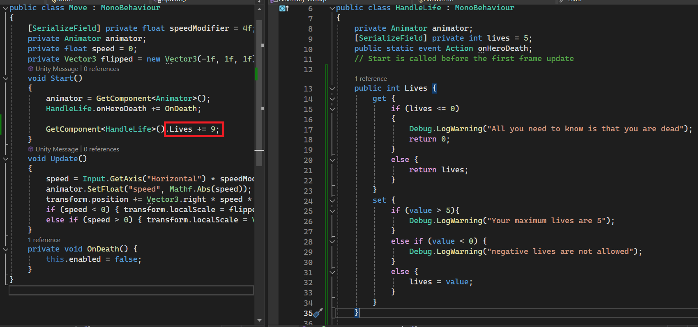
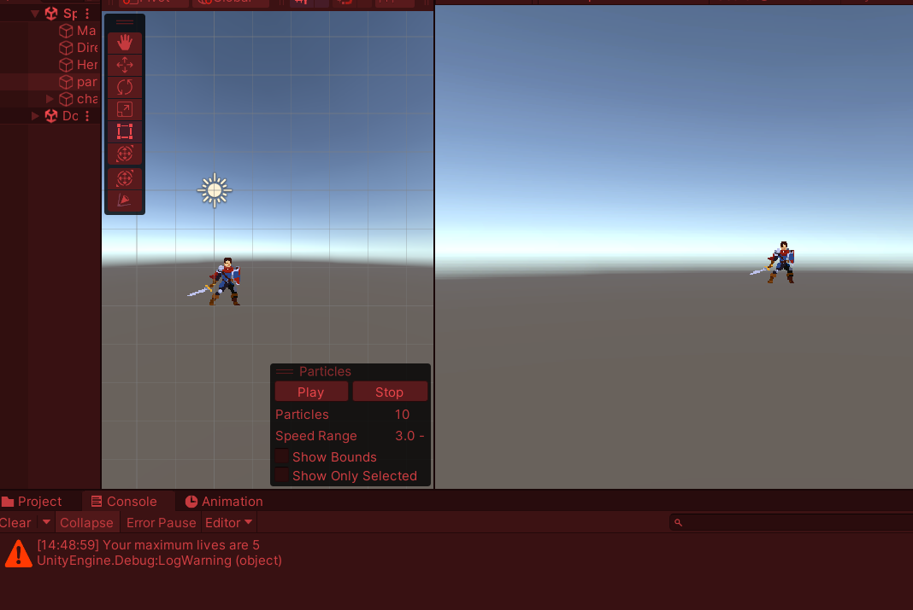
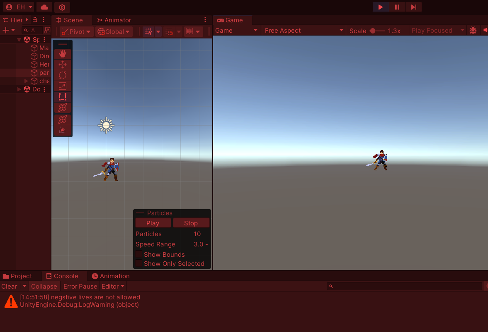
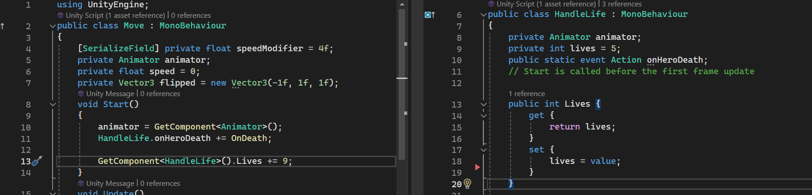
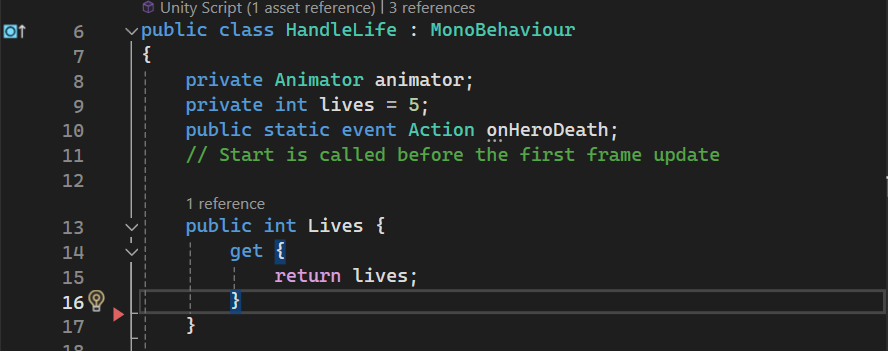
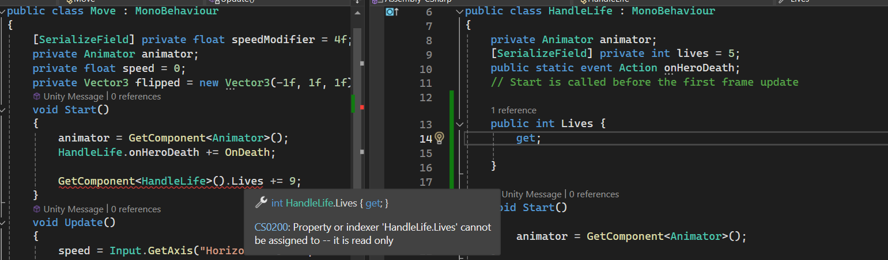
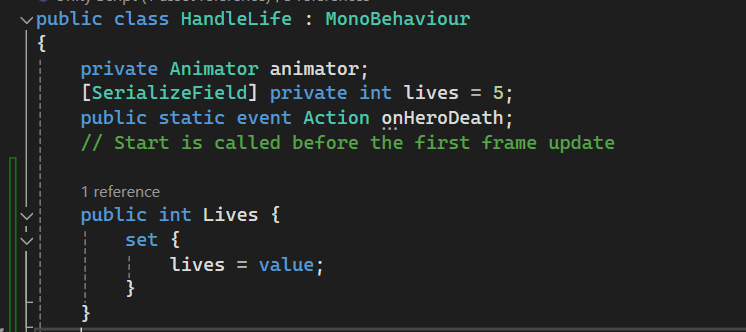
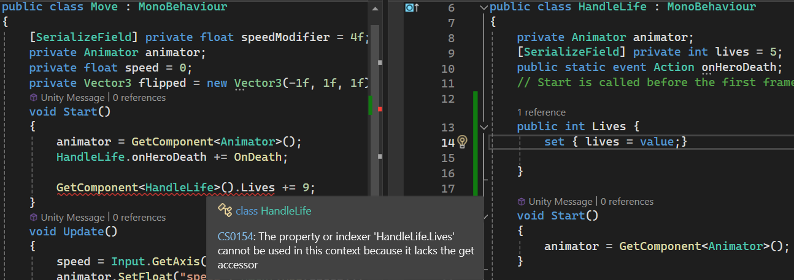
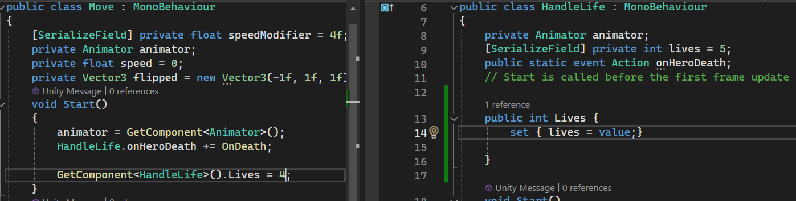

# PROG les 6: OOP Encapsulation

**"Encapsulation"**, ook wel **"inkapseling"** in het nederlands, is een manier om je code te beschermen tegen manipulatie van buitenaf. Je kunt je vast voorstellen dat je een public value die overal vandaan aan te passen is kan leiden tot onverwachte resultaten, waarna het lastig is om te bepalen waardoor dat wordt veroorzaakt.

Neem het volgende script in gedachten , wat op een player gameobject zit:

```
    class PlayerLife:MonoBehaviour{
        public int life = 10;
        void Update{
            if(life <= 0)Die();
        }
        void Die(){
            //player dies
            //game goes to game over screen
        }
    }
```

Elk script in het project wat toegang heeft tot mijn player, kan van de player nu de levens instellen.
Met gevolgen als ik dit veelvuldig doe. Mijn pickups geven me extra leven. Mijn enemies halen er leven af. Mijn kogels halen er leven af. Mijn timer doet dat ook omdat dat extra snannend is. Ook werk ik samen met andere developers die vanuit allerlei andere scripts mijn levens aan het manipuleren (uitlezen en aanpassen) zijn.

Tot ineens blijkt dat mijn game niet meer opstart en rechstreeks naar het gameover scherm gaat. Of wellicht kan ik juist helemaal niet meer dood omdanks dat ik al 1000 x geraakt ben. Misschien krijg ik er ineens levens bij i.p.v eraf wanneer ik word geraakt.

Veel succes met zoeken waar er een fout gemaakt is waar begin je met zoeken?

Encapsulation betekent dat je je code afschermt om aangepast te worden en dat je deze alleen als het niet anders kan op een zo veilig mogelijke manier beschikbaar maakt.

## Private

Sowieso is de standaard **private**. Pas als een variabele echt beschikbaar moet zijn in een ander script kun je overwegen om hem niet private te maken.

## Protected

Als een variabele beschikbaar moet zijn in een ander script dat via overerving een child is van het script waar de variabele gedefinieerd is kun je hem **protected** maken. Alleen de child class kan dan de waarde van de variabele lezen en aanpassen.

## Internal

Als een variabele beschikbaar moet zijn binnen de **Assembly** (Dynamic Link Library), dat zijn alle scripts die samen worden gecompiled naar 1 package. Standaard is dat je gehele Unity project maar je kunt ook aangepaste assemblies definieren in Unity. Dit betekent dat scripts die buiten jouw project gecompiled worden geen toegang hebben tot je variabelen en alle scripts binnen je project wel.

## Public

Vergelijkbaar met het tatoeeren van je pincode op je voorhoofd ;) De waarden van je variabelen kunnen vanuit elk ander script gelezen en veranderd worden.

## Methods

Je kunt **private** variabelen ook beschikbaar maken via een method. Je kunt in de method afdwingen dat het lezen en/of schrijven van de waarden volgens een aantal regels gaat:

```
    class PlayerLife{
        private int life = 10;
        public int GetLife(){
            return life;
        }
        public void LoseLife(int amount){
            //Check of er geen vreemde hoeveelheid leven af gaat
            if(Mathf.ABS(amount) > 50)Debug.LogWarning("losing an extreme amount of life");
            //forceer dat er altijd wat af gaat en nooit per ongeluk iets bij komt
            life -= Mathf.ABS(amount);
            if(life <= 0){
                Die();
            }
        }
        void Die(){
            //player dies
            //game goes to game over screen
        }
    }
```

_Een bijkomend voordeel van de bovenstaande code is ook dat er niet meer elk frame gecontroleerd hoeft te worden hoeveel levens de speler nog heeft en alleen nog maar als er een leven vanaf gaat. Dat bespaart weer een hoop processor kracht._

## Getter & Setter

Je kunt ook werken met zogenaamde **"getters"** en **"setters"**. Dit zijn eigenlijk ook methoden waar je extra checks in kunt zetten die je bovendien ook de mogelijkheid geven om variabelen alleen leesbaar of alleen schrijfbaar te maken.

Het leuke van **Getters** en **Setters** is ook dat ze buiten de class worden behandeld als property (variable) in plaats van als methode.



Dankzij de code die je in de getter en setter plaatst kun je mogelijke fouten van mededevelopers opvangen:




Je hoeft geen code te implementeren in een getter en een setter. Je kunt ze ook leeg laten. Dan is de property gewoon beschikbaar om te lezen en te schrijven.



Je kunt ook alleen de **getter** implementeren wat resulteert in een **read-only** property.

Je krijgt dan een error als je iets probeert weg te schrijven.


Je mag er ook een **write-only** property van maken. Door alleen de **setter** te gebruiken. Maar dan kun je er dus niets uit opvragen.




Alleen iets wegschrijven lukt dan dus wel.


Getters en Setters gebruiken is een goede manier om waarden van variabelen dus op een gecontroleerde manier zo beperkt mogelijk beschikbaar te maken voor andere scripts.

## Inspector

Als je variabelen beschikbaar wil maken in de inspector doe je dat met een private variable en zet je er de `[SerializeField]` attribute voor. Dit zorgt ervoor dat je de variabele vanuit de inspector wel een waarde kunt geven maar deze niet vanuit een andere class kunt aanpassen. [Hier vind je meer informatie](https://www.renz.is/useful-unity-attributes-for-better-inspector-experience/) over wat je nog meer voor attributes hebt en wat je er nog meer mee kunt.

### Opdracht 9, Encapsulation:

Ga door je Towerdefense project heen en zoek op hoeveel public variables je hebt gebruikt.

Maak deze **allemaal** private!

Als de variable vanuit een ander script beschikbaar moet zijn implementeer je er een **getter** en/of **setter** voor.

Als je via de inspector een waarde aan de variabele moet geven dan gebruik je het **[SerializeField]** attribuut.

**Write only:**
Als je vanuit een ander script alleen wegschrijft maak je er een **setter** van.

**Read only:**
Als je vanuit een ander script alleen leest maak je er een **getter** van.

**Read write:**
En als je vanuit een ander script zowel leest als schrijft implementeer je de **getter** en de **setter**.

Bedenk nu ook of er variabelen zijn die problemen kunnen geven als ze een verkeerde waarde krijgen. Bijvoorbeeld negatieve waarden. Zorg er dan voor dat de waarden die niet negatief mogen zijn altijd positief gemaakt worden: Dit doe je in de bijhorende getters met `Mathf.ABS(value);` Dit is de "Absolute" functie die de waarde altijd postief maakt.

**Maak een dependancy lijst:**

Maak een lijst (.pdf) met daarin geordend per script (zet de classnaam erboven) de naam van **elke** variabele die beschikbaar is vanuit een ander script. (dit noem je een **dependancy**)

Zet daarbij het datatype en of deze read-only, write-only of beide is. De lijst komt er dus ongeveer zo uit te zien en bevat **alle** dependancies uit je project:

```
Depandancies

class FireProjectile:
int ammoLeft read & write
float shootForce write only

class TowerLife:
int life read only

class powerUp:
float timeLeft read only

class UI:
int score read & write

```

### Eisen

Voor alle variabelen in de lijst heb je getters en of setters geimplementeerd in je project.

Er mogen in je project geen public variabelen meer zijn.

### Inleveren

Lever je dependancies lijst in als .pdf op Simulise.

Lever op simulise een linkje in naar je Scripts map op je github repo.
