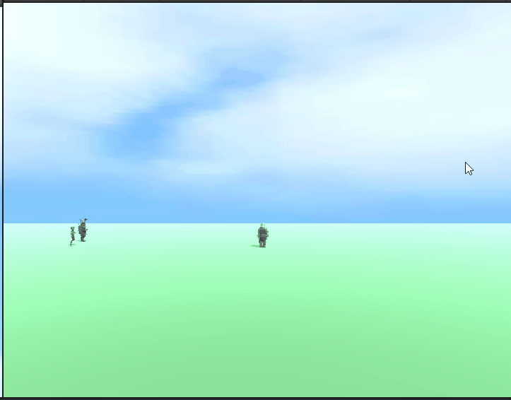

# PROG les 7: OOP Abstraction

Abstractie maakt complexe systemen eenvoudiger door onnodige details te verbergen en alleen de essentiële onderdelen beschikbaar te maken.

Met abstractie richt je je op wat een object doet in plaats van hoe het dat doet. Dit betekent dat je een algemene beschrijving geeft van een object of functie, zonder in te gaan op de specifieke implementatie.

Bijvoorbeeld: een Auto

Je weet dat een auto kan rijden, stoppen en de snelheid kan aanpassen. Dit zijn de essentiële functies van een auto.

Details verborgen door abstractie: Hoe de motor werkt, hoe de remmen functioneren, en hoe de snelheid precies wordt aangepast, zijn details die verborgen blijven.

In programmeertaal kan abstractie worden geïmplementeerd door middel van **abstracte klassen** of **interfaces**, die methoden definiëren zonder hun werking te specificeren. Hierdoor kunnen verschillende objecten dezelfde interface delen, maar hun eigen specifieke gedrag implementeren.

## Abstracte klassen

Bij een abstracte klasse kun je methoden (functions) maken met of zonder implementatie. Dit betekent dus dat je de methode werkende code geeft of niet. Als je een methode maakt zonder implementatie moet je die in de child klasse wel een implementatie geven. Bij een methode zonder implementatie zet je er abstract voor. Ook voor de naam van een abstracte class moet je het woordje abstract zetten.

Abstracte methoden moeten door hun child class verplicht worden geimplementeerd. Er moet dus een invulling voor komen.

Bij het maken van abstracte klassen is er dus ook sprake van overerving / inheritance.

Een voorbeeld:

```
using UnityEngine;

public abstract class Animal : MonoBehaviour
{
    public string Name;

    // Een abstracte methode zonder implementatie
    public abstract void MakeSound();

    // Een niet-abstracte methode die door alle dieren wordt gedeeld
    public void Sleep()
    {
        Debug.Log(Name + " is sleeping.");
    }
}

public class Dog : Animal
{
    // Implementatie van de abstracte methode
    public override void MakeSound()
    {
        Debug.Log(Name + " says: Woof!");
    }

    void Start()
    {
        Name = "Buddy";
        MakeSound();  // Output in de Console: Buddy says: Woof!
        Sleep();      // Output in de Console: Buddy is sleeping.
    }
}

public class Cat : Animal
{
    // Implementatie van de abstracte methode
    public override void MakeSound()
    {
        Debug.Log(Name + " says: Meow!");
    }

    void Start()
    {
        Name = "Whiskers";
        MakeSound();  // Output in de Console: Whiskers says: Meow!
        Sleep();      // Output in de Console: Whiskers is sleeping.
    }
}

```

## Interfaces

Een interface is een soort sjabloon of contract dat bepaalt welke methoden of eigenschappen een klasse moet implementeren, zonder dat het specificeert hoe die methoden of eigenschappen moeten worden geïmplementeerd.

Door interfaces te gebruiken zorg je ervoor dat je classes zich allemaal aan dezelfde afspraken houden en je dus snel en zonder problemen nieuwe classes kunt koppelen die op dezelfde manier gebouwd zijn.

De interface heeft geen implementatie (werkende code) en geeft dus alleen aan wat er in een class moet gebeuren. Als een contrect dus. Er mag dus geen werkende code in een interface worden gezet, zoals dat wel kan en mag in een abstracte class.

Bij overerving kan een class alleen een child zijn van 1 andere class. Bij interfaces kun je er meerdere implementeren. Je er zoveel koppelen aan je class als gewenst.

Interfaces kunnen worden gebruikt naast overerving. een class kan dus overerven van een base class en tegelijkertijd meerdere interfaces hebben.

Zo definieer je een interface:

```
public interface IMyInterface           //Om een interface gelijk te herkennen is het handig om een "I" aan het begin van de naam te zetten.
{
    int Value { get; set; }             //een interface kan getters en setters (eigenschappen) afdwingen
    void MyMethod(int myValue);         //een interface kan methoden eventueel met parameters en return values afdwingen
    static event Action OnSomethingHappened;   //een interface kan events afdwingen
}

```

Zo koppel je een class aan een interface en implementeer je de onderdelen:

```
public class Implementation : IMyInterface
{
    public static event Action OnSomethingHappened;
    private int myValue = 0;
    public int Value
    {
        get { return myValue; }         //Implementeer de Getter
        set { myValue = value; }        //En of de Setter
    }
    public void MyMethod(int myValue)
    {
        //implementeer de methode
        //trigger het event
        OnSomethingHappened?.Invoke();
    }
}
```

Zo koppel je meerdere interfaces

```
public class Implementation : IMyInterface1, IMyInterface2, IMyInterface3
{
    // De methoden, eigenschappen en events uit alle interfaces moeten geimplementeerd worden
}
```

Zo combineer je overerving van een baseclass met interfaces:

```
public class Implementation : BaseClass, IMyInterface1, IMyInterface2, IMyInterface3
{
    // De methoden, eigenschappen en events uit alle interfaces moeten geimplementeerd worden
}
```

Hier is een concreter voorbeeld van het gebruik van een interface:

```
public interface IDamageable
{
    static event Action OnDeath;
    int Health { get; }
    void TakeDamage(int amount);
}

```

Via de bovenstaande interface dwing ik alle classes die deze interface gebruiken om 3 dingen te implementeren. Namenlijk

1. Een Action genaamd **OnDeath** die moet worden verstuurd als het leven van het object op is.
2. Een **getter** voor de variabele health waarmee een andere class de health variabele enkel kan uitlezen en niet wegschrijven.
3. De methode **TakeDamage()** met als parameter de int amound die daar aan meegegeven moet worden. Uiteraard voor het verminderen van levens.

De implementatie van het interface in een andere class gaat dan als volgt:

```
public class Player : MonoBehaviour, IDamageable
{
    private int health;
    //1:
    public static event Action OnDeath;
    //2:
    public int Health
    {
        get { return health; }
    }
    // 3:
    public void TakeDamage(int amount)
    {
        health -= amount;
        Debug.Log("Player took " + amount + " damage. Health now: " + health);
        if(health<=0>)OnDeath?.Invoke();
    }
}

```

Als ik een onderdeel uit de interface niet implementeer zal ik een error krijgen.


Dit helpt mij dus om alle classes die dezelfde functionaliteit met elkaar delen op de zelfde manier te bouwen en te structureren.

### Opdracht 9: Abstraction en Interfaces

Werk verder aan het prototype van opdracht 8. Doe dit in een nieuwe branch want er moet het een en ander worden omgegooid. Het zou jammer zijn als opdracht 8 straks stuk is.

Zorg naast de Classes **Brute** en **Elf** ook voor de class **Player**.

Maak een nieuwe Abstracte class **Unit** ipv **EnemyParent** en zorg dat ze allemaal overerven van **Unit**. **EnemyParent** kun je in deze branch weggooien als je de logica hebt overgezet.

Maak de volgende interfaces: **IDamagable**, **IMovable** en zorg dat deze allemaal worden geimplementeerd in alle klassen.

Zorg dat de speler rond kan lopen over het veld met de pijltjestoetsen. Zorg dat de Elf en de Brute vanzelf naar rechts gaan. (zoals bij opdracht 8)

Doe dit via implementatie van de in **IMovable** gedefinieerde methode **Move()**. Implementeer Move in **Player** en in **Unit**.

Zorg ervoor dat alle units geraakt kunnen worden door de kogels die je vanaf de camera schiet. (zoals in opdracht 8).

Gebruik hiervoor een methode **TakeDamage()** die je ook eerst definieert in de **IDamagable** Interface. Implementeer deze in **Unit**.

Dit is ongeveer het resultaat:



Net als bij opdracht 8 zijn animaties niet verplicht. Deze gelden als Bonus opdracht.

Dubbelcheck goed of alle code in de juiste classes staat. is je code nog DRY?

- **_Push je code naar github en maak een screen capture van je werkende prototype._**
- **_Lever een link je code en je gifje in via Simulize._**

### Bonus : Animaties

Zorg dat alle animaties nog goed werken. Voeg ook een idle toe aan de player voor het geval je niets doet in de game.
