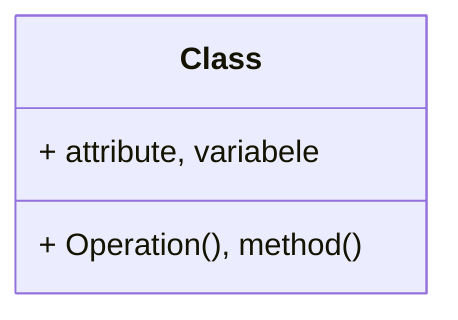
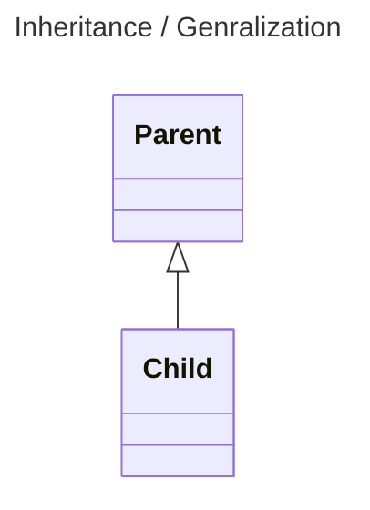
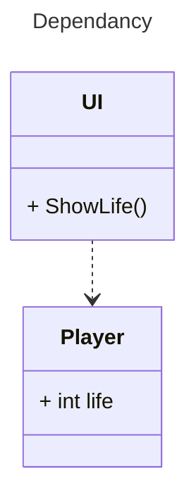
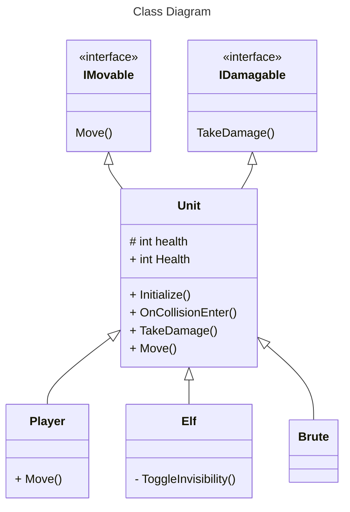
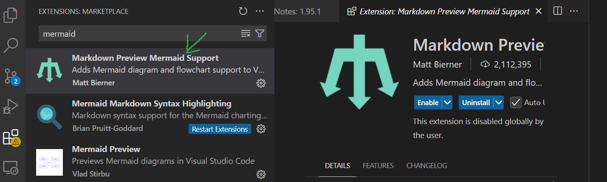
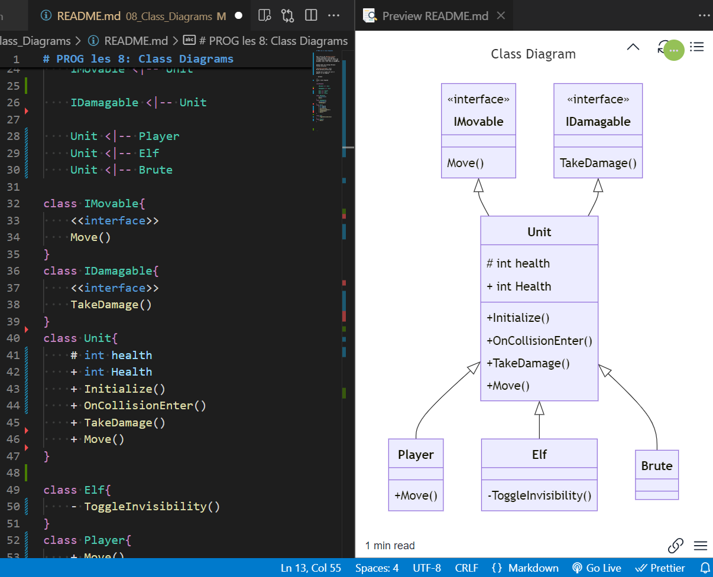
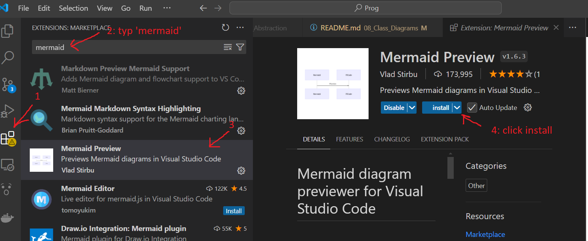

# PROG les 8: Class Diagrams

In deze les gaan we het hebben over class diagrams. [neem deze presentatie door](ClassDiagrams.pdf).

## UML

Een class diagram is onderdeel van de **UML** oftewel de **Unified Modelling Language**. Dit is een verzameling van modellen waarmee je technische ontwerpen kunt maken van sotware en code. [Meer over UML vind je hier.](https://www.uml.org/)

## Nut

Een class diagram kun je op 3 manieren goed inzetten:

1. Het in kaart brengen van een reeds bestaande codebase om zo weer een beetje overzicht te creeeren.

2. Het ontwerpen van je codebase voordat je begint met programmeren zodat je een beginstructuur hebt waar je binnen kunt blijven.

3. Het uitleggen van je structuur aan andere developers.

## Onderdelen van een class

In een class diagram kun je al je classes weergeven uit een project. Je kunt daarbij de **inhoud** van die classes zichtbaar maken. Dit zijn de **Attributes** en **Operations** van een class. Oftewel de **variabelen** en **methoden** van een class.



## Relaties, Inheritance & Generalization

In een class diagram kun je ook de relaties die verschillende classes met elkaar hebben aangeven. Dit kunnen bijvoorbeeld relaties van overerving zijn (ook wel generalization).

Deze geef je aan in dit format:



In het bovenstaande voorbeeld erft de Child over van de Parent.

## Relaties, Dependancies

Vaak wordt er tussen classes informatie uitgewisseld. bijvoorbeeld via getters, setters en public methods. Je kunt dan spreken van een dependancy. Deze kun je in een class diagram ook weergeven met behulp van het volgende format:



In het bovenstaande voorbeeld is de UI afhankelijk van de Player class. Zonder de Player kan de UI geen **life** waarde krijgen en breekt de code.

In het volgende class diagram zie je een voorbeeld van de code van de [vorige opdracht](https://github.com/djsjollema/lessen-gamedevelopment/tree/main/M5/Prog/07_OOP_Abstraction#opdracht-10-abstraction-via-interfaces)

Hierin zie je naast de relaties en de inhoud van de classes ook nog de definitie van de bijbehorende interfaces.



## Mermaid

Om class diagrammen te maken heb je heel erg veel verschillende tools. Je zou het in photoshop kunnen doen of zelfs in paint(niet aan te raden). Echter is het lastigste niet de inhoud goed krijgen maar de ordening van de blokjes. Met de **Mermaid** tool gaat dat ordenen vanzelf en hoef je alleen de inhoud en de relaties van je classes aan te geven.

Mermaid werkt standaard in je markdown bestanden. Je kunt dit dus in je readme verwerken.

Hier vind je de [Mermaid syntax](https://mermaid.js.org/syntax/classDiagram.html) voor het maken van je eigen class diagrammen in je eigen markdown files (.md) zoals je README.md

Je kunt ook de bron van deze readme bekijken om te zien hoe ik de bovenstaande schema's in mermaid heb gemaakt.

VSCode heeft ook een handige Mermaid Preview extension. Het is ook zeker handig om die te installeren.



Hiermee kun je terwijl je bezig bent goed zien wat er gebeurt in je diagrammen.



## Opdracht 11: Class Diagram van je TD project

Maak een class diagram van alle code in je TD project.

Installeer de mermaid preview extension voor VSCode

Maak een markdown bestand genaamd ClassDiagramTD.md

Gebruik mermaid om al je classes met inhoud en relaties in kaart te brengen.

Hiervoor kun je de volgende syntax gebruiken:

````
```mermaid

//titel is optioneel
---
Title: Class Diagram Tower Defense
---

//geef aan dat je een class diagrm wil maken
classDiagram

//definieer je classes en bijhorende attributen en operaties
class MyClass{
    + Attribute     //public
    - attribute     //private
    + Operation()   //public
    - Operation()   //private
}


//geef alle relaties aan
//Overerving Relatie
ChildClass --|> ParentClass

//Dependancy relatie
DependentClass ..> MyClass

//2 richting relatie
MyClass <..> AnotherClass

```
````

Alleen global variables (gedefinieerd in je class en niet lokaal in een functie) en dependancies en inheritance relaties verwerk je in je class diagram.

push je readme in een mapje op je TD repo op github en lever een link in naar de readme via simulise. Lever ook een link in naar je Scripts folder op github waar alle classes ook terug te vinden zijn.
