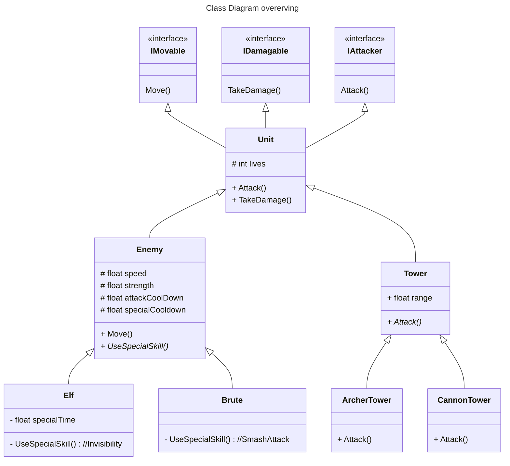

# PROG les 8: Class Diagrams

[Mermaid syntax](https://mermaid.js.org/syntax/classDiagram.html)

```mermaid

---
title: Class Diagram overerving
---

classDiagram

    IMovable <|-- Unit
    IDamagable <|-- Unit
    IAttacker <|-- Unit

    Unit <|-- Enemy
    Unit <|-- Tower

    Enemy <|-- Elf
    Enemy <|-- Brute

    Tower <|-- ArcherTower
    Tower <|-- CannonTower

class IMovable{
    <<interface>>
    Move()
}
class IDamagable{
    <<interface>>
    TakeDamage()
}
class IAttacker{
    <<interface>>
    Attack()
}
class Unit{
    # int lives
    + Attack()
    + TakeDamage()
}
class Enemy{
    # float speed
    # float strength
    # float attackCoolDown
    # float specialCooldown
    + Move()
    + UseSpecialSkill()*
}
class Elf{
    - float specialTime
    - UseSpecialSkill() //Invisibility
}
class Brute{
    - UseSpecialSkill() //SmashAttack
}
class Tower{
    + float range
    + Attack()*
}
class ArcherTower{
    + Attack()
}
class CannonTower{
    + Attack()
}


```
