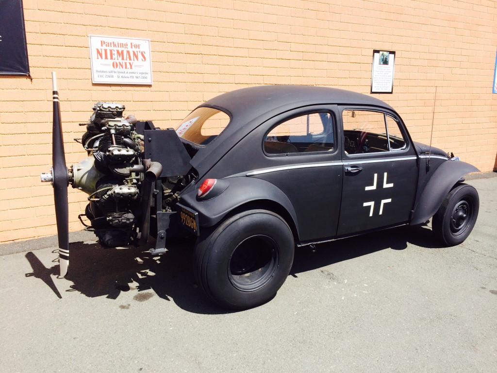

# PROG les 8: OOP Abstraction en Polymorfisme

Abstractie en Polymorfisme zijn ook onderdeel van OOP en gaan in de praktijk vaak samen en worden veel door elkaar gebruikt. Ze dienen alleen beiden andere specifieke doelen. Maar hebben ook als gemeenschappelijk doel dat het de code beter leesbaar, onderhoudbaar en uitbreidbaar maakt.

### Doelen van Abstractie:


**Complexiteit verbergen:** Vereenvoudigt de interactie met een object door alleen essentiële functies te tonen en de interne details te verbergen.

**Duidelijkheid:** Biedt een helder overzicht van wat een object kan doen zonder te onthullen hoe het werkt.

### Doelen van Polymorfisme:


**Uniformiteit:** Laat verschillende objecten dezelfde methoden gebruiken, zodat ze consistent als overkoepelend type behandeld kunnen worden, ongeacht hun specifieke type.

**Uitbreidbaar:** Maakt het eenvoudig om nieuwe objecten toe te voegen die op dezelfde manier werken zonder bestaande code aan te passen.

**Dynamisch gedrag:** Biedt objecten de mogelijkheid om op unieke manieren te reageren op dezelfde methode-aanroep.

## Deel 1: Abstraction

Abstractie maakt complexe systemen eenvoudiger door onnodige details te verbergen en alleen de essentiële onderdelen beschikbaar te maken.

Met abstractie richt je je op **wat** een object doet in plaats van **hoe** het dat doet. Dit betekent dat je een algemene beschrijving geeft van een object of functie, zonder in te gaan op de specifieke implementatie van functionerende code.

Bijvoorbeeld: een **Auto**

Je weet dat een auto kan rijden, stoppen en de snelheid kan aanpassen. Dit zijn de essentiële functies van een auto.

Details verborgen door abstractie: Hoe de motor werkt, hoe de remmen functioneren, en hoe de snelheid precies wordt aangepast, zijn details die verborgen blijven.

## Polymorphism

Polymorfisme betekent letterlijk "veelvormigheid". Het stelt verschillende objecten in staat om te reageren op dezelfde methode-aanroepen, ook al hebben ze verschillende implementaties van die methode. Denk aan het "Rijden" op een fiets of in een auto. Ze kunnen beiden rijden maar dit werkt wel heel anders.

Het doel van polymorfisme is om flexibele en uitbreidbare code te schrijven. Hierdoor kan je verschillende objecten, die afgeleide vormen zijn van een gemeenschappelijke basisklasse, op dezelfde manier behandelen, ongeacht hun specifieke type.

## Het Verschil

Bij Abstractie en Polymorphisme maak je gebruik van overerving.

Bij abstracte overerving kun je de abstracte basis klasse niet instantieren, of hiervan een methode aanroepen.

Bij Polymorfisme kun je dit wel.

Abstractie gebruikt de keywords **abstract** (parent class) en **override** (subclass).

Polymorfisme gebruikt de keywords **virtual** (parent class) en **override** (subclass)

### Abstractie voorbeeld:

```
    public abstract class Vehicle
    {
        public abstract void Drive();
    }
    public class Car : Vehicle
    {
        public override void Drive()
        {
            Debug.Log("VROEM");
        }
    }
    public class Game:MonoBehaviour
    {
        private void Start(){
            Vehicle vehicle = new Vehicle();    //Mag niet!
            Car car = new Car();                //Mag wel!
        }
    }

```

### Polymorfisme voorbeeld:

```
public class Vehicle
{
    public virtual void Drive(){
        Debug.Log("we're driving something");
    }
}
public class Car : Vehicle
{
    public override void Drive()
    {
        Debug.Log("VROEM");
        base.Move();        //out:"we're driving something"
    }
}
public class Game:MonoBehaviour
{
    private void Start(){
        Vehicle vehicle = new Vehicle();    //Mag wel!
        Car car = new Car();                //Mag wel!
    }
}
```

### Abstractie gebruiken



Ons Voertuig heeft meerdere child klassen zoals Auto, Fiets en Bus maar mag zelf niets zijn. Voertuig is enkel een verzamelnaam.

Niemand van jullie pakt "het voertuig" naar school, maar de trein, bus, auto en of de fiets.

Elke sub-klasse krijgt een eigen implementatie van de **Move()**-methode maar Vehicle class niet.

Waarom past **Move** beter als methodenaam dan **Drive**?

```
public abstract class Vehicle
{
    public abstract void Move();
}
public class Car : Vehicle
{
    public override void Move()
    {
        Debug.Log("we rijden in een auto");
    }
}
public class Bike : Vehicle
{
    public override void Move()
    {
        Debug.Log("we rijden op de fiets");
    }
}
public class Bus : Vehicle
{
    public override void Move()
    {
        Debug.Log("We rijden in de bus");
    }
}
public class Train : Vehicle
{
    public override void Move()
    {
        Debug.Log("Tjoeke tjoeke!!");
    }
}
```

In het bovenstaande geval gebruiken we dus **Abstractie** om verschillende soorten objecten als gelijkwaardig behandelen. Ze zitten immers in de basis op dezelfe manier in elkaar. Ze bevatten in dit geval allemaal de methode Move().

We kunnen nu alle subclasses als een Vehicle behandelen. Bijvoorbeeld door ze allemaal in een lijst met hetzelde type te zetten.

Toch doen ze allemaal iets anders wanneer de methode **Move()** wordt aangeroepen.

```
public class Game:MonoBehaviour{
List<Vehicle> vehicles;
    void Start(){
        vehicles = new List<Vehicle> { new Car(), new Train(), new Bike(), new Bus() };
        foreach(Vehicle v in vehicles){
            v.Move();
        }
    }
}
```

## Met of zonder implementatie

Bij een abstracte klasse kun je methoden maken met of zonder implementatie. Dit betekent dus dat je de methode werkende code geeft of niet. Als je een methode maakt zonder implementatie moet je die in de child klasse wel een implementatie geven.

Abstracte methoden moeten door hun child class verplicht worden geimplementeerd. Er moet dus een invulling voor komen met werkende code.

Hier zie je een voorbeeld van abstarctie **met** en **zonder** implementatie:

```
using UnityEngine;

public abstract class Unit : MonoBehaviour
{
    protected string name;

    // Abstract dus zonder implementatie
    public abstract void Attack();

    // Met implementatie
    public void Move()
    {
        Debug.Log(name + " is moving.");
    }
}

public class Archer : Unit
{
    // Implementatie van de abstracte methode uit Unit
    public override void Attack()
    {
        Debug.Log(name + " shoots arrows");
    }

    void Start()
    {
        name = "Hank";
        Attack();       // Output in de Console: Hank shoots arrows
        Move();         // Output in de Console: Hank is moving.
    }
}
```

De child class **moet** een implementatie maken voor de abstracte methode. Als ik een abstracte methode niet implementeer in een child class krijg ik een error:


Als ik zou proberen om de abstracte class te instantieren krijg ik ook een error:


---

### Oefening Abstraction

Maak nu zelf de volgende classes:

- Zoo : MonoBehariour
- Animal
- Bird
- Dog
- Elephant

Welke van deze is de abstracte class?

Maak een abstracte methode in de Abstracte class die **Move** heet. Deze mag geen implementatie hebben.

Geef alle dieren een eigen implementatie van de `Move` methode. Bijvoorbeeld: `Debug.Log("Flaps it's wings")`

Maak in de abstracte class ook een methode **Eat** die je de volgende implementatie geeft : `Debug.Log("Njam Njam");`

Maak in de Zoo class alle dieren aan en zet ze in een List of Array die **animals** heet.

Roep met een loop voor alle dieren de methode **Eat** en **Move** aan.

Test je code door Zoo.cs aan de camera te hangen in unity.

---

## Deel 2: Polymorphisme en virtual

Stel je een game voor met verschillende personages, zoals krijgers, magiërs en boogschutters. Elk personage kan op een andere manier "aanvallen". Slaan, Vuurballen gooien en pijlen schieten. Ze delen allemaal dezelfde actie: "Aanvallen".

Voor elk type komt er dus een andere code-"implementatie" van de aanval.


Om dit te doen gebruik je wederom overerving en de keywords **virtual** (in plaats van abstract) en **override**.

```
public class Character : MonoBehaviour
{
    public virtual void Attack()
    {
        Debug.Log("Character valt aan");
    }

}
```

Je baseclass / parent class heeft een methode die **virtual** is. En dus overschreven kan worden.

```
public class Warrior : Character
{
    public override void Attack()
    {
        Debug.Log("Krijger zwaait met een zwaard!");
    }
}
```

Net als bij abstraction gebruik je het **override** keyword om de daadwerkelijke implementatie van de code uit te voeren.

```
public class Mage : Character
{
    public override void Attack()
    {
        Debug.Log("Magiër werpt een vuurbal!");
    }
}
```

## Polymorfisme en Interfaces

Een interface is een soort sjabloon of contract dat bepaalt welke methoden of eigenschappen een klasse moet implementeren, zonder dat het specificeert hoe die methoden of eigenschappen moeten worden geïmplementeerd.

Door interfaces te gebruiken zorg je ervoor dat je classes zich allemaal aan dezelfde afspraken houden en je dus snel en zonder problemen nieuwe classes kunt koppelen die op dezelfde manier gebouwd zijn.

De interface heeft geen implementatie (werkende code) en geeft dus alleen aan wat er in een class moet gebeuren. Als een contract dus. Er mag dus geen werkende code in een interface worden gezet, zoals dat wel kan en mag in een class waarvan je overerft.

Bij overerving kan een class alleen een child zijn van 1 andere class. Bij interfaces kun je er meerdere implementeren. Je er zoveel koppelen aan je class als gewenst.

Interfaces kunnen worden gebruikt naast overerving. Een class kan dus overerven van een base class en tegelijkertijd meerdere interfaces hebben.

Zo definieer je een interface:

```
public interface IMyInterface                   //Om een interface gelijk te herkennen is het handig om een "I" aan het begin van de naam te zetten.
{
    int Value { get; set; }                     //een interface kan getters en setters (eigenschappen) afdwingen
    void MyMethod(int myValue);                 //een interface kan methoden eventueel met parameters en return values afdwingen
    static event Action OnSomethingHappened;    //een interface kan events afdwingen
}

```

Zo koppel je een class aan een interface en implementeer je de onderdelen:

```
public class Implementation : IMyInterface
{
    public static event Action OnSomethingHappened;
    private int myValue = 0;
    public int Value
    {
        get { return myValue; }         //Implementeer de Getter
        set { myValue = value; }        //En of de Setter
    }
    public void MyMethod(int myValue)
    {
        //implementeer de methode
        //trigger het event
        OnSomethingHappened?.Invoke();
    }
}
```

Zo koppel je meerdere interfaces

```
public class Implementation : IMyInterface1, IMyInterface2, IMyInterface3
{
    // De methoden, eigenschappen en events uit alle interfaces moeten geimplementeerd worden
}
```

Zo combineer je overerving van een baseclass met interfaces:

```
public class Implementation : BaseClass, IMyInterface1, IMyInterface2, IMyInterface3
{
    // De methoden, eigenschappen en events uit alle interfaces moeten geimplementeerd worden
}
```

Hier is een concreter voorbeeld van het gebruik van een interface:

```
public interface IDamageable
{
    static event Action OnDeath;
    int Health { get; }
    void TakeDamage(int amount);
}

```

Via de bovenstaande interface dwing ik alle classes die deze interface gebruiken om 3 dingen te implementeren. Namenlijk

1. Een Action genaamd **OnDeath** die moet worden verstuurd als het leven van het object op is.
2. Een **getter** voor de variabele health waarmee een andere class de health variabele enkel kan uitlezen en niet wegschrijven.
3. De methode **TakeDamage()** met als parameter de int amound die daar aan meegegeven moet worden. Uiteraard voor het verminderen van levens.

De implementatie van het interface in een andere class gaat dan als volgt:

```
public class Player : MonoBehaviour, IDamageable
{
    private int health;
    //1:
    public static event Action OnDeath;
    //2:
    public int Health
    {
        get { return health; }
    }
    // 3:
    public void TakeDamage(int amount)
    {
        health -= amount;
        Debug.Log("Player took " + amount + " damage. Health now: " + health);
        if(health<=0>)OnDeath?.Invoke();
    }
}

```

Als ik een onderdeel uit de interface niet implementeer zal ik een error krijgen.


Dit helpt mij dus om alle classes die dezelfde functionaliteit met elkaar delen op de zelfde manier te bouwen en te structureren.

### Opdracht 12: Polymorphisme via Interfaces

Werk verder aan het prototype van [Opdracht 8: Inheritance](https://github.com/djsjollema/lessen-gamedevelopment/tree/main/M5/Prog/05_OOP_Inherritance#opdracht-8-inheritance). Doe dit in een nieuwe branch want er moet het een en ander worden omgegooid. Het zou jammer zijn als de vorige opdracht straks stuk is.


Zorg naast de Classes **Brute** en **Elf** ook voor de class **Player**.

Hernoem de class **EnemyParent** naar **Unit**. Zorg dat Brute, Elf en Player allemaal overerven van **Unit**.

Maak de volgende interfaces: **IDamagable**, **IMovable** en zorg dat **Unit**, **Player**, **Brute** en **Elf** allemaal overerven van deze interfaces.

```
public class Unit : MonoBehaviour, IMovable, IDamagable

public class Player : Unit, IMovable, IDamagable

public class Brute : Unit, IMovable, IDamagable

public class Elf : Unit, IMovable, IDamagable

```

```
public interface IMovable
{
    void Move();
}
```

```
public interface IDamagable
{
    int Health { get; }
    void TakeDamage();
}
```

#### Rondlopen via IMovable

Zorg dat de speler rond kan lopen over het veld met de pijltjestoetsen.

Je mag hiervoor deze code gebruiken:

```
transform.position += transform.forward * moveSpeed * Time.deltaTime * Input.GetAxis("Vertical");
transform.Rotate(Vector3.up*rotationSpeed*Time.deltaTime * Input.GetAxis("Horizontal"));
```

Zorg dat de Elf en de Brute vanzelf naar rechts gaan. (zoals bij opdracht 8)

Implementeer de **Move()** methode in **Player** en in **Unit**. Brute en Elf hebben geen implementatie nodig omdat ze zich net zo moeten gedragen zoals in Unit.

Voor **Player** implementeer je code in **Move()** waarmee je met de pijltjes of WASD kunt rondlopen.

#### Doodgaan via IDamagable

Zorg ervoor dat alle units geraakt kunnen worden en doodgaan door de kogels die je vanaf de camera schiet. (zoals in opdracht 8).

Gebruik hiervoor een methode **TakeDamage()** die je ook eerst definieert in de **IDamagable** Interface. Implementeer deze enkel in **Unit**. Zowel Player als Brute en Elf gaan allemaal op dezelfde manier dood.

Zo ziet je structuur er nu uit:


Dit zijn je bestanden:


Dit is ongeveer het werkende resultaat (met of zonder animaties):


Net als bij opdracht 8 zijn animaties niet verplicht. Deze gelden als Bonus opdracht.

Dubbelcheck goed of alle code in de juiste classes staat. is je code nog DRY? Werkt alles zoals het moet?

- **_Push je code naar github en maak een screen capture van je werkende prototype._**
- **_Lever een link je code en je gifje in via Simulize._**

### Bonus : Animaties

Zorg dat alle animaties nog goed werken. Voeg ook een idle toe aan de player voor het geval je niets doet in de game.
