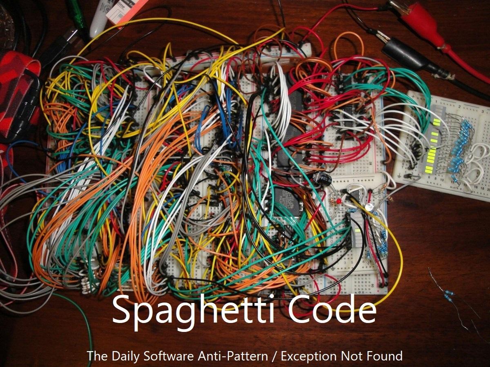
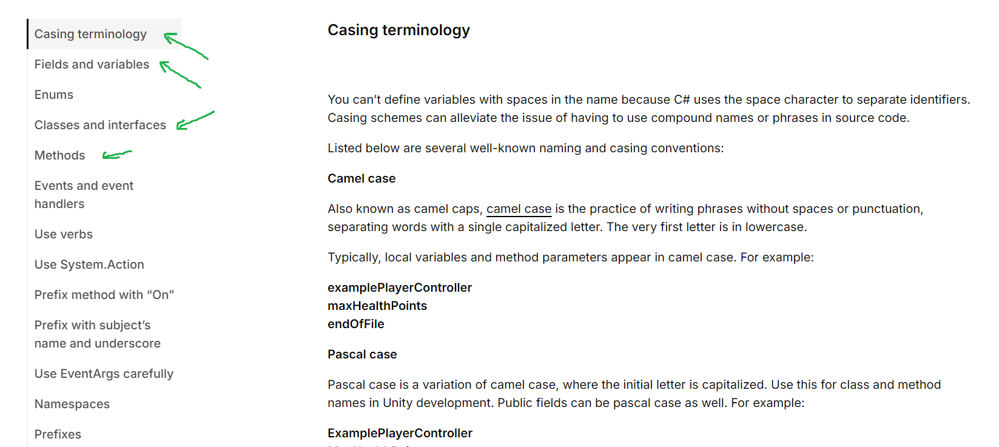

# PROG les 9: Code Conventions


## Waarom gebruik je code conventies?

### Leesbaarheid en Begrip

Als je code schrijft volgens vastgestelde conventies, is het gemakkelijker voor anderen (inclusief jezelf!) om later te begrijpen wat de code doet. Je houden aan deze conventies zorgt ervoor dat je meteen ziet waar functies, variabelen en belangrijke blokken zich bevinden en wat ze doen.



### Samenwerking

Bij projecten waarin meerdere programmeurs werken, helpt een consistente stijl om de samenwerking soepeler te laten verlopen. Iedereen schrijft code op een vergelijkbare manier, waardoor het eenvoudiger is om elkaars werk te begrijpen en hierop door te werken.

### Onderhoudbaarheid

Door conventies te volgen, wordt code makkelijker aan te passen of te debuggen. Als je bijvoorbeeld ooit terug moet naar een stuk code van maanden geleden, zorgt een goede stijl ervoor dat je snel kunt begrijpen wat er gebeurt en wijzigingen kunt aanbrengen zonder fouten.

### Vermijden van Fouten

Bepaalde codeconventies zijn gericht op het voorkomen van veelvoorkomende fouten. Bijvoorbeeld, duidelijke naamgeving voor variabelen en functies kan helpen voorkomen dat je per ongeluk iets verkeerd gebruikt of aanroept.

### Professionaliteit

In de professionele wereld wordt verwacht dat je schrijft volgens conventies. Dit laat zien dat je niet alleen technische vaardigheden hebt, maar ook aandacht voor detail en respect voor teamafspraken.

## Wat zet je in je code conventies?

**Naamgeving:** Omschrijf hoe je namen geeft aan variabelen, functies, klassen en andere elementen in de code (bijvoorbeeld camelCase voor variabelen, PascalCase voor classes en functions). Geef hierbij ook duidelijke voorbeelden. Of bijvoorbeeld een maximum aantal woorden

```
//variables use camelCase
private int highScore = 0;

//no more than 3 words
private float thePlayerHighScoreModifier;

//don't shorten words
private float plScMod;

//max 3 words , unshortend
private float playerScoreModifier;

//functions Use PascalCase
private void MyFunction(){

}
```

**Indeling en Opmaak:** Waar en hoe je inspringing (tabjes), witruimte en nieuwe regels gebruikt om de code overzichtelijk en consistent te houden. Staat de curly brace `{` achter je functie declaratie of eronder?

```
class MyClass{
    void function(){

    }
}

```

```
class MyClass
{
    void function()
    {

    }
}

```

**Structuur:** Hoe je de structuur van een bestand bepaalt, zoals de volgorde van functies, declaraties en andere onderdelen.
Bijvoorbeeld kun je starten met je private variables en daarna alle public variables en getters en setters.

```
class Example:Monobehavior {
    //eerst private
    private float time = 0;

    //dan protected
    protected int lives = 5;

    //dan public of getters en setters
    public Time {
        get {
            return time;
        }
    }

    //dan private functies
    private void DoSomethingPrivate(){

    }

    //dan methods
    public void DoAnotherThing(){

    }

}
```

**Commentaar:** Regels voor het gebruik van commentaar om code beter te documenteren, zodat anderen (en jijzelf) de logica en intentie kunnen begrijpen.

Wanneer zet je wel en geen commentaar in je code? Wanneer moet de naam van je functie voldoende zijn? Wanneer schrijf je bijvoorbeeld een summary.

```
//single-line comment

/*
multi-line
comment
*/

/// single-line summary

/**
multi-line
summary
/

```

Tip: _Summaries kun je exporteren naar online documentatie met tools zoals [DoxyGen](https://www.doxygen.nl/download.html)_

**Best Practices:** Aanbevelingen om fouten te vermijden en de code efficiënter en leesbaarder te maken, zoals het vermijden van dubbele code of het gebruik van duidelijke en betekenisvolle functie- en variabele namen.

```
    // Wat is duidelijker?

    public int Calculate(){
        int s = (bs * lmod) + (lives * liMod);
        return s;
    }

    //of..

    public int CalcScore(){
        int finalScore = (baseScore * scoreModifier) + (lives * lifeModifier);
        return finalScore;
    }


```

Kortom, codeconventies zijn bedoeld om een gemeenschappelijke "taal" voor code te creëren, zodat iedereen die eraan werkt of de code leest, dezelfde afspraken en patronen volgt. Dit maakt de code consistenter en daardoor makkelijker te lezen, begrijpen en onderhouden.

## Unity

Voor **Unity** kun je ook gebruik maken van de standaard codeconventions die door de Unity community zelf zijn opgesteld. Dit is een mooie basis om verder uit te bouwen naar eigen behoefte. De Unity code conventions zijn heel uitgebreid en [hier te vinden](https://unity.com/how-to/naming-and-code-style-tips-c-scripting-unity).

### Opdracht 13:

Lees de volgende onderdelen uit de Unity code conventions goed door:

- Casing terminology
- Fields and variables
- Classes and interfaces
- Methods



Ga door de codebase van je project heen en zorg dat je code voldoet aan al deze Unity code conventions. (Minimaal 3 classes)

Denk zelf ook na over het gebruiken van comments. Wat wil jij zelf graag in de comments verwerken. Wat voor infomatie wil je wel in je comments hebben en wat niet en waarom? geef ook een voorbeeld van een goede en een voorbeeld van een slechte comment. Verwerk dit in een readme met de naam CommentingConvention.md

Zorg dat de 3 classes ook gecomment zijn volgens je eigen Commenting Convention.

Commit en push de readme met de commenting conventions, lever de link in. Lever ook een link in naar de 3 scripts die aan de Unity code conventions voldoen.

### Bonus: DoxyGen

Schrijf voor deze 3 classes en bijhorende methods summaries en exporteer deze via DoxyGen.

Omschrijf in de summaries de verantwoordelijkheid van de class en de wat de functions doen en hoe je ze aan kunt roepen.
