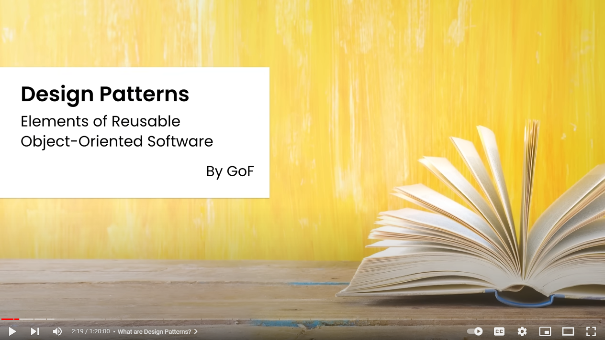
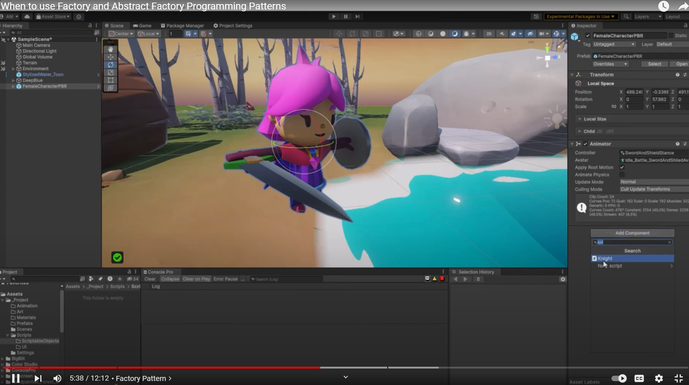
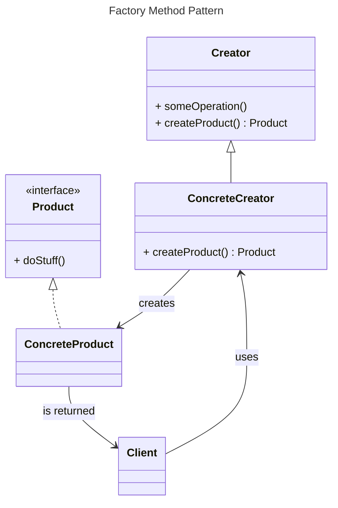
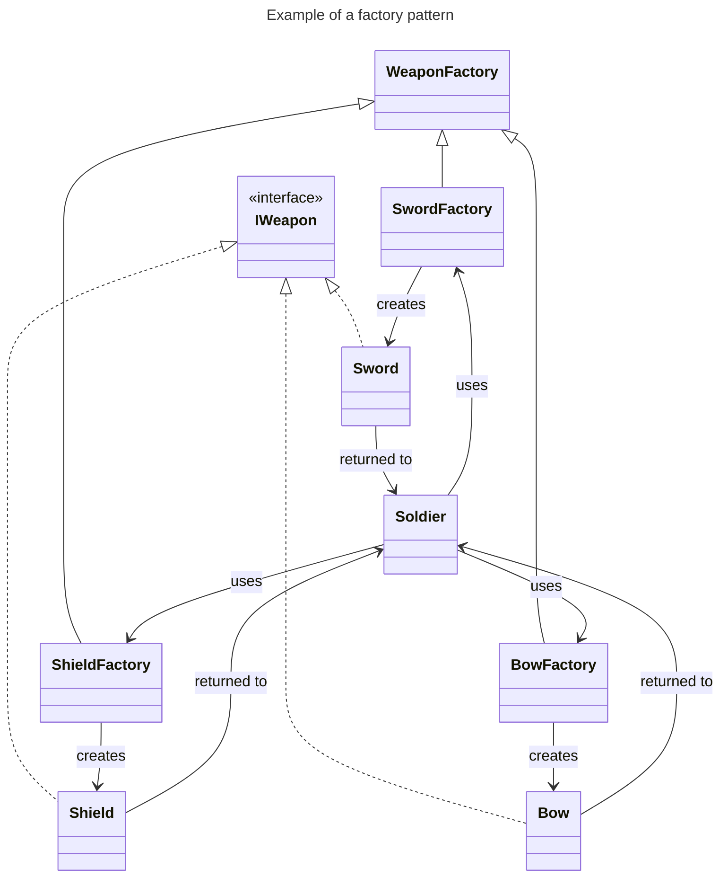
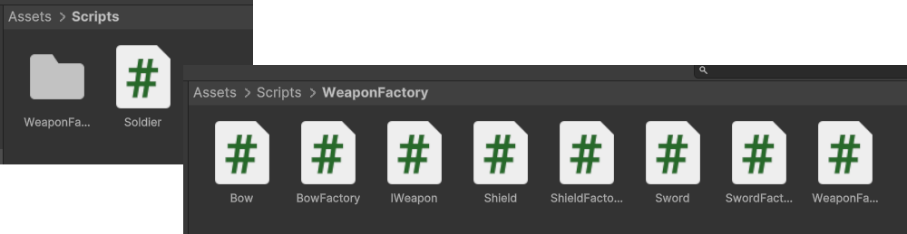
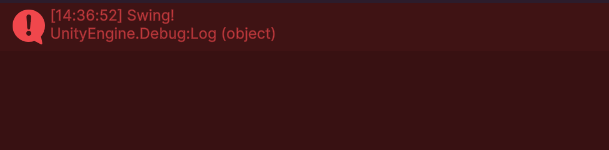
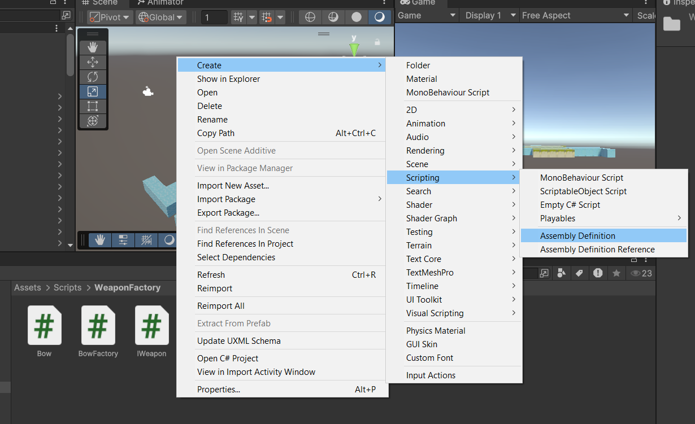
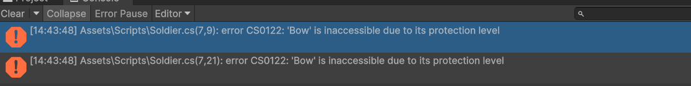
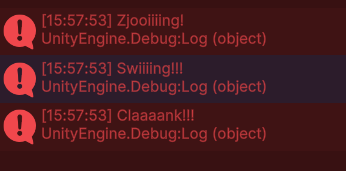

# PROG les 10 :

## Creational Design Patterns

## Factory Method Pattern

<span style="font-size:1.4em">
Wat is een design pattern oftewel; een ontwerppatroon?
</span>

<span style="font-size:0.7em">

_"a general repeatable solution to a commonly occurring problem in software design."_

_"The pattern is not a specific piece of code, but a general concept for solving a particular problem."_

_"Patterns are a toolkit of solutions to common problems in software design."_

_"Represent the best practices used by experienced object-oriented software developers."_

_"Elegant solutions to repeating problems."_
<span>

<span style="font-size:1.4em">

Oftewel (in mijn eigen woorden), goede herbruikbare oplossingen voor veel voorkomende programmeer problemen.

[](https://youtu.be/NU_1StN5Tkk?si=4BPqW48QaJt9esPL&t=100)

Creational de sign patterns zijn geschikt voor het creeren van objecten in je game.

Dit voorkomt bijvoorbeeld een harde koppeling tussen objecten. welk object in je game maakt de torens aan? Wat gebeurt er met de torens als je dat object gaat verwijderen?

Ook voorkom je herhalende code in je project waardoor je niet op meerdere plekken je code hoeft aan te passen als je iets aan je torens wil wijzigen.

Er zijn meerder creational design patterns namelijk:

- Singleton Pattern
- Factory Method Pattern
- Abstract Factory Pattern
- Builder Pattern
- Prototype Pattern

Allemaal hebben ze specifieke voor en nadelen zijn zijn ze geschikt voor specifieken doeleinden.

Voor deze les gaan we ons verdiepen in de **"Factory Method Pattern"**. Juist omdat deze heel goed aansluit bij het bouwen van een towerdefense game en dan met name voor de creatie van de verschillende units in je game zoals de torens en de enemies.

[Deze uitleg](https://youtu.be/Z1CDJASi4SQ?si=zH0Lr_Zjl8UQGzzp) Geeft ook een goed beeld van het patroon.
[](https://youtu.be/Z1CDJASi4SQ?si=zH0Lr_Zjl8UQGzzp)

Het probleem dat wordt opgelost met een factory method pattern is dat er zonder problemen uitbreiding plaats kan vinden van verschillende typen producten die je wil kunnen toevoegen aan je game. Denk aan verschillende soorten wapens, torens of enemies.

Je wil voorkomen dat je op verschillende plekken in je code aanpassingen moet gaan maken om die ene nieuwe toren toe te kunnen voegen.

Dit heeft ook te maken met het **open and closed principe** _"open for extension closed for modification."_ Open voor uitbreiding en gesloten voor aanpassing. Met behulp van het factory pattern kun je de game uitbreiden met nieuwe typen wapens, torens etc. zonder dat er code voor moet worden aangepast.

De stuctuur voor een Factory Method Pattern ziet er als volgt uit:



Dit is een voorbeeld van een factory pattern zoals die kan worden geimplementeerd bij het maken van wapens in je game:



We gaan de bovenstaande structuur nabouwen zodat we uiteindelijk onze eigen facory method pattern hebben.

**Opdracht 1:**
Maak een **"/Scripts"** folder aan in je unity project als die er nog niet is.

Maak in je Scripts folder een Script en Class voor Soldier.

Maak in de Scripts folder ook een folder **"/WeaponFactory"** aan.

In je WeaponsFactory folder maak je de scripts voor de overige classes uit het schema.

Let op want IWeapon is geen class maar een interface [die definieer je zo](https://www.w3schools.com/cs/cs_interface.php)

Je structuur zal er dan zo uitzien:



**IWeapon:**

```
public interface IWeapon
{
    internal void DoStuff();
}
```

**Sword, Bow, Shield**

```
using UnityEngine;
internal class Bow:IWeapon
{
    internal void DoStuff() {
        Debug.Log("Zjaaaanggg!");
    }
}
```

**Soldier**

```
using UnityEngine;
public class Soldier : MonoBehaviour
{
    // Start is called once before the first execution of Update after the MonoBehaviour is created
    void Start()
    {
        Bow b = new Bow();
        b.DoStuff();
    }

    // Update is called once per frame
    void Update()
    {

    }
}

```

Hang je Soldier script aan de camera en test de code. Je krijgt nu een swing te zien van je zwaard!



De bedoeling is dat je code is afgeschermd dus we moeten zorgen dat je Soldier niet zomaar een zwaard kan aanmaken. Dat moet immers gedaan worden door de SwordFactory!

**Opdracht 2:**

Om code via het keyword **"internal"** af te schermen in unity moet je zorgen dat de **"assemblies"** (brokken gecompilede code in een DLL) goed zijn gedefinieerd. De map **"/WeaponFactory"** moet verwerkt worden in een eigen geisoleerde assembly. Dit doe je door in deze map een **"Assembly Definition Asset"** te maken.



Noem deze **"WeaponFactory"** zoals de naam van de map.

Als je de de code weer runt krijg je als het goed is de volgende errors:



Je producten (Bow, Sword, Shield) zijn nu succesvol afgeschermd voor code van buitenaf!

**Opdracht 3:**
We gaan nu een werkende BowFactory maken. Om te beginnen maken we de abstacte **"WeaponFactory"** class aan:

```
public abstract class WeaponFactory
{
    public abstract IWeapon CreateWeapon();//factory method
    public IWeapon GetWeapon() {
        IWeapon weapon = CreateWeapon();
        weapon.DoStuff();
        return weapon;
    }
}
```

Dan de **"BowFactory"**:

```
public class BowFactory : WeaponFactory
{
    public override IWeapon CreateWeapon()
    {
        return new Bow();
    }
}
```

Let op dat de factory classes **public** zijn en niet **internal** zoals de Bow class. De Soldier moet namelijk wel bij de factory kunnen komen. Zodat die een Bow voor hem kan aanmaken!

Maak nu vanuit de **Soldier** class een nieuwe **bowfactory** aan en laat deze nu een boog voor je soldier aanmaken.

```
using UnityEngine;
public class Soldier : MonoBehaviour
{
    // Start is called once before the first execution of Update after the MonoBehaviour is created
    void Start()
    {
        BowFactory bowFactory = new BowFactory();
        IWeapon bow = bowFactory.GetWeapon();
    }
}
```

**Opdracht 4**

Maak nu ook de SwordFactory en de ShieldFactory af en geef je soldier via deze factories ook een zwaard en schild.



Contoleer dat de wapens niet rechtstreeks aan te maken zijn!


**Opdracht 5**

Pas je **WeaponFactory** script aan zodat deze als argument voor de methodes **_GetWeapon()_** en **_CreateWeapon()_** een string ontvangt met daarin het type wapen.

```
public abstract class WeaponFactory
{
    private string _type;
    public abstract IWeapon CreateWeapon(string type);//factory method
    public IWeapon GetWeapon(string type) {//some operation

        _type = type;
        IWeapon weapon = CreateWeapon(_type);
        weapon.DoStuff();
        return weapon;
    }
}
```

Voeg aan je verschillende factories meerdere typen wapens toe die als type "weak", "normal" en "strong" kunnen zijn:

```
public class BowFactory : WeaponFactory
{
    public override IWeapon CreateWeapon(string type)
    {

        if (type == "weak") {
            return new ShortBow();
        }
        else if (type == "normal")
        {
            return new Bow();
        }
        else if (type == "strong")
        {
            return new Ballista();
        }
        else
            return null;
    }
}
```

Creeer voor al deze wapens ook hun eigen classes die iets unieks loggen!

```
using UnityEngine;
internal class ShortBow : IWeapon
{
    public void DoStuff() {
        Debug.Log("flop!");
    }
}
```
