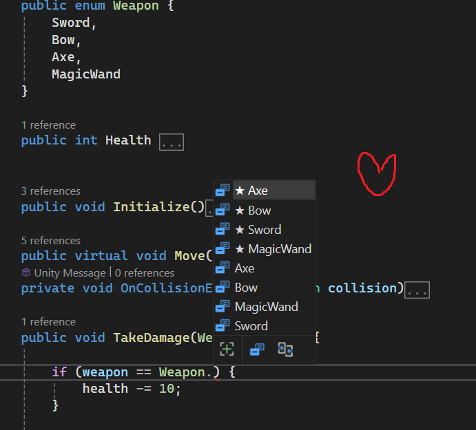

# PROG les 10: Enums


Een enum (afkorting van enumeration) is een speciaal gegevenstype in C# waarmee je een verzameling van verwante, vaste waarden kunt definiëren. Elke waarde in een enum heeft een betekenisvolle naam. Dit maakt de code leesbaarder en begrijpelijker.

## Hoe werkt een enum?

Een enum definieert een lijst van constante waarden die je als een type kunt gebruiken. Elk element in een enum krijgt automatisch een integer-waarde toegewezen, beginnend vanaf 0, tenzij je zelf specifieke waarden toewijst. Omdat elk element in een enum een naam heeft, is het meteen duidelijk waarvoor het staat, wat bijdraagt aan de leesbaarheid van de code.

## Voorbeeld:

Stel dat je een spel hebt waarin de speler verschillende moeilijkheidsgraden kan kiezen: Easy, Medium, en Hard. Met een enum kun je deze moeilijkheidsgraden op een duidelijke en gestructureerde manier definiëren.

```
public enum DifficultyLevel
{
    Easy, // 0
    Medium, // 1
    Hard // 2
}
```

Hier heeft elk element een eigen integer-waarde (automatisch vanaf 0). Wanneer je DifficultyLevel gebruikt in je code, kun je eenvoudig en zonder fouten werken met de moeilijkheidsgraden:

```
public class GameSettings : MonoBehaviour
{
    public DifficultyLevel currentDifficulty;

    void Start()
    {
        SetDifficulty(DifficultyLevel.Medium);  // Zet de moeilijkheidsgraad op Medium
    }

    void SetDifficulty(DifficultyLevel difficulty)
    {
        currentDifficulty = difficulty;
        Debug.Log("Moeilijkheidsgraad ingesteld op: " + currentDifficulty);
    }

}
```

Enums zijn ideaal voor situaties waarin je een beperkte en vooraf bekende reeks van opties nodig hebt. In Unity en C# zijn ze bijvoorbeeld handig voor status- of toestandsbeheer, zoals moeilijkheidsgraden, AI-toestanden, of soorten aanvallen.

Enums zijn ontzettend handig omdat ze betekenisvolle waarden definiëren in plaats van onduidelijke "magic numbers" of strings.
Zoals bijvoorbeeld de **"Magic Number"** hieronder:

```
public class GameSettings : MonoBehaviour
{
    public int currentDifficulty;

    void Start()
    {
        SetDifficulty(1);  // Zet de moeilijkheidsgraad op 1
    }

    void SetDifficulty(int difficulty)
    {
        currentDifficulty = difficulty;
        Debug.Log("Moeilijkheidsgraad ingesteld op: " + currentDifficulty);
    }

}
```

Hierboven maak ik gebruik van een int weet je als programmeur niet wat 1 dan betekent. Is het "easy"?,"medium"?,"hard"?. Ook je weet niet wat de maximale difficulty kan zijn. Wat nu als ik 10 invul? Wat krijg ik dan voor difficulty? of krijg ik een error omdat er geen difficulty bestaat van 10?

Wat nu als ik een **String** gebruik?

```
public class GameSettings : MonoBehaviour
{
    public string currentDifficulty;

    void Start()
    {
        SetDifficulty("eesy");  // Zet de moeilijkheidsgraad op "eesy"
    }

    void SetDifficulty(string difficulty)
    {
        currentDifficulty = difficulty;
        Debug.Log("Moeilijkheidsgraad ingesteld op: " + currentDifficulty);
    }

}
```

Zoals je wellicht ziet is dan de kans op een typo aanwezig. Moet ik nu "easy", "Easy" of "EASY" invullen? En welke moeilijkheidsgraden zijn er eigenlijk? Bestaat "Very Easy"? Hoe weet ik dat als developer? Moet ik ergens een lijst bijhouden met verschillende moeilijkheidsgraden?

## Code Completion

Dankzij de code completion van je IDE zal deze altijd de verschillende opties/elementen van de enum tonen. Hierdoor kun je geen fouten meer maken.



### Opdracht 14: Anti-Magic

Zoek in je code base naar een magic number of string. Vervang deze met een enum waarin alle mogelijke waarden verwerkt zitten.

Lever een link in naar de code op github.
