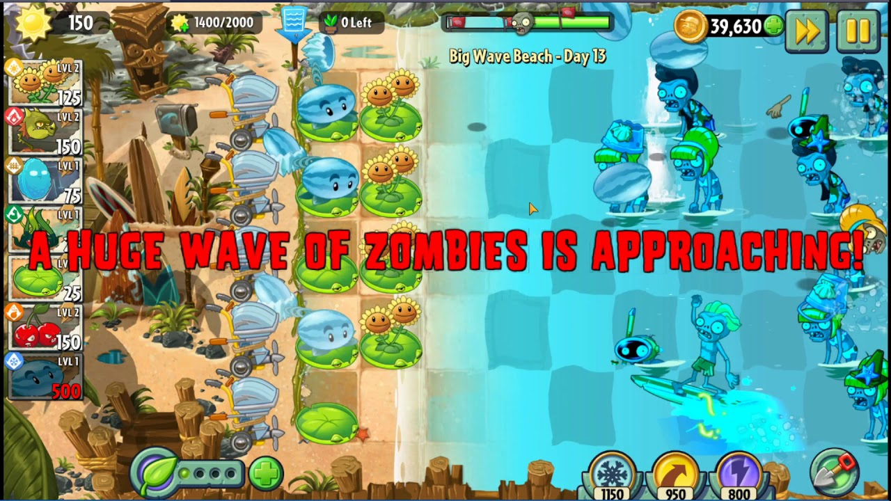

# PROG les 11: Delegates - UNDER CONSTRUCTION!


Eerder hebben jullie geleerd om met zogenaamde [Action Events](../02_Herhaling_Action_Events/README.md) te werken in Unity. De ondeliggende basis van deze Action Events zijn Delegates.

Een **Delegate** is als een verwijzing naar een methode die je kunt opslaan in een "variabele". Je kunt later die "variabele" gebruiken om de methode aan te roepen, net zoals je een telefoonnummer kunt bellen dat je in je telefoon hebt opgeslagen.


Een delegate kun je ook vergelijken met het geven (delegeren) van een taak aan iemand anders. Stel je voor:

Jij bent de manager en jij ziet dat het een rommel is.

Je hebt een taak die je niet zelf wilt of kunt uitvoeren, zoals "de vloer schoonmaken" of "papieren ordenen".

In plaats van de taak zelf te doen, wijs je anderen aan om dat specifieke werk te doen.

## Code Voorbeeld

Laten we een simpel voorbeeld bouwen met een monster dat doodgaat, een scorebord dat de score dan bijwerkt, en een WaveSystem dat het aantal actieve monsters bijhoudt en een nieuwe wave start als alle monsters verslagen zijn.

Het is niet de taak van het monster om de scores en de status van het wavesysteem te updaten. Toch moet dit wel gebeuren naar aanleiding van het monster dat doodgaat.



### Overzicht van de Klassen

**Monster:** Het monster dat gedood kan worden en dan de Delegate aanroept.

**Scoreboard:** Houdt de score bij en werkt deze bij wanneer een monster wordt gedood.

**WaveSystem:** Beheert de monster-spawning en start een nieuwe golf als er geen actieve monsters meer zijn.

**GameManager:** Koppelt de verschillende methoden aan de delegate en zorgt er zo voor dat de juiste acties worden uitgevoerd wanneer een monster sterft.

### Stap 1: De Delegate

Eerst definiëren we de delegate die zal worden aangeroepen wanneer een monster sterft. We plaatsen deze buiten de andere klassen zodat zowel het Scoreboard als het WaveSystem deze kunnen gebruiken.

```
public delegate void MonsterDeathDelegate();
```

### Stap 2: Monster

De Monster-klasse roept de OnMonsterKilled delegate aan wanneer het monster gedood wordt.

```
using UnityEngine;

public class Monster : MonoBehaviour
{
    public MonsterDeathDelegate OnMonsterKilled; // Delegate om acties te starten bij dood

    public void Kill()
    {
        Debug.Log("Monster is verslagen!");

        if (OnMonsterKilled != null)
        {
            OnMonsterKilled(); // Roep de delegate aan voor score en wave update
        }

        Destroy(gameObject); // Verwijder het monster uit de scène
    }
}
```

### Stap 3: Scoreboard

Het Scoreboard verhoogt de score elke keer als een monster gedood wordt.

```
using UnityEngine;

public class Scoreboard : MonoBehaviour
{
    rivate int totalScore = 0;

    public void UpdateScore()
    {
        totalScore += 100; // Verhoog score met 100 punten per monster
        Debug.Log("Score bijgewerkt! Totale score: " + totalScore);
    }

}
```

### Stap 4: WaveSystem

Het WaveSystem houdt het aantal actieve monsters bij. Wanneer dit aantal 0 bereikt, begint een nieuwe golf na 5 seconden.

```
using UnityEngine;
using System.Collections;

public class WaveSystem : MonoBehaviour
{
    [SerializeField] private int startCountMonsters = 3;
    [SerializeField] private int activeMonsters = 0;
    [SerializeField] private float waveDelay = 5f;

    public void DecreaseMonsterCount()
    {
        activeMonsters--;

        if (activeMonsters <= 0)
        {
            StartCoroutine(DelayedNextWave());
        }
    }

    private IEnumerator DelayedNextWave()
    {
        yield return new WaitForSeconds(waveDelay);
        SpawnWave();
    }

    public void SpawnWave()
    {
        activeMonsters = startCountMonsters;
    }

}
```

### Stap 5: GameManager

    De GameManager zorgt ervoor dat alles samenwerkt. Het creëert monsters, verbindt de delegates, en houdt alles overzichtelijk.

```
using UnityEngine;

public class GameManager : MonoBehaviour
{
    [SerializeField] private Monster monsterPrefab;
    [SerializeField] private Scoreboard scoreboard;
    [SerializeField] private WaveSystem waveSystem;
    [SerializeField] private float offsetX = 2f;

    void Start()
    {
        waveSystem.SpawnWave(); // Start de eerste wave
        //WIP not working YET!!

        SpawnMonsters();
    }

    // Methode om monsters te spawnen en delegates te verbinden
    private void SpawnMonsters()
    {
        for (int i = 0; i < waveSystem.activeMonsters; i++)
        {
            Monster spawnedMonster = Instantiate(monsterPrefab, new Vector3(i * offsetX, 0, 0), Quaternion.identity);

            // Voeg Methodes aan de Delegate toe
            spawnedMonster.OnMonsterKilled += scoreboard.UpdateScore;
            spawnedMonster.OnMonsterKilled += waveSystem.DecreaseMonsterCount;
        }
    }
}

```

### Parameters gebruiken

Aan een Delegate definitie kun je ook parameters toevoegen. Je kunt dankzij deze parameters dus informatie meesturen vanaf de bron waar de delegate aangeroepen wordt. Bijvoorbeeld het monster dat weet hoeveel punten hij zelf waard is en dit meegeeft.

Om dit te doen voeg je de parameter toe aan de definitie van de Delegate:

```
public delegate void MonsterDeathDelegate(int monsterScore);

```

Als het Monster dood gaat laat je hem zijn "waarde" meegeven:

```
using UnityEngine;

public class Monster : MonoBehaviour
{
    public MonsterDeathDelegate OnMonsterKilled;

    private int scoreValue = 500;

    public void Kill()
    {
        Debug.Log("Monster is verslagen!");

        if (OnMonsterKilled != null)
        {
            OnMonsterKilled(scoreValue); //Geef de score mee aan de Delegate
        }

        Destroy(gameObject);
    }
}
```

Alle methodes die via de Delegate worden aangeroepen moeten deze parameter nu ook ontvangen en verwerken. Dus bijvoorbeeld de methode **UpdateScore** uit de **ScoreBoard**-class.

```
using UnityEngine;

public class Scoreboard : MonoBehaviour
{
    private int totalScore = 0;

    public void UpdateScore(int value)
    {
        totalScore += value; // Verhoog score met de meegegeven waarde
        Debug.Log("Score bijgewerkt! Totale score: " + totalScore);
    }

}
```

Ook de methode **DecreaseMonsterCount** uit de **WaveSystem**-class, die ook via de delegate wordt aangeroepen moet nu de waarde van de score ontvangen.

```
public void DecreaseMonsterCount(int value)
{
        activeMonsters--;
        Debug.Log("Actieve monsters: " + activeMonsters);

        if (activeMonsters <= 0)
        {
            StartCoroutine(StartNextWave());
        }
    }
```

### Het discard symbol


De waarde die je ontvangt is in dit geval niet nodig voor de werking van de methode. De waarde is immers alleen maar meegegeven zodat het **ScoreBoard** deze kan verwerken. Om duidelijk te maken dat een parameter niet gebruikt wordt in een methode kun je gebruik maken van het "discard symbol" `_`. Dit is enkel een code conventie om de code duidelijk en leesbaar te houden. Dit symbool blijft technisch gezien wel een bruikbare variabele.

```
public void DecreaseMonsterCount(int _ ) //gebruik een discard symbol
{
        activeMonsters--;
        Debug.Log("Actieve monsters: " + activeMonsters);

        if (activeMonsters <= 0)
        {
            StartCoroutine(StartNextWave());
        }
    }
```

### Opdracht 15: Score Update

Wanneer krijg jij er score bij in je game? Als je een monster verslaat? Als je de finish bereikt? of als je een schat vind? Maak zelf ook minimaal één Delegate om het verhogen van je score in je scorebord aan te roepen.

Zorg dat je een waarde van je score aan je delegate mee kan geven voor de hoeveelheid score die erbij moet komen.

Zorg ook dat er een 2e methode via dezelfde Delegate wordt aangeroepen. Maak gebruik van het "discard symbol" als er een methode geen gebruik maakt van de score parameter.
