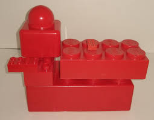
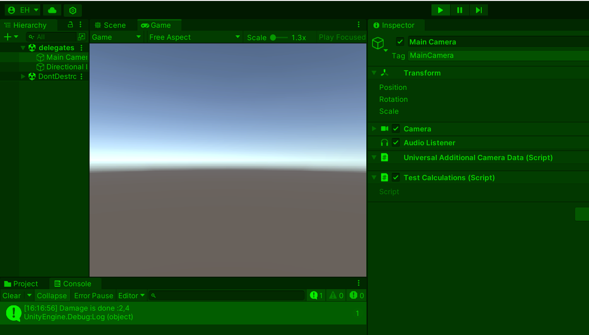

# PROG les 11: Delegates, Interfaces en OCP

Eerder hebben jullie geleerd om met zogenaamde [Action Events](../02_Herhaling_Action_Events/README.md) te werken in Unity. De ondeliggende basis van deze Action Events zijn **Delegates**.

Een **Delegate** is als een verwijzing naar een methode die je kunt opslaan in een "variabele". Je kunt later die "variabele" gebruiken om de methode aan te roepen, net zoals je een telefoonnummer kunt bellen dat je in je telefoon hebt opgeslagen.


## Delegates gebruiken

Voordat je een Delegate kunt gebruiken moet je deze eerst definieren.

Laten we een delegate maken die wordt aangeroepen als er een Enemy sterft in je game. Verder maken we een ScoreBoard die de score update als er een Enemy gedood is.

Definieer de delegate in je Enemy class.

```
using UnityEngine;

public class Enemy : MonoBehaviour
{
    public delegate void EnemyDeathDelegate();
}
```

Hierbij kun je de delegate ook verschillende parameters geven:

```
using UnityEngine;

public class Enemy : MonoBehaviour
{
    public delegate void EnemyDeathDelegate(float points, float experience);
}
```

Om deze delegate vervolgens ook in je class te implementeren doe je het volgende :

```
using UnityEngine;

public class Enemy : MonoBehaviour
{
    public delegate void EnemyDeathDelegate(float points, float experience);
    public static event EnemyDeathDelegate OnEnemyKilled;
}

```

Je kunt nu de Delegate aanroepen op het juiste moment (Gebruik hiervoor liefst Invoke):

```
public class Enemy : MonoBehaviour
{
    public delegate void EnemyDeathDelegate(float points, float experience);
    public static event EnemyDeathDelegate OnEnemyKilled;
    public void Kill()
    {
        //Check of er en functie in de Delegate zit en roep hem dan aan.
        if (OnEnemyKilled != null)
        {
            OnEnemyKilled();
        }

        //Of beter nog, gebruik Invoke? dat doet hetzelfde en is veel leesbaarder
        OnEnemyKilled?.Invoke();

        Destroy(gameObject);
    }
}
```

Nu moet je natuurlijk ook nog de argumenten meegeven als je parameters hebt gedefinieerd:

```
    OnEnemyKilled?.Invoke( 100, 500 ); // points, experience
```

Dan hebben we natuurlijk ook nog het **ScoreBoard**:

```
using TMPro;
using UnityEngine;

public class ScoreBoard:MonoBehaviour
{
    private float score = 0f;
    private TMP_Text scoreField;
    private void Start()
    {
        scoreField = GetComponent<TMP_Text>();
        Enemy.OnEnemyKilled += UpdateScore;
    }
    private void UpdateScore(float score, float _ )
    {
        this.score += score;
        scoreField.text = score;
    }
}
```

Herkenbaar?

Als je een Action event kunt gebruiken dan kun je ook makkelijk een delegate aanmaken en gebruiken. Dit komt omdat de Action events afstammen van Delegates. Een Action is een specifieke vorm van een Delegate.

_Tip: Als je een parameter moet implementeren die je niet wil gebruiken kun je de `_` "discard operator" gebruiken. De conventie is dat dit betekent dat je de parameter niet gebruikt. Echter is deze nog wel gewoon bruikbaar.\_

Maar wat is dan het verschil met een Action event?

## Delegates kunnen waardes returnen

Wat je met een Action niet kunt doen en met een delegate wel is deze een **return value** geven.

In het onderstaande voobeeld zie je een situatie waarin dit handig zou kunnen zijn.

Stel: In mijn game heb ik verschillende soorten wapens. Ik wil afhankelijk van het wapen dat ik gebruik mogelijk een andere berekening gebruiken voor het bepalen van de damage die hij doet aan de enemy.

Hoe zou jij dit normaal gesproken gaan aanpakken?

Je kunt hiervoor natuurlijk een **if** of **switch** statement gebruiken om afhankelijk van het wapen een andere formule te gebruiken:

```
    public class DamageCalculator
    {
        public static float CalculateDamage(WeaponType type, float baseDamage, float armor, float multiplier)
        {
            float damage;
            switch(type)
            {
                case WeaponType.Sword:
                    damage = (baseDamage - armor) * multiplier;
                    break;
                case WeaponType.Hammer:
                    damage = (baseDamage - (armor * 0.8)) * multiplier;
                    break;
                case WeaponType.Spear:
                    damage = baseDamage * multiplier;
                    break;
            }
            return damage;
        }
    }
    public enum WeaponType{
        Sword,
        Hammer,
        Spear
    }
```

De Methode zou je nu vanuit elke andere class als volgt aan kunnen roepen:

```
    float damage = DamageCalculator.CalculateDamage(WeaponType.Sword, 20,7,1.2f); //type, baseDamage, armor, modifier
```

Om de opties voor de verschillende wapens en berekeningen uit te breiden moet ik een nieuwe case aan mijn switch toevoegen en ook een nieuw Type toevoegen aan mijn Enum.

```
    public static float CalculateDamage(WeaponType type, float baseDamage, float armor, float multiplier)
    {
        float damage;
        switch(type)
        {
            case WeaponType.Sword:
                damage = (baseDamage - armor) * multiplier;
                break;
            case WeaponType.Hammer:
                damage = (baseDamage - (armor * 0.8)) * multiplier;
                break;
            case WeaponType.Spear:
                damage = baseDamage * multiplier;
                break;
            case WeaponType.Whip:                               //NIEUW!
                damage = baseDamage * multiplier - armor;
                break;
        }
        return damage;
    }
    public enum WeaponType{
        Sword,
        Hammer,
        Spear,
        Whip                                                    //NIEUW!
    }
```

De bestaande code moet dus op 2 plekken worden aangepast.

**Is dat erg dan?!**

**JA!** het kan uiteindelijk leiden tot fouten en bugs.

Daar hebben we weer een nieuw principe uit het rijtje **SOLID**. Waar stond de **S** ook alweer voor?

**" Single .. .. "**

Ditmaal de **"O"** van het **"Open-Closed principe"** (OCP)


"In object-oriented programming, the open–closed principle (OCP) states "software entities (classes, modules, functions, etc.) should be open for extension, but closed for modification"; that is, such an entity can allow its behaviour to be **extended without modifying** its source code."



Oftewel: Je wil later onderdelen toe kunnen voegen, zonder dat daar verandering noodzakerlijk is aan de reeds bestaande code.

### Met delegates OCP toepassen

Je kunt een Delegate gebruiken om de **CalculateDamage** methode steeds een andere invulling te geven en dus de waarde te returnen.

```
public class DamageCalculator
{
    public delegate float DamageCalculation(float baseDamage, float armor, float multiplier);
    private static DamageCalculation currentCalculation;

//set which calculation method to use

    public statis void SetDamageCalculation(DamageCalculation calculation)
    {
        currentCalculation = calculation;
    }

//use the selected calculation method to calculate the damage

    public static float CalculateDamage(float baseDamage, float armor, float multiplier)
    {
        //Invoke could return null so cast it to float;
        return (float)currentCalculation?.Invoke(baseDamage, armor, multiplier);
    }

//Calculation options

    public static float SwordCalculation(float baseDamage, float armor, float multiplier)
    {
        return (baseDamage - armor) * multiplier;
    }

    public static float HammerCalculation(float baseDamage, float armor, float multiplier)
    {
        return (baseDamage - (armor * 0.8f)) * multiplier;
    }

    public static float SpearCalculation(float baseDamage, float armor, float multiplier)
    {
        return baseDamage * multiplier;
    }

}
```

Aanroepen van de code gaat nu zo:

```
    DamageCalculator.SetDamageCalculation(DamageCalculator.SwordCalculation);
    float damage = DamageCalculator.CalculateDamage(20,7,1.2f);

```

Als ik de code nu wil uitbreiden met meerdere damage berekeningen hoef ik alleen maar een nieuwe methode toe te voegen

```
    public static float WhipCalculation(float baseDamage, float armor, float multiplier)
    {
        return damage = baseDamage * multiplier - armor;
    }

```

Deze kan ik met de **SetDamageCalculation** methode selecteren:

```
    DamageCalculator.SetDamageCalculation(DamageCalculator.WhipCalculation);
    float damage = DamageCalculator.CalculateDamage(20,7,1.2f);
```

Maar heb ik nu een **toevoeging** gedaan of heb ik mijn systeem **aangepast**? (extension or modification?)

Ik heb nu mijn script **DamageCalculator** aangepast door hier een nieuwe methode aan toe te voegen. Het zou dus net iets netter zijn om de verschillende berekenmethoden echt allemaal apart te houden en ze echt toe te voegen.

### Een Interface maken

Om te zorgen dat je makkelijk nieuwe calculatie methoden kunt toevoegen in een nieuwe class is het goed om van te voren vast te leggen waar deze methoden aan moeten voldoen. Ze moeten immers goed aansluiten op de gedefineerde delegate.

Om eventuele fouten te voorkomen maken we de volgende interface:

```
public interface ICalculation
{
    public float Calculate(float baseDamage, float armor, float multiplier);
}
```

Deze hebben we zo gedefinieerd zodat deze aansluit op de delegate:

```
 public delegate float DamageCalculation(float baseDamage, float armor, float multiplier);
```

Nu kunnen we voor elke calculatie een class schrijven en om fouten te voorkomen koppelen we hem aan de interface **ICalculation**:

```
public class SwordDamageCalc : ICalculation
{
    public float Calculate(float baseDamage, float armor, float multiplier) {
        return (baseDamage - armor) * multiplier;
    }
}

public class HammerDamageCalc : ICalculation
{
    public float Calculate(float baseDamage, float armor, float multiplier) {
        return (baseDamage - (armor * 0.8f)) * multiplier;
    }
}

public class SpearDamageCalc : ICalculation
{
    public float Calculate(float baseDamage, float armor, float multiplier) {
        return baseDamage * multiplier;
    }
}

public class WhipDamageCalc : ICalculation
{
    public float Calculate(float baseDamage, float armor, float multiplier) {
        return damage = baseDamage * multiplier - armor;
    }
}

```

Om de calculatie methoden te koppelen aan de DamageCalculator gebruiken we het volgende script:

```
    DamageCalculator.SetDamageCalculation(new SwordDamageCalc().Calculate);
    Debug.Log("Damage is done :" + DamageCalculator.CalculateDamage(10, 8, 1.2f));
```

Onze code voldoet nu aan het **OCP** principe!

Als ik een nieuwe methode wil toevoegen kan ik daar nu een nieuwe class voor maken zonder dat ik hoef te "rommelen" aan bestaande code.

### Opdracht 15: BoulderDamage!


Implementeer en test de code uit de uitleg hierboven.

Voeg nu zelf de damage calculation methode : **BoulderDamageCalc** toe. Deze doet altijd 1000 damage ongeacht de armor.

Zorg dat je gebruik maakt van de interface **ICalculation** en laat zien in de inspector dat deze ook goed werkt.



### Opdracht 15 Bonus: Open-Closed (Bonus)

Zijn er in jouw game ook onderdelen die goed uitbreidbaar moeten zijn? Heb jij zelf ook gebruik gemaakt van switch of if statements waarin je van plan bent om verschillende variaties op dezelfde methode toe te voegen?

Heb je verschillende soorten wapens? Die allemaal net even anders werken?

Maak gebruik van een delegate om deze methodes steeds een andere invulling te geven.

Probeer ook te voldoen aan het Open-Closed principe door Interfaces te gebruiken en de variaties van de methoden in aparte classes te zetten.

Test dus ook of je een nieuwe variant van je methode toe kunt voegen zonder bestaande code aan te passen.

Lever een link in naar de scripts waarin je de delegates en de Interfaces hebt gebruikt.
