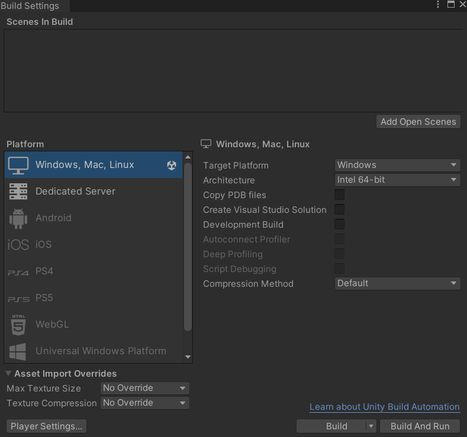
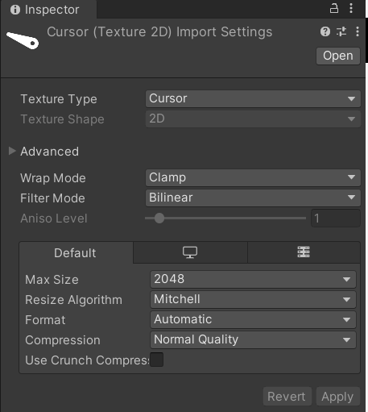
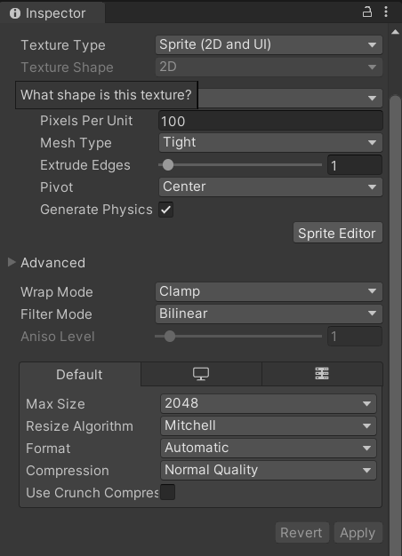
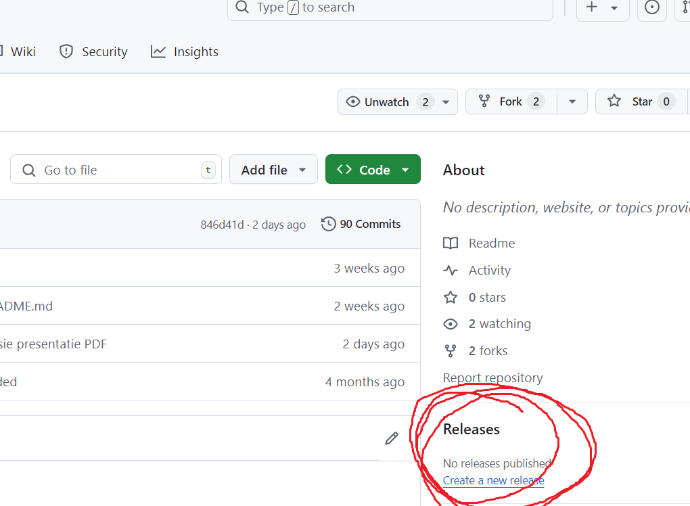
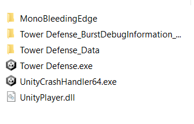

# SKIL-GD les 2: Builden voor PC in Unity

Voordat je je game gaat builden is het natuurlijk zaak om zoveel mogelijk de bugs en errors eruit te halen.

Maar naast Bugs en error zorg je ook dat je code "schoon" is gemaakt. Dat betekent dat er geen onnodige scripts zijn en dat er ook geen onnodige code in scripts zit. Tevens haal je de Debug.Log statemants eruit of je comment ze.

Ga naar **File > Build Settings** (ctr + shift + B)

Voor een windows build kunnen de settings zo grotendeels blijven staan.

Onder Asset Import Overrides heb je de mogelijkheid om de texture sizes te beperken. Heb je geen idee van je texture sizes en hier niet op gelet dan is het zeker aan te raden. Ben je bewust omgegaan met texture sizes en heb je ook altijd **"POWER of 2"** textures gebruikt dan kun je hem natuurlijk gewoon op no override laten staan.

#### POW2:

Power of 2 textures zijn textures die qua size altijd terug te verdelen zijn naar 1 pixel in de hoogte en 1 pixel in de breedte. Dus 1, 2, 4, 8, 16, 32, 64 .. 256, 512, 1024, 2048 etc.. dit is belangrijk omdat er voor elke image in het geheugen altijd ruimte moet worden gereserveerd die aan POW2 voldoet. door hiervan af te wijken zorg je dus voor "padding", het opvullen van het geheugen met lege pixels. Een image van 128 x 256 is POW2 en een image van 32 x 32 ook. echter is een image van 1024 X 400 geen POW2. een texture van 1024 x 400 krijgt dus een padding van 1024 \* 112 = 114688 pixels. Dit kan snel aardig oplopen dus.

#### Compression:

Je kunt er ook voor kiezen om een andere "sterkere" compressie methode te gebruiken zodat je game sneller compiled en runt. Echter kan dit leiden tot mindere kwaliteit van graphics door het comprimeren van je textures.

Ook kun je forceren om helemaal geen compression te gebruiken. Dit kun je wederom doen in het geval je heel zeker bent van de kwaliteit van je textures en de formaten die je hebt gebruikt. Dit levert een build op met ongecomprimeerde textures.

## Player Settings

De als je klikt op **player Settings** kom je in je **Project Settings**.  
Binnen deze project settings ga naar **Player** om specifiek de Player voor je build te customizen.

### Player

Hier kun je bepalen hoe je Unity Player er na het builden uit komt te zien.
Vul hier de naam van je "fictieve" Gamebedrijf in en de naam van je game. Deze zie je dan terug in de player. Tevens vul je het versienummer van je game in. 0.1 voor de testversie. 1.0 voor je eerste release enzovoort.

#### Icon

Je kunt hier ook textures aanpassen voor je Game Icon, waarmee je de game opstart en je kunt de cursor die in je game zichtbaar is hier ook uploaden.
Let ook hier weer op het gebruiken van POW2 textures.

Je game icon is een standaard texture.

#### Cursor

Via de Cursor Hotspot kun je het click punt van je cursor veranderen. Bijvoorbeeld als je die in het midden van je cursor image zou willen hebben bij het gebruiken van een crosshair in plaats van een pijl.

Je image moet je importeren als cursor via de inspector.

#### Resolution and Presentation

Hier heb je nog een aantal weergave opties voor de player waarin je game wordt gespeeld. Je kunt hier bijvoorbeeld de optie aanzetten om je game window te kunnen resizen.

#### Splash Image

Je kunt hier de splash image van je game aanpassen voordat de game start. In plaats van het standaard unity logo in beeld komt nu ook je eigen splash screen langs. Zodoende kun je de branding van je game en je "fictieve" studio hier doorvoeren.

om deze Splash images toe te voegen moet je deze importeren in je project als Sprite.

### Nog wat handige Project Settings

Onder de project settings zijn er nog wat interessante onderdelen.

#### Audio

Audio settings voor je game. Afhankelijk van wat je in gedachte hebt zou je bijvoorbeeld je game dolby surround kunnen laten ondersteunen.

#### Editor

Dit zijn de settings van de unity Editor en gaan dus over het afspelen van je project in de unity editor tijdens het testen.

### Graphics

Hier kun je de gebruikte Render pipeline terugvinden en de beschikbare shaders. Hier kun je nog wat shader settings aanpassen.

### Input Manager

Deze staat "nog" standaard ingesteld op het oude Unity input systeem. Als je het nieuwe unity input systeem wil gebruiken kun je die na installatie hier ook terugvinden. De package manager zet dan het oude input systeem uit en dat kun je hier dan ook weer aan zetten. [Meer over het nieuwe input systeem in deze video](https://youtu.be/DThkTXhEybw?si=7-CUktbLxzDtyVqB)

### Physics

Hier vind je de settings van je Physics systeem. Maak je hier gebruik van dan kun je het systeem hier tweaken.

### Physics 2D

Dit is een heel ander systeem , sommige dingen werken vergekijbaar maar het zijn 2 losse systemen. Hier kun je dit systeem tweaken.

### Quality

Hier heb je een hoop opties om de kwaliteit versus de performance van je game te kunnen tweaken. Dit kun je doen door de verschillende kwaliteits niveas in te stellen te tweaken of zelfs nieuwe toe te voegen. Dit kan erg nuttig zijn als je bijvoorbeeld voor specifieke hardware specificaties wil gaan builden.

# Opdracht

In deze opdracht gaan jullie een build maken van je towerdefense game voor op de PC.

Zorg ervoor dat je alle opties gebruikt om je game zo goed en mooi mogelijk af te werken:

- Zorg voor een mooi afgewerkte splash screen
- Een eigen game icon om de game mee op te starten
- En een mooie bijpassende cursor.
- Zorg ervoor dat de game goed runt op je eigen PC. Alle textures, sprites in de game moeten een Power of 2 hebben.
- Zorg dat alle textures netjes in de map textures terug te vinden zijn in je project.

## Inleveren

Deze Build lever je in (uploaden) op je repo onder het kopje releases op github.

Dus niet je build comitten en pushen in je repo. Zorg dat je alle files zipt en upload.

Dus ook de mappen en dll's etc.

Op simulise lever je een link in naar je release in je repo op github.

Op simulise lever je ook een link in naar je textures map.
