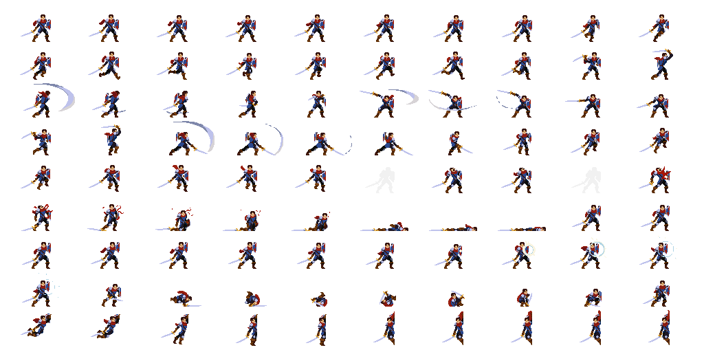
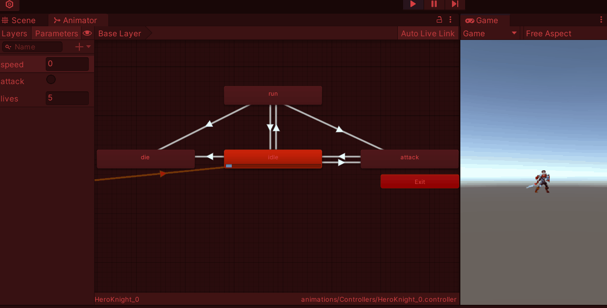
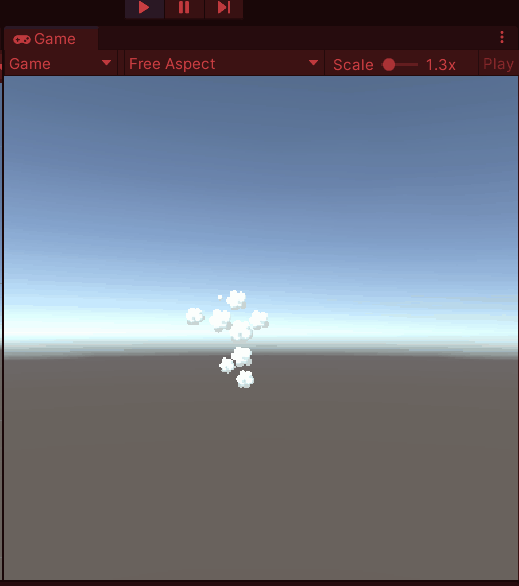

# Sprites, Spritesheets, Animaties en Particles

Hier kunnen jullie de de presentatie nog terugvinden:
[Demo 2d Sprites integratie](../presentaties/2D%20Sprites%20&%20Integration.pdf)

Hier vind je de officiele unity tutorial over het importeren van sprite sheets en creeeren van animaties:
[introduction-to-sprite-animations](https://learn.unity.com/tutorial/introduction-to-sprite-animations#)

## Opdracht 1: Sprite Sheet animations

Download deze spritesheet:


Importeer deze in unity en maak hiervan 3 animaties

- Idle
- Walk
- Attack
- Die

Voeg alle animaties toe aan dezelfde controller.

Maak in de controller de volgende parameters aan:

- speed (float)
- life (float)
- attack (trigger)

Voeg de noodzakelijke transitions toe en stel ze logisch in:

Gebruik deze scripts om de parameters aan te sturen:

### Move.cs

```
using UnityEngine;
public class Move : MonoBehaviour
{
    [SerializeField] private float speedModifier = 4f;
    private Animator animator;
    private float speed = 0;
    private Vector3 flipped = new Vector3(-1f, 1f, 1f);
    void Start()
    {
        animator = GetComponent<Animator>();
        HandleLife.onHeroDeath += OnDeath;
    }
    void Update()
    {
        speed = Input.GetAxis("Horizontal") * speedModifier;
        animator.SetFloat("speed", Mathf.Abs(speed));
        transform.position += Vector3.right * speed * Time.deltaTime;
        if (speed < 0) { transform.localScale = flipped; }
        else if (speed > 0) { transform.localScale = Vector3.one; }
    }
    private void OnDeath() {
        this.enabled = false;
    }
}
```

### Attack.cs

```
using UnityEngine;
public class Attack : MonoBehaviour
{
    private Animator animator;
    void Start()
    {
        HandleLife.onHeroDeath += OnDeath;
        animator = GetComponent<Animator>();
    }
    void Update()
    {
        if (Input.GetKeyDown(KeyCode.Space)) {
            if (!animator.GetCurrentAnimatorStateInfo(0).IsName("attack")) {
                animator.SetTrigger("attack");
            }
        }
    }
    private void OnDeath()
    {
        this.enabled = false;
    }
}
```

### HandleLife.cs

```
using System;
using System.Collections;
using System.Collections.Generic;
using UnityEngine;

public class HandleLife : MonoBehaviour
{
    private Animator animator;
    [SerializeField] private int lives = 5;
    public static event Action onHeroDeath;
    // Start is called before the first frame update
    void Start()
    {
        animator = GetComponent<Animator>();
    }
    void Update()
    {
        if (Input.GetKeyUp(KeyCode.Delete)) {
            lives--;
            animator.SetInteger("lives", lives);
            if (lives == 0) {
                onHeroDeath?.Invoke();
            }
        }
    }
}
```

Uiteindelijk moet het zo werken!


Met "pijltjes" of "A,D" kun je heen en weer lopen
Met de spatie slaan
Met "delete" gaan er levens af en sterf je als die op zijn.

Neem een gifje op van je werkende animaties inclusief het animator window zodat de transitions in actie te zien zijn.

lever het gifje in op simulise.

## Opdracht 2 Particle animations

Download ergens een spritesheet met daarop geanimeerde particles. Deze mag je ook gebruiken.

importeer deze op de juiste manier in Unity als een sprite in multiple sprite mode.

Slice de spritesheet met de sprite editor.

Maak een material aan van het type **"particles>unlit"** en hang de spritesheet aan de material.

Maak een particle system aan die deze material gebruikt als animatie.



Neem een gifje op van je geimplementeerde particle animatie en lever tevens de door jouw gebruikte spritesheet (png file) in. Lever beide in op simulise.
