# Playability en Re-playability

[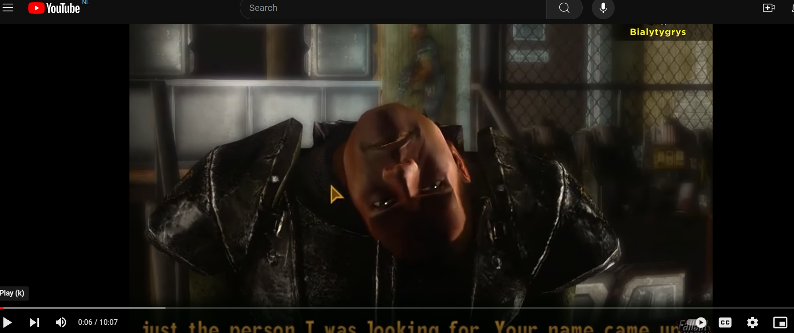](https://youtu.be/z_ipP6Tc_eA?si=RXee_Z7tBHMFZQJt)

In de context van gamedesign zijn de termen "playability" en "replayability" essentieel voor de evaluatie van de kwaliteit en aantrekkelijkheid van een game. Hoewel ze nauw verwant zijn, verwijzen ze naar verschillende aspecten van de game-ervaring.

[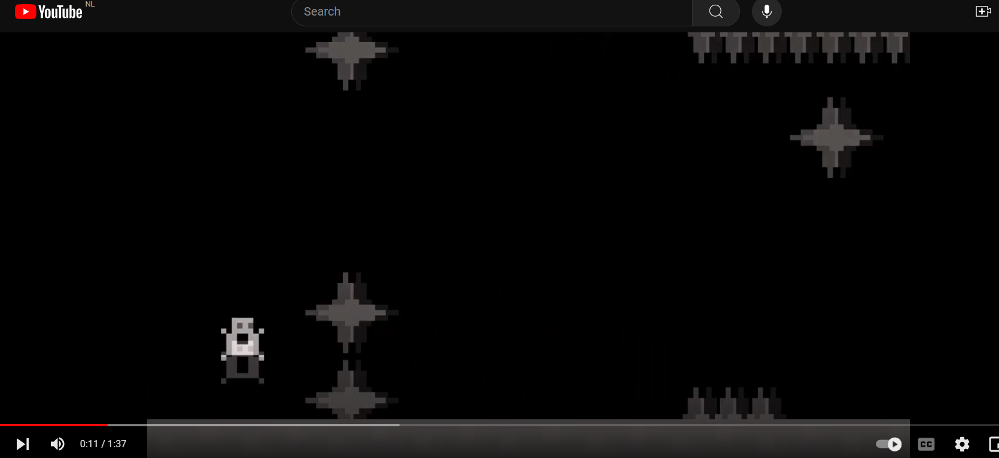](https://www.youtube.com/watch?v=h6gvJKY7DnA)

## Playability

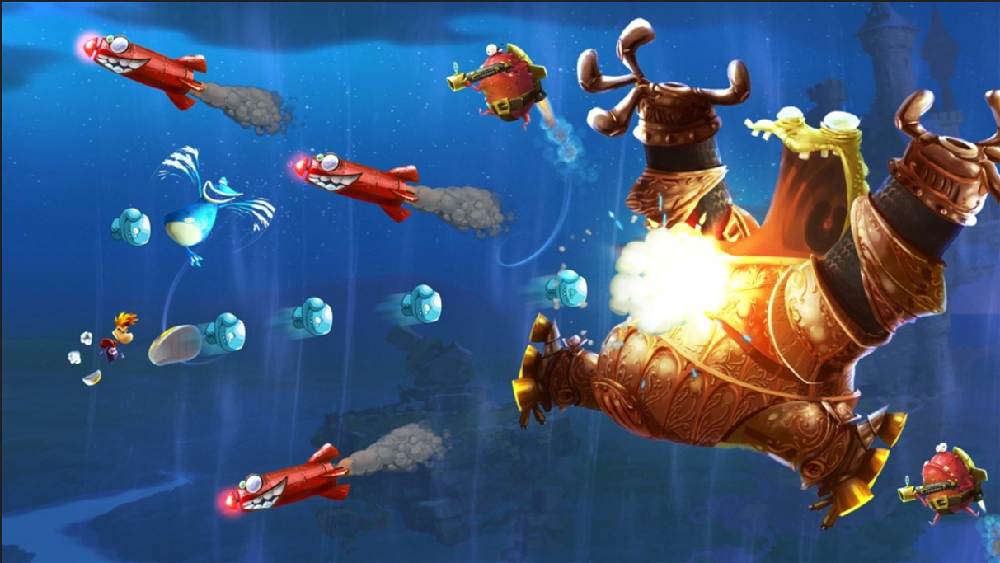

Playability verwijst naar hoe goed een game gespeeld kan worden, oftewel hoe toegankelijk en plezierig de ervaring is voor de speler. Het omvat verschillende factoren, zoals:

**Gebruiksvriendelijkheid**:
Hoe gemakkelijk is de besturing van de game? Is het spel intuïtief en begrijpelijk, zelfs voor nieuwe spelers?

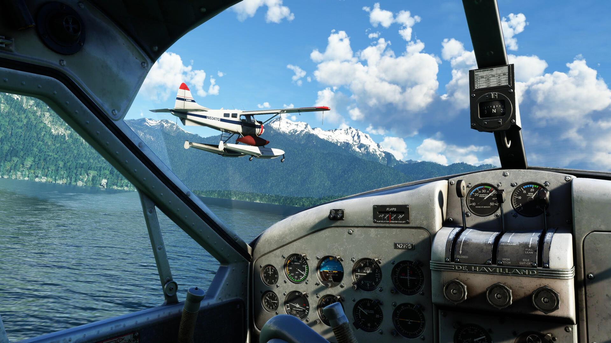

**Balans en moeilijkheidsgraad**: Is het spel eerlijk en goed uitgebalanceerd, zonder te gemakkelijk of te moeilijk te zijn?

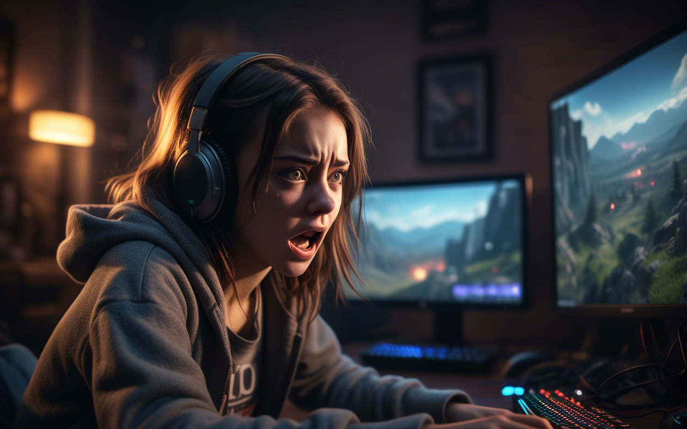

**Prestatie en technische aspecten**: Zijn er technische problemen zoals bugs, glitches of prestatieproblemen die het spel hinderen?

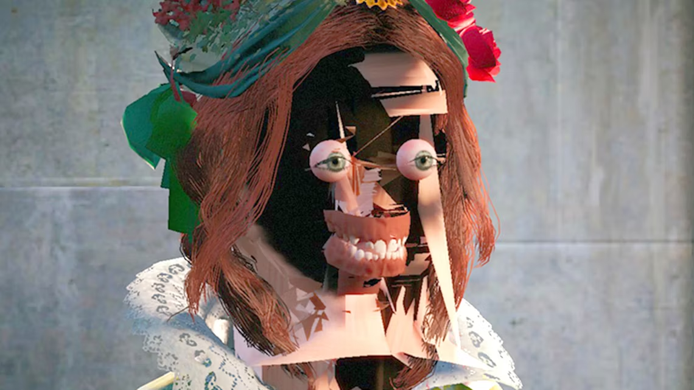

**Interactiviteit en gameplay-loop**: Hoe boeiend en meeslepend is de spelervaring? Zijn de mechanieken leuk en uitdagend genoeg om de speler betrokken te houden?

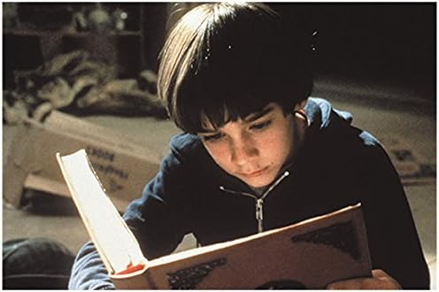

Een spel met een hoge "playability" is toegankelijk, soepel, en prettig om te spelen vanaf het moment dat je begint. Het richt zich op de eerste ervaring van de speler en zorgt ervoor dat de game begrijpelijk, plezierig en functioneel is. **Het voelt lekker aan!**

## Replayability

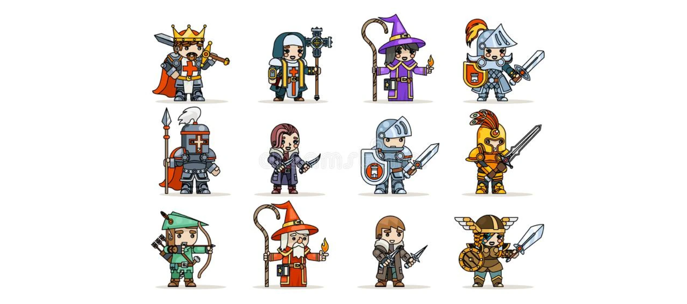
Replayability verwijst naar de mate waarin een game interessant blijft om meerdere keren te spelen, nadat het eenmaal is uitgespeeld. Het gaat om de langetermijnwaarde van een game en kan beïnvloed worden door verschillende factoren:

**Wisselende verhaallijnen of uitkomsten**: Games met meerdere verhaallijnen, keuzes die de uitkomst beïnvloeden of verschillende eindes hebben vaak een hogere replayability.

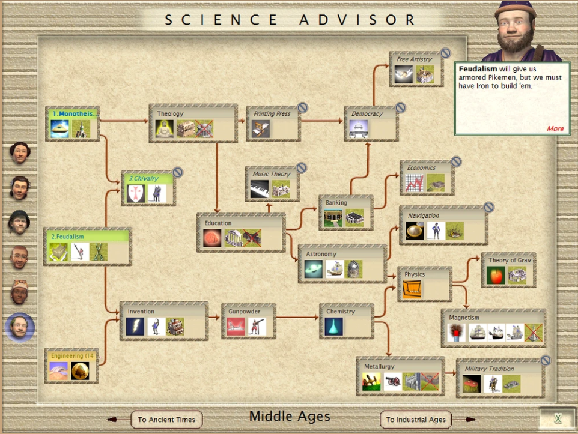

**Dynamische content**: Denk aan procedureel gegenereerde levels, willekeurige gebeurtenissen, of uitdagingsmodi die elke keer een andere ervaring bieden.
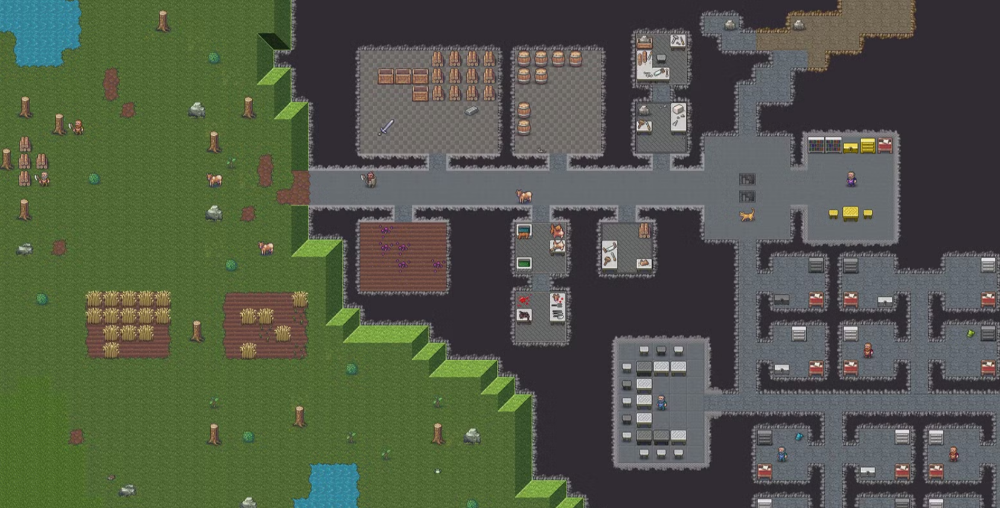
**Multiplayer en co-op**: Games die een sociale component hebben, zoals competitieve of samenwerkende multiplayer-modes, blijven vaak langer interessant om te spelen.

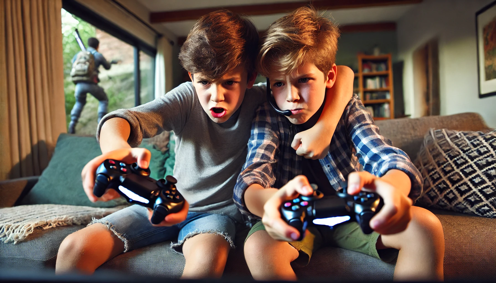

**Aanpasbaarheid**: De optie om met nieuwe strategieën, personages, of speelstijlen te experimenteren, kan ook bijdragen aan de replayability.

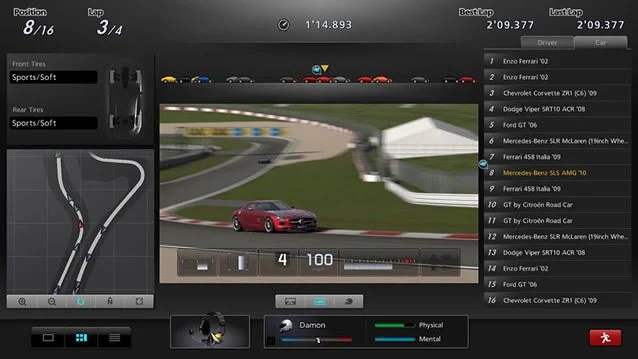

Games met een hoge **"replayability"** blijven aantrekkelijk na de eerste keer spelen, omdat ze steeds weer nieuwe ervaringen of uitdagingen bieden.

## Opdracht 1:

Bedenk zelf ook nog een factor die van invloed kan zijn op de **playability** of **replayability** van een game. Waarom vind jij deze factor zo belangrijk?

Zet dit in een readme.

## Opdracht 2

Zoek online naar een video of artikel dat gaat over playability of replayability? Wat is volgens dit artikel de balangrijkste factor. Leg uit waarom dit volgens het artikel zo is. Ben je het er mee eens? geef je mening hierover.

Embed de video of een link naar het artikel in je readme. Embedcode voor video of image in een readme:``
Link naar webpagina: `[tekst van de link](URL van de link)`

Zet je uitwerking van de opdracht ook in dezelfde readme.

## Opdracht 3:

Zoek en edit een video clip (10 sec) van een voorbeeld van een bestaande game waarin goede **"playability"** duidelijk naar voren komt.

Zet de video in je readme.

Omschrijf in de readme wat er in de clip gebeurt en hoe dit de **playability** versterkt.

## Opdracht 4:

Zoek en edit een video clip (10 sec) van een voorbeeld van een bestaande game waarin goede **"re-playability"** duidelijk naar voren komt.

Zet de video in je readme.

Omschrijf in de readme wat er in de clip gebeurt en hoe dit de **re-playability** versterkt.

## Opdracht 5:

Kies 2 factoren voor **playability** of **re-playablity** uit die je zou willen doorvoeren in je towerdefense game. Omschrijf hoe je deze in je game wil gaan verwerken. Maak hierbij 2 kleine schetsjes die verduidelijken hoe deze factoren in je game zouden moeten worden geintegreerd.

Zet je schetsen en de uitleg in de readme.

## Inleveren:

Maak een readme aan waarin je de bovenstaande opdrachten verwerkt. lever de link naar de readme in op simulise.
