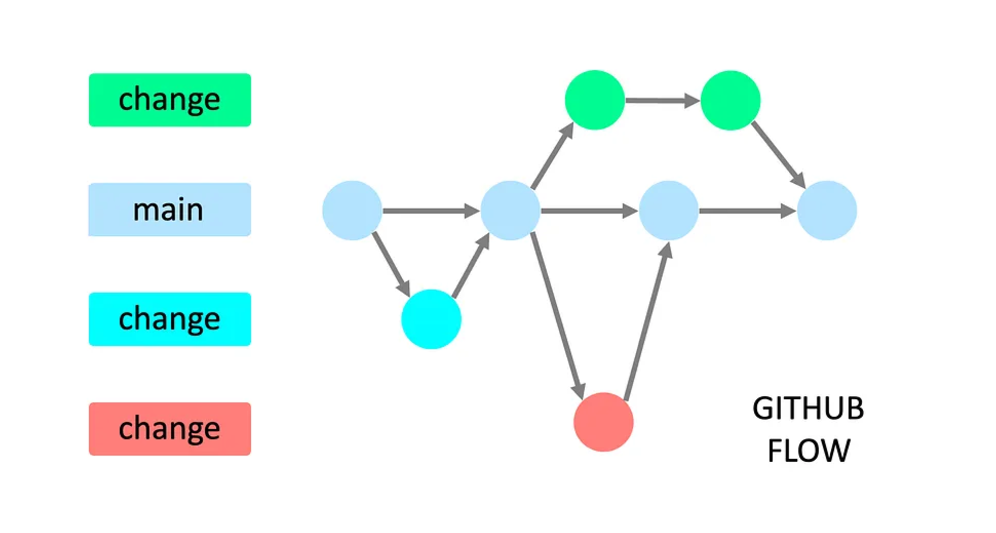
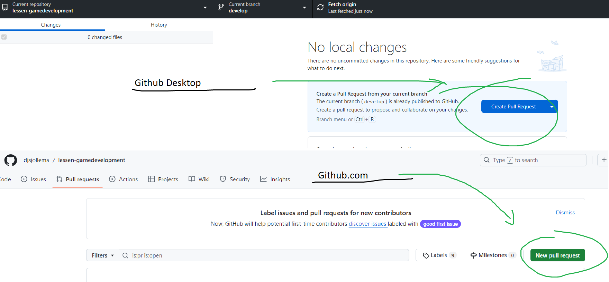

# Versie beheer strategieen

Een Versiebeheerstrategie is een aanpak om wijzigingen in je code, of andere bestanden binnen je project, systematisch bij te houden en te beheren met behulp van een versiebeheer systeem (bijvoorbeeld Git).

Door een vooraf-gedefinieerde strategie te gebruiken is het voor iedereen duidelijk wat de regels zijn en hoe deze strategie toegepast moet worden.

**Wat was tot nu toe je strategie voor het samen voeren van versiebeheer?**

**Wat waren hiervan de voor en nadelen?**

Veelgebruikte versiebeheer strategieën in software development zijn:

- Git Flow
- Github Flow
- Trunk based development

## Git Flow:

- Twee primaire branches: main (productie) en develop (laatste ontwikkelingen)
- Feature branches worden gemaakt voor nieuwe functionaliteiten
- Release branches voorbereiden en testen van nieuwe versies
- Hotfix branches voor kritische productie-updates
- Meer geschikt voor grote, complexe software met gereguleerde releases
- Meer complex en overhead voor kleinere teams

## GitHub Flow:

- Eenvoudige, op continue levering gerichte strategie
- Centrale main branch is altijd deployable
- Korte en lichte feature branches
- Pull requests voor code review en samenwerking
- Direct mergen naar main na goedkeuring
- Minimale branching-overhead
- Geschikt voor teams die snel moeten leveren

## Trunk Based Development:

- Alle ontwikkelaars committen direct naar centrale main branch
- Minimaal gebruik van branches
- Sterke nadruk op continue integratie en levering
- Vereist sterke test automatisering
- Geschikt voor teams met veel vertrouwen en discipline
- Hoge code kwaliteit is vereist
- Minder controle op elkaars werk

**Welke van de bovenstaande strategieen is volgens jou het meest bruikbaar voor je Vertical Slice project en waarom?**

## Stappen binnen de GitHub Flow strategie:

1. Voordat je een een nieuwe featuren gaat bouwen maak je hiervoor een nieuwe feature branch aan.

- Het vertrekpunt hiervoor is de "main" branch.
- Geef een goed omschrijvende naam. (bijv. feature/enemyBehavior)

2. Gefocuste ontwikkeling.

- Maak kleine, "gefocuste" commits die zich op specifieke kleine onderdelen richt en niet op complete features of systemen.
- Maak Gedetailleerde commit-berichten waarin duidelijk wordt wat je hebt gedaan en wat er is veranderd.
- Regelmatig pushen naar de remote repository zodat de voortgang voor iedereen up to date blijft.

3. Mergen van branches altijd via Pull Requests.

- Merge terug van de feature branch naar de "main" branch.
- Geef in een Pull Request een gedetailleerde beschrijving van alle wijzigingen.
- De teamleden of de lead devloper worden via een Pull Request gevraagd om een code review.
- Zonder code review kan en mag er niet gemerged worden.

4. Code Reviews uitvoeren

- Teamleden of lead developers controleren alle code in de pull request.
- Suggesties en feedback wordt terug gegeven en besproken.
- Eventuele aanpassingen worden doorgevoerd.

5. Merge naar main branch

- Na goedkeuring samenvoegen
- De verandering wodt direct geintegreerd in de productie-omgeving (Verwerken in final scene)

**Heb je een beeld van alle bovenstaande stappen? Wat moet je met je team doen om deze uit te voeren? Welke tools en skills hebben jullie hiervoor nodig?**

---

## Branches maken, mergen en deleten (Optioneel)

**Wie weet hoe je een branch maakt? en deze ook weer merged en delete?**

Oefen dit eventueel eerst door een oefen repository te maken. Daar wat testbranches te maken. Op verschillende branches te comitten en deze ook weer te mergen naar de main.

Commands:

`git branch` : check welke branches er zijn en waar je bent.

`git branch [new name]` : maak een nieuwe branch aan.
`git switch [branch name]` : ga naar deze branch.
`git merge [branch to merge]` : pak de commits van de "branch to merge" en merge die in de branch waar je bent.
`git branch -d [branch to delete]` : verwijder de branch nadat deze gemerged is.
`git branch -D [branch to delete]` : verwijder de branch ook al is die niet gemerged.

Uiteraard kun je hiervoor ook github desktop gebruiken:

Maak nieuwe branches:

Check je branches:

Mergen van je branches (van test naar test2):

Deleten van branches:

---

## Samen werken in 1 repo "Collaborators"

Om samen te kunnen werken in 1 repo moet de eigenaar anderen toelaten als "collaborators":

## Pull Requests

**Wie weet wat een pull request is?**

## Afdwingen van pull requests

Je kunt je collaborators dwingen om pull requests te maken voordat nieuwe branches gemerged kunnen worden:

Ga naar je Repo op github.
Ga naar Settings.
Ga naar Branches.
Klik op **"Add classic branch protection rule"**.

Vul de naam in voor de branch waar je niet zomaar naartoe mag mergen (main).
Vink aan dat er pull requests vereist zijn.
Vink aan dat deze ook een approval moeten krijgen.
Scroll naar beneden en klik op **"create"**.

Naast het samenvoegen van veranderingen is een pull request ook vooral bedoeld om te controleren of de code wel goed is. We zorgen er dus voor dat er bij elke pull request een code review word uitgevoerd.

Dit kan gedaan worden door een teamgenoot of je kunt er ook voor kiezen om de beste developer, "lead" developer te maken die de taak heeft om alle pull requests te reviewen.

## Opdracht 6A: Pull requests op een test repo

Maak met z'n 2 of 3-en (hoeft niet je VS team te zijn) een test repo aan voeg iedereen toe als collaborator.
Maak een paar nieuwe test branches aan, specifiek:
**/testHelloWorld**, voeg hier een simpel "hello world" Script toe.
**/testImage**, voeg hier een random image toe

Maak voor beide branches een pull request aan waarbij je ze samen probeert te voegen in main.

Dit kan op github en via github desktop:

Zorg dat je in deze pull request goed omschrijft wat er in die branch gebeurd is.

Laat iemand anders uit je team controleren of de veranderingen kloppen en de pull request goedkeuren en mergen.

Maak nu zelf eens expres een merge conflict aan.

Maak een branch **/testConflict** aan. Verander hier de het **"hello world"** script.
Maak ook een aanpassing in het **"hello world"** script op je **main**.
Commit ze beiden.

Maak nu een pull request om **/testConflict** te mergen naar **main**.

Resolve nu ook het merge conflict op github of in je code editor en merge **/testConflict** in **main**.

Lever de link naar je test repo in op Simulise.

## Opdracht 6B: dwing pull requests af op je Vertical slice repo

Doe deze opdracht samen met je VS teamleden. Eventueel buiten deze les.

Bepaal hoeveel personen er minimaal naar elke pull request moeten kijken (code review)
Spreek af wie dit allemaal gaan doen. Alleen een LEAD? of alle developers?
Stel dit in voor je vertical slice project. **Github > Repo > Settings > Branching**

Maak een **/testBadPull** branch aan en plaats daarin [deze image](https://i.giphy.com/media/v1.Y2lkPTc5MGI3NjExNWM5MXp4MGN2b282NWc5amNodzJsbjhjZDNwcXg4OXJiMmQ5eG0wciZlcD12MV9pbnRlcm5hbF9naWZfYnlfaWQmY3Q9Zw/5kq0GCjHA8Rwc/giphy.gif)

Probeer de branch te mergen naar main.

**Als dit lukt zonder pull request is het niet goed!** en moet je de settings van je repo aanpassen.

Zodra je niet meer kunt mergen zonder pull request maak je een nieuwe pull request aan.

Let dus op dat je **/testBadPull** moet mergen naar main.

Laat je teamgenoot deze pull request **afkeuren** "wegens slechte smaak" o.i.d.

Lever een link in naar de afgekeurde pull request.
