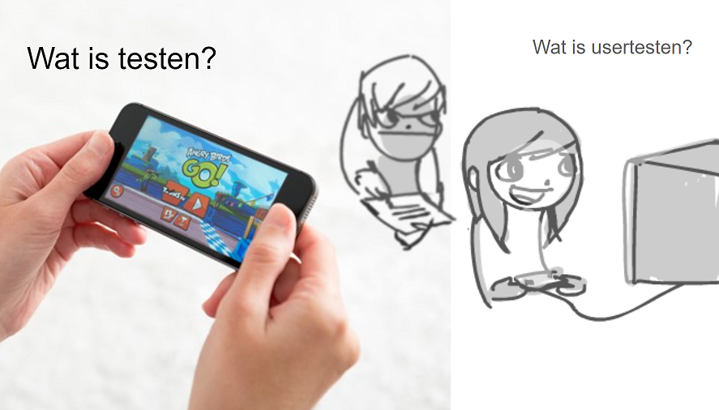

# Usertesting

[usertesting pdf](../presentaties/Usertesting.pdf)

Er is een verschil tussen je game testen en Usertesten!

## Testen:

Werkt alles zoals we verwachten?

## Usertesten:

Werkt alles zoals de eindgebruiker verwacht?

## Opdracht 7 testplan schrijven

Schrijf een testplan (testplan.md) voor je VS game en beantwoord daarin de volgende vragen:

- Wie is of zijn de Users? (doelgroep)
  _"De game is voor liefhebbers van classic 80's style retro games. Ze spelen vooral PC games en hebben hier wel wat voor over op steam. Ze zijn gewend om redelijk complexe indie games te begrijpen en houden van een diepgaande en originele story en setting."_
- Wat verwachten en hopen we over wat ze van onze game vinden?
  _"We hopen vooral dat ze de sfeer van de game tof vinden en dat ze de story dialogues niet gaan skippen. We hebben expres een duidelijke skip button gemaakt om dit te checken."_
- Wat willen we te weten komen over onze game? (bugs, usability, fun)
  _"We willen weten of de speler de story leest en leuk vind. We willen weten of de spelers de controls begrijpen. We willen weten of de spelers alle mechanics herkennen en begrijpen. We willen weten of de spelers meegevoerd worden met ons verhaal"_

- Hoe denken we dat terug te kunnen zien in de test, welke observaties hopen we tegen te komen?
  _"we hopen dat de speler veel lacht om de eastereggs in de art. We verwachten dat de speler de eerste paar keer moeite heeft met de controls, maar dat dat na 3 keer beter gaat. We hopen dat de speler de story niet gaat skippen maar we verwachten dat dit wel een paar keer gaat gebeuren en willen dus graag weten wanneer en waarom. We hopen dat de speler alle machanics uit zich zelf gaat gebruiken. Als we merken dat hij een mechanic niet of weinig gebruikt moeten we vragen waarom."_
- Welke test doelen geven we aan de tester?
  _"De speler moet starten in het tutorial level en deze skippen als hij denkt het te snappen. De speler moet proberen om bij het einde van level 3 te komen. De speler moet proberen om 5 special skills te bemachtigen."_
- Hoe moet de tester zich gedragen?
  _"We willen dat de tester zich zoveel mogelijk gedraagt zoals hij dat thuis zou doen. Dus als hij naast gamen ook nog zijn telefoon gebruikt mag dat. Vraag hoe hij thuis gamet en probeer dat zoveel mogelijk na te bootsen. Is het donker? zit hij in zijn kamer? Wat voor stoel heeft hij? Heeft hij zijn laptop op schoot? We geven de tester de keuze of hij een controller wil gebruiken of het toetsenbord. De tester moet zoveel mogelijk invloed hebben op de setup die hij wil gebruiken."_
- Hoe krijgen we de tester op zijn gemak?
  _"We geven de tester eerst even een bak koffie en wat lekkers en we stellen ons team even voor. We laten ook even een eerdere game zien. We zorgen voo verschillende stoelen en laten de speler zelf bepalen waar hij wil zitten of staan."_
- Hoe moeten de afnemers van de test zich gedragen?
  _"1 persoon geeft de instructies die we vooraf hebben beschreven. We gaan niet met elkaar in discussie tijdens de test. We vertellen verder niets over de werking van de game en stellen tijdens de game zo min mogelijk vragen, tenzij de speler niet genoeg hardop denkt. We zijn heel stil en zorgen dat we goede video's kunnen opnemen."_

- Welke vragen willen de testers laten beantwoorden? (vragenlijst)
  _"Wat vond je van je eerste encounter met de wraith (zwarte spook)?
  Schrok je van de wraith?
  Welk gevoel gaf deze jou?
  Wat vond je van de sfeer van het eerste bos level?
  Had je het gevoel dat je verdwaald was in het bos?
  Zou je zeggen dat je een verhoogde hartslag had?
  Was het bos uiteindelijk zoals je het van te voren verwacht had nav wat de nimf erover vertelde?
  Wat vond je van de controls?
  Denk je dat je alle mogelijke moves met je character gebruikt hebt? Welke moves vond je het fijnste werken?
  "_

- Wat hebben we nodig om goed te kunnen testen? (mensen, ruimte, materiaal, software, kennis)
  _"Voor onze test hebben we het volgende nodig. Broodjes , koffie en thee voor de testers en onszelf 12 personen. Buttons van de studio om aan de testers uit te delen. Onze arcade kast met de vorige game staat klaar zodat wachtende testers deze ook kunnen spelen. Wachtruimte voor testers. Test ruimte met een bankstel, een buro en een zitzak. 2 laptops (en laders) met de build zodat we bij problemen kunnen switchen. Statief en camera om tester gezicht op te nemen. 3 xbox controllers. Op het bureau een extra draadloos keyboard en muis en een extra scherm zodat de tester deze optie heeft."_

- Wat hebben we nodig om goede footage te krijgen die later ook goed te analyseren is?
  _"We willen goede stabiele footage van de tester krijgen. Gezicht moet goed in beeld zijn zodat de gezichtsuitdrukkingen duidelijk af te lezen zijn. Ook willen we als dat lukt de handen van de speler in beeld hebben (mits het gezicht nog goed te zien is.) Als het lukt om een 2e camera te regelen gaan we deze apart instellen op de handen. Verder gaan de OBS studio klaarzetten voor het maken van een screen capture en we plaatsen een extra microfoon naast de speler zodat we zijn stem goed horen."_

push je testplan naar github en lever de link in op simulise.

## Waarnemen versus Interpreteren

**"De speler kan niet zien wat er op de doos staat!"**

**Is dat een observatie/waarneming of interpretatie/conclusie?**

Hoe weet je dat de speler niet kan zien wat er op de doos staat?

Observaties / waarnemingen:

"De speler zegt : "Wat staat er op de doos!?"
"De speler heeft doos QW gepakt terwijl hij in dit level QK zou moeten pakken."

Interpretatie / conclusie:

A:
"De speler kan niet goed genoeg zien welke code er op de doos staat."

B:
"De codes lijken soms te veel op elkaar."

**Welke interpretatie klopt?**

Verbeterpunt / actie:

A:
"De code op de doos moet een duidelijker lettertype krijgen."
"De code op de doos moet groter worden."

B:
"Verschillende codes mogen nooit met dezelfde letter beginnen en eindigen."

**Welke actie is nu de beste oplossing?**

Afhankelijk van je eigen analyse van deze observaties kun je dus andere interpretaties krijgen die leiden tot andere acties.

Daarom is het belangrijk om zoveel mogelijke neutrale observaties te verzamelen waar geen interpretaties of conclusies in zitten. En pas later met elkaar de beste interpretaties en acties te bepalen.

## Opdracht 8 Analyse van test footage

Bekijk [deze testfootage](https://mediacollegeamsterdam.sharepoint.com/:v:/t/SDGAexamen20232024-Team04/ETJcz7JhjexJnvKJqYKNjwIBXuUmyo0jx-43sThkjXpJcQ?nav=eyJyZWZlcnJhbEluZm8iOnsicmVmZXJyYWxBcHAiOiJTdHJlYW1XZWJBcHAiLCJyZWZlcnJhbFZpZXciOiJTaGFyZURpYWxvZy1MaW5rIiwicmVmZXJyYWxBcHBQbGF0Zm9ybSI6IldlYiIsInJlZmVycmFsTW9kZSI6InZpZXcifX0%3D&e=WPQe6j).

Kies een stuk van 5 minuten uit waar er getest wordt en noteer "observaties / waarningen"; wat zie je allemaal gebeuren? wat wordt er gezegd? wat doen mensen?.

Probeer niet gelijk te concluderen wat het betekent. Schrijf het gewoon op.

**Wat is het verschil tussen een observatie/waarnemen en een conclusie/interpreteren??!?!**

Pas als je 5 minuten aan observaties hebt opgeschreven ga je met elkaar overleggen over wat deze observaties kunnen betekenen met betrekking tot:

- Bugs en speelbaarheid van de game
- De usability van de game
- De fun factor van de game

Stel voor elke boventstaande factor een conclusie op met een onderbouwing die verwijst naar jullie observaties.

Schrijf nu voor elke bovenstaande factor minimaal 1 actiepunt op. Wat zou er moeten gebeuren met de game om deze te verbeteren?

Verwerk dit allemaal in een readme en noem deze testAnalyse.md

Noteer ook vanaf hoeveel minuten vanaf de start je de footage hebt genalyseerd.

Noteer ook wat je van de kwaliteit van de testfootage vond. Was de footage goed te observeren? hoe kwam dat? wat vond je goed aan de footage en wat zou je zelf anders doen?

Push deze naar je repo en lever de link in via simulise.

## Opdracht 9: Usertesten van je Vertical Slice game

Gebruik je testeplan als basis om je eigen game te gaan testen. Zorg voor een goede voorbereiding en nodig minimaal 2 testers uit.

### Voer 2x een goede usertest uit:

- Elke test duurt 5 minuten
- Help de tester niet, tenzij die echt vast zit.
- Laat de tester hardop denken.

### Maak goede footage:

- Neem het game scherm op.
- Neem het gezicht van je speler op.
- Zorg voor goede audio kwaliteit.
- Zorg dat de beelden mooi synchoon lopen.
- Monteer de speler netjes in beeld zonder obstructie van de gameplay.

### Laat de speler de vragenlijst invullen na het spelen. (uit opdracht 7)

Maak een readme met de naam Usertest.md
Zet de footage van elke test op youtube en plaats een link in je readme.
Zet de vragenlijst en de bijhorende antwoorden van alle testers in je readme.

Zorg voor een net en leesbaar document.

push je readme op je repo en lever een link in op simulise.
