# Visueel Presenteren van werk

## Visual sheets

Als gamedeveloper wil je je werk zo mooi en duidelijk mogelijk kunnen presenteren. Vaak kun je je werk goed presenteren door een gifje of een video te maken van je gameplay en hier nog een goede omschrijving aan toe te voegen.

Toch komt het ook voor dat je bezig bent met systemen die werken op de achtergrond van je game en dus niet perse heel duidelijk te zien zijn in een gifje. Denk bijvoorbeeld aan een algoitme om op een ingewikkelde manier een score of experience punten uit te rekenen. Of een systeem dat ervoor zorgt dat er geen lag optreed als er veel objecten in een keer gespawned moeten worden bijvorbeeld in een bullet-hell game. (object pooling)

Alleen een stuk code laten zien is hierbij vaak niet genoeg. Niet iedereen zal deze code snel kunnen begrijpen. Uiteraard ligt dit natuurlijk ook aan hoe netjes en duidelijk je de code hebt geschreven.

Je wil dus op een abstracte visuele manier je systeem goed uit kunnen leggen.

Hier zie je een voorbeeld van hoe je de werking van een complex algoritme kunt weergeven. In dit geval gaat het over de werking van een "Breadth-First Search" algoritme.
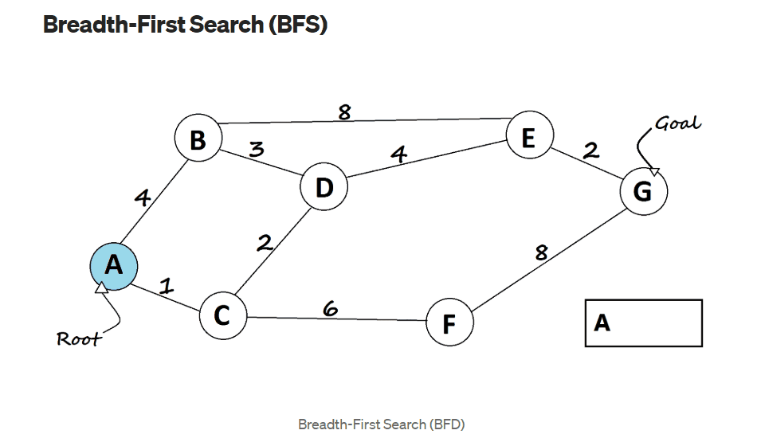

In dit voorbeeld is het natuurlijk heel mooi om via een animatie de verschillende stappen te laten zien.

Maar je zou hiervoor ook bijvoorbeeld een **"storyboard"** achtige structuur kunnen gebruiken.

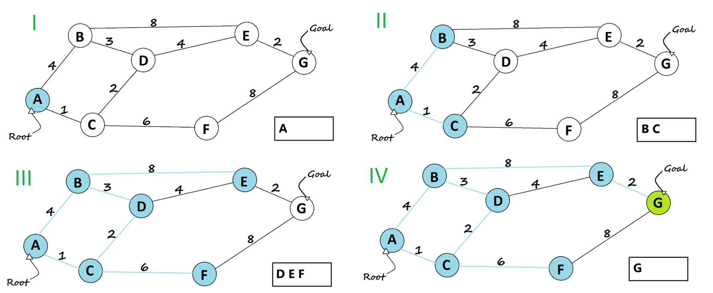

Uiteraard mis je nu nog wel de context. Wat is dat voor algoritme en wat zou het moeten doen?

_"Het Breadth-First Search (BFS) is een zoek-algoritme dat een boomstructuur met knooppunten stap voor stap doorzoekt naar een eindpunt._

_Stappen:_

_Start bij de "Root" (A) en markeert deze als bezocht._
_Bezoekt alle aangrenzende knopenpunten (B,C,D) van de huidige knoop._
_Gaat door naar het volgende niveau (E, F) en herhaal het proces totdat het doel (G) gevonden is of alle knopenpunten bezocht zijn."_

Een duidelijke leesbare omschijving moet aan een leek duidelijk kunnen maken wat je hebt gebouwd en hoe het werkt.
Vervolgens kun je met een code snippet ook laten zien hoe je dit in code hebt gebouwd.

```
    // Breadth-First Search method
    public void BFS(int startVertex)
    {
        // Keep track of visited nodes
        bool[] visited = new bool[vertices];
        // Queue for BFS
        Queue<int> queue = new Queue<int>();

        // Mark the starting vertex as visited and enqueue it
        visited[startVertex] = true;

        queue.Enqueue(startVertex);

        Console.WriteLine("Breadth-First Search starting from vertex " + startVertex + ":");

        while (queue.Count > 0)
        {
            // Dequeue a vertex and print it
            int currentVertex = queue.Dequeue();
            Console.Write(currentVertex + " ");

            // Get all adjacent vertices
            foreach (var neighbor in adjacencyList[currentVertex])
            {
                if (!visited[neighbor])
                {
                    // Mark as visited and enqueue
                    visited[neighbor] = true;
                    queue.Enqueue(neighbor);
                }
            }
        }
        Console.WriteLine(); // For a clean output
    }
```

Uiteindelijk kun je dit mooi proberen samen te voegen tot een **visual sheet**. Zorg er hierbij voor dat alle onderdelen goed zichbaar en leesbaar zijn.

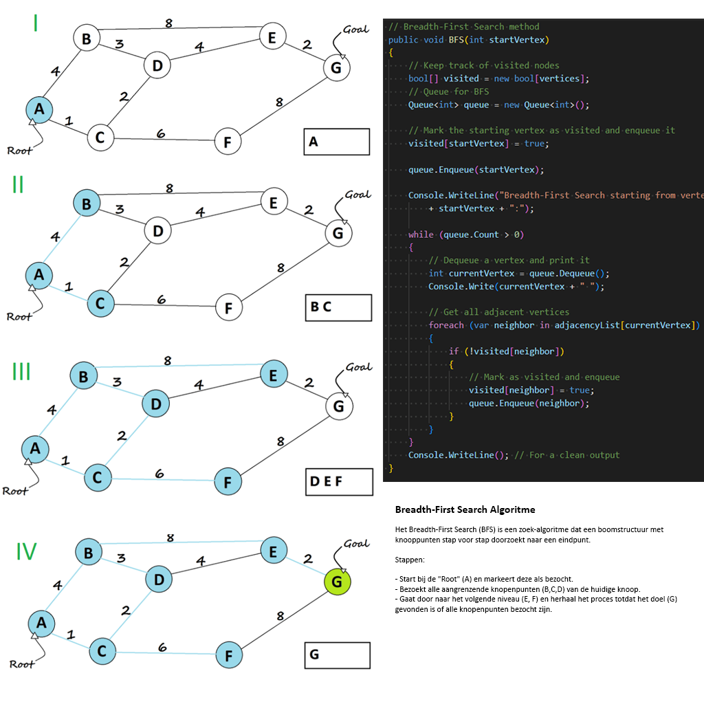

## Opdracht 10 Visual Sheet

Kies in je Vertical Slice project voor een zichtbare mechanic of een onzichtbaar algoritme. Maak hiervan een visual sheet. De visual sheet bevat een visuele weergave van de mechanic of het algoritme. Een omschrijving van de mechanic of het algoritme en de bijhorende code snippets.

Verwerk dit tot een mooi, overzichtelijk en leesbaar geheel.

Zet je visual sheet in een readme op github en lever de link in op Simulise.

Tip gebruik deze code om images in je readme weer te geven: ` `

## Technical design en UML

Vaak zijn bepaalde technische onderdelen lastig te presenteren. Denk bijvoorbeeld aan de structuur van je code of de verschillende stappen in een ingewikkeld algoritme. Om technische aspecten van je game toch goed te kunnen presenteren kun je in veel gevallen gebruik maken van UML.

UML staat voor **Unified Modelling Language**

**Wat betekenen deze termen? Wat zegt dit jou over wat UML is?**

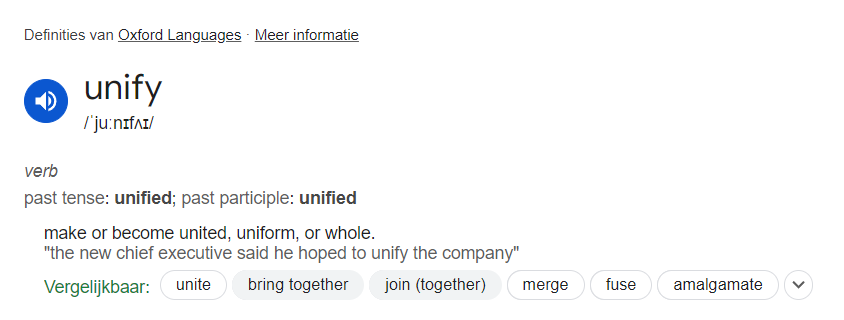
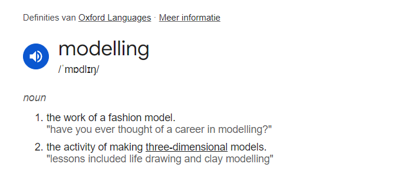
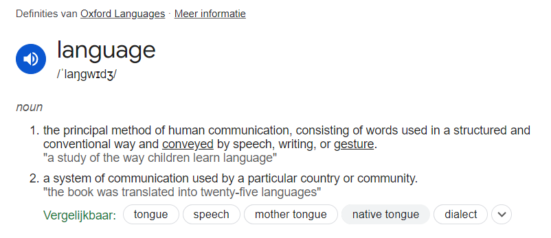

## Waarom UML gebruiken?

UML is er om technische misverstanden te voorkomen.
UML is een visuele taal die vaste regels heeft.
Hierdoor hebben onderdelen een specifieke betekenis.
Door de taal op de juiste manier te gebruiken kun je specifieke betekenissen visueel weergeven.
Denk maar eens terug aan de relaties in je **class diagram**.

Wat betekent deze pijl ook alweer?

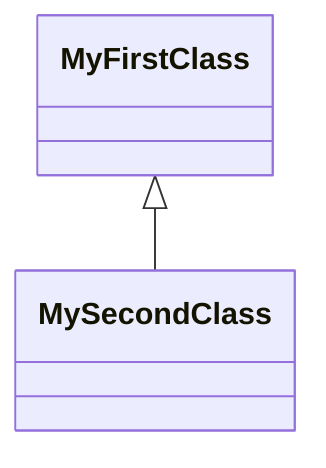

En wat is het verschil met deze pijl?


De eerste pijl staat voor een **"overerving"**-relatie terwijl de tweede staat voor een **"dependancy"**.

### Overerving

```
public class ChildClass : ParentClass{

}
```

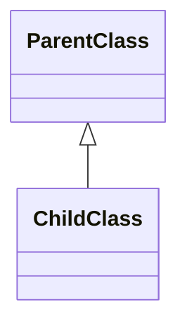

### Dependancy

```
public class DependOnMe{
    public void DoIt(){
        Debug.Log("Hello!");
    }
}

public class INeedYou : MonoBahaviour{
    private void Start(){
        DependOnMe dependancy = GetComponent<DependOnMe>();
        dependancy.DoIt();

        //De class INeedYou werkt niet zonder de DependOnMe class!
    }
}
```

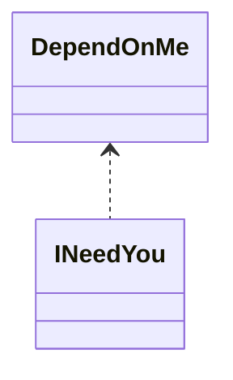

Door UML te gebruiken kun je als programmeur precies weten wat er bedoeld wordt dankzij de vorm van de pijl.

Super handig dus om technische details van je systeem goed in kaart te brengen zonder dat deze verkeerd begrepen worden.

Uiteraard werkt dit natuurlijk alleen als alle betrokkenen de betekenissen van deze pijlen kennen en de taal goed gebruiken.

**Moet je dan heel UML uit je hoofd kennen?:**

Nee, je moet UML kunnen **her**kennen en de betekenis van de onderdelen op kunnen zoeken. Je moet weten welke informatie je over kunt brengen via de verschillende modellen.

UML heeft heel veel verschillende modellen die allemaal een ander doel hebben.

Deze modellen zijn in te delen im 2 verschillende categorieen:

1. De categorie: **"Structural Diagrams"**
   Uit welke onderdelen bestaat een systeem?

2. De categorie: **"Behavioural Diagrams"**
   Wat moet er gebeuren in een systeem?


Het class diagram kennen jullie al. Hiermee hebben jullie je Towerdefense project in kaart gebracht.

## Opdracht 11

Verwerk opdracht 11 A en B in een readme. Zet deze op github en lever een link in via Simulise.

### Opdracht 11 A Onderzoek een nieuw UML model

Kies een UML model uit (behalve het Class diagram) en onderzoek waarvoor je deze kunt gebruiken. Welke informatie kun je weergeven in dit model en wat heb je hieraan?

Zoek of maak een voorbeeld van dit type diagram en geef uitleg over de verschillende onderdelen. Doe dit zoals in dit voorbeeld van het class diagram waarin je alle onderdelen een beknopte omschrijving geeft:

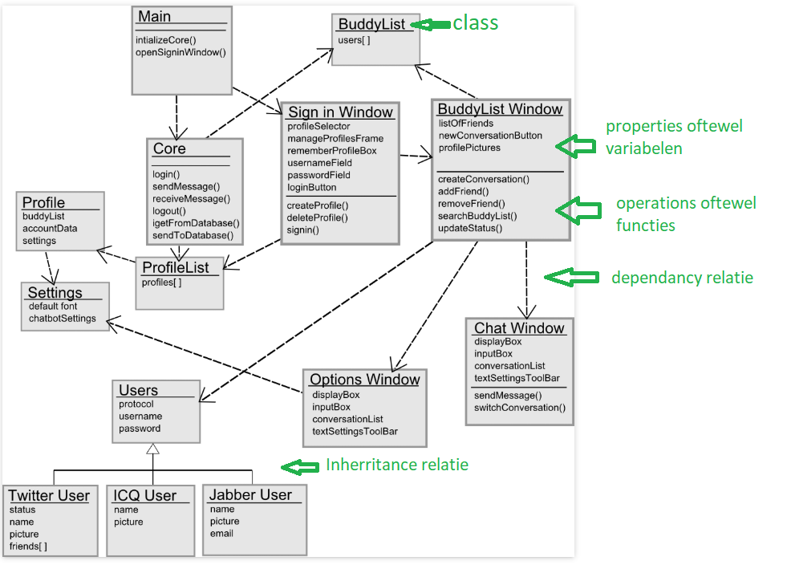

### Opdracht 11 B: Uitwerken UML model

Kies 1 van de volgende opdrachten en voer deze uit. Dus doe **opdracht 10 B1** of **opdracht 10 B2**

### Opdracht 11 B1:

Maak een **Class Diagram** van de complete Vertical Slice codebase inclusief alle [<u>attributes</u>](https://www.visual-paradigm.com/guide/uml-unified-modeling-language/uml-class-diagram-tutorial/), [<u>operations</u>](https://www.visual-paradigm.com/guide/uml-unified-modeling-language/uml-class-diagram-tutorial/), [<u>dependancies</u>](https://www.visual-paradigm.com/guide/uml-unified-modeling-language/uml-class-diagram-tutorial/) en [<u>overerving</u>](https://www.visual-paradigm.com/guide/uml-unified-modeling-language/uml-class-diagram-tutorial/)-relaties.

Voeg ook alle classes en relaties toe die je nog nodig denkt te hebben. Je levert dus een class diagram op van je code zoals die eruit ziet als de Vertical slice game klaar is. Uiteraard hoeft dit aan het einde van het project niet foutloos te zijn. Het gaat erom dat je een goede inschatting probeert te maken.

### Opdrachtr 11 B2:

Onderzoek zelf de syntax (regels) van het **Activity Diagram**. Breng de gameplay binnen je vertical slice zo volledig mogelijk in kaart met behulp van een Activity Diagram. Probeer het gedrag van je gehele vertical slice systeem te vatten zoals het moet werken als het straks klaar is. Zorg dat je in het activity diagram ook **"swimlanes"** gebruikt voor de verschillende entiteiten in je game. Denk aan spelers, enemies, bosses, UI, etc... Wat moeten die allemaal doen? In welke volgorde? Onder welke voorwaarden? Wanneer is het afgelopen? Zorg dus ook dat je activity diagram een begin en eind heeft.

Dit is een voorbeeld van een goed activity diagram:
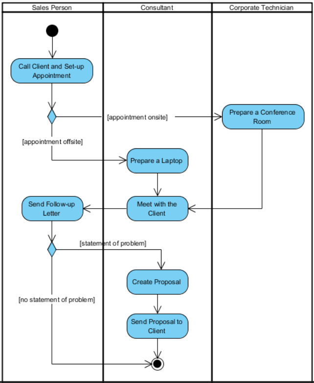
