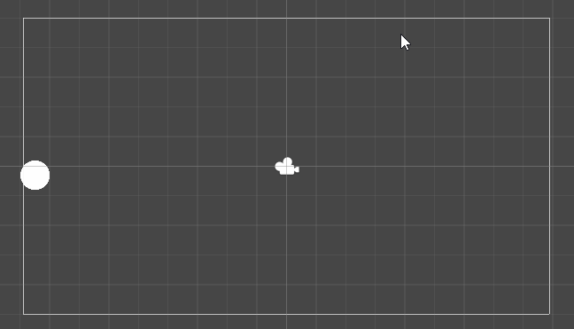

# Intro gravity

## Opdracht


# begin
maak eerst een endless bouncer


```` cs


public class EndlessBouncer : MonoBehaviour
{
    [SerializeField] Transform ball;
    [SerializeField] Vector3 acceleration = new Vector3(0, 1, 0);
    Vector3 velocity = new Vector3(2, 3, 0);
    Vector2 screenMin, screenMax; //minimale en maximale grootte van jouw speelveld in WorldCooranidates

    void Start()
    {
        screenMin = Camera.main.ScreenToWorldPoint(Vector2.zero);
        screenMax = Camera.main.ScreenToWorldPoint(new Vector2(Screen.width, Screen.height));
    }

    void Update()
    {
        ball.position += velocity * Time.deltaTime;
    }
}

````

als je dit klaar hebt, voeg je acceleration (zwaartekracht) toe

```` cs
    void Update()
    {
        velocity += acceleration * Time.deltaTime;
        ball.position += velocity * Time.deltaTime;

    }
````
De waarde `Time.deltaTime` wordt in de wis- en natuurkunde aangegeven met de variabele $\Delta t$ (spreek uit: "Delta-t")

Dit laatste stukje waarbij de velocity wordt geintergreerd over de acceleration $\Delta t$ en de positie wordt geintegreerd over de velocity $\Delta t$ noemen wij de **kinetic loop**