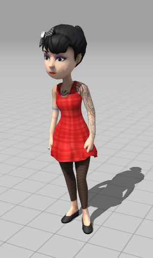
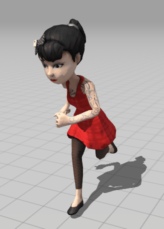
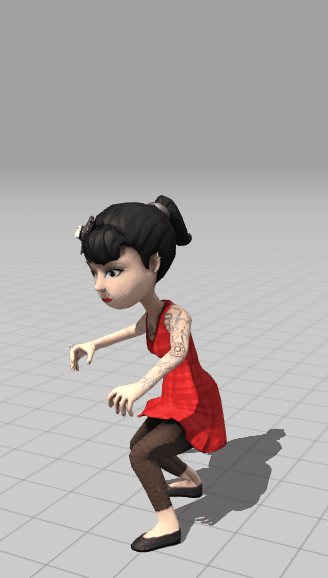
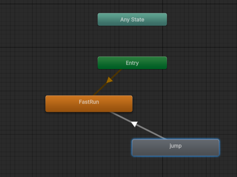

# Endless Runner

# De opdracht


# uitvoering
## stap 1 keuze karakter
download een karakter van www.mixamo.com

bijvoorbeeld Claire


Maak een map `Models' en plaats het 'fbx'-bestand (Filmbox) daar 


## stap 2 keuze animaties
download voor jouw karakter een animate van een run



download voor jouw karakter een animatie van een jump




importeer de animaties via de dialoogbox en dupliceer met ctrl-d de uiteindelijke animaties

## stap 3 maak een Animator

Maak een nieuwe Animator en zet de 'run' als default en maak een transitie van de 'jump' terug naar de 'run'



## Stap 4 Plaats in de Hierarchy

Maak een nieuwe scene-2d en plaats het model van Clair in de Hierarchy.

Voeg jouw Animator toe als een component van Claire

## Stap 5 script
Voeg aan Claire ook een script "endlessRunner" met de volgende variabelen

```` cs
    [SerializeField] float vbegin = 4;
    [SerializeField] float g = -5;
    Animator animator;

    enum State { running, jumping};
    State myState = State.running;

    Vector3 velocity = Vector3.zero;
    Vector3 acceleration = Vector3.zero;

    float tmax = 1.667f;
    float t = 0;
````

Ontwikkel een script met:
* in de Start initiatie van de Animator
* in de Upload een kinetische loop waarbij de velocity en positie van Clair worden vastgesteld
* in de Upload een state-machine waar de toestanden `running` en `jumping` worden vastgelegd 

## stap 6 de sprong

Zorg dat bij een toetsklik of muisklik de animatie "jump" eenmalig wordt afgespeeld

Voor een symetrische sprong geldt: 

$$ t_{max} = \frac{-2 v_b}{g} $$

de $t_{max}$ staat bij een animatie vast, dus kunnen we of een **g** of een **v** kiezen.

 Stel dat wij de grootte van **v** kiezen, dan moeten wij bij een gegeven $t_{max}$ uitrekenen hoe groot de waarde van **g** moet zijn 

$$ g\cdot t_{max} = -2 \cdot v_b$$

dus

$$g = \frac{-2 \cdot v_b}{t_{max}} $$

Zoek in jouw Animator uit hoe lang de `jump` duurt. Deze waarde is dus jouw $t_{max}$

## stap 7 de achtergrond

maak of zoek op het internet een achtergrond-afbeelding waarbij de linkerrand aansluit op de rechterrand, zodat de afbeelding oneindig kan roteren


Maak een nieuw materiaal met als naam background en gebruik de afbeelding

Plaats een `Quad` in de hierarchy, geef deze de afmetingen van het speelveld en gebruik background als materiaal

zet de shader op 'Unlit-texture' en voeg een script aan de Quad toe, importeer de renderer van de quad als Renderer

```` cs
public class scrollingBackground : MonoBehaviour
{
[SerializeField]
private Renderer bgRenderer;
public float speed = 2.0f;
void Update()
{
bgRenderer.material.mainTextureOffset += new Vector2(speed * Time.deltaTime, 0);
}
````