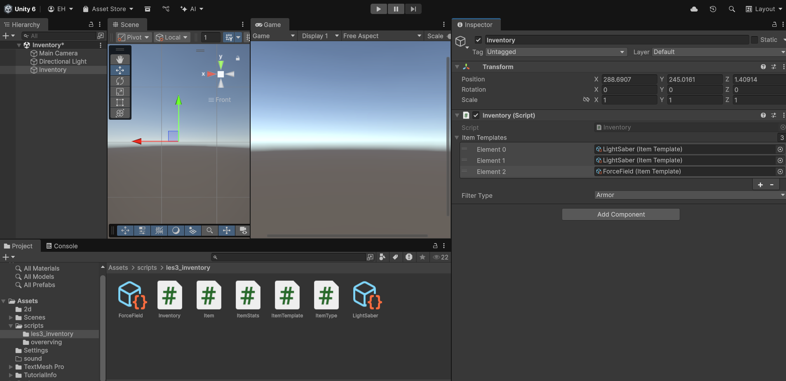

# Les 3 - Data Structures in Unity

## Doel

Jullie leren wat "data structuren" zijn en maken kennis met een specifieke structuren. Je leert wanneer je welke het beste kunt gebruiken: wanneer gebruik je Class, Struct, Enum of ScriptableObject?

## Inhoud van de les

- Korte intro Stack vs Heap
- Classes vs Structs
- Oefening 1
- Enums & ScriptableObjects
- Oefening 2
- Huiswerk uitleg

## Stack vs Heap

Het RAM geheugen van je computer heb je nodig om je computer instructies te laten onthouden zodat deze ook goed uitgevoerd kunnen worden. Het geheugen kent 2 verschillende manieren van hoe deze omgaan met data.


- **Stack:** snelle, tijdelijke opslag voor **"value types"** (lokale variabelen, structs). Wordt automatisch opgeruimd volgens het first in last out (FILO) principe.
- **Heap:** opslag voor **"reference types"** (classes, ScriptableObjects). Langere levensduur, beheerd door Garbage Collector. Slim systeem dat zorgt dat gegevens automatisch worden verwijderd bijvoorbeeld als er weinig geheugen over is.

Kort voorbeeld:

```csharp
int a = 5;                 // value - stack
Vector3 v = new Vector3(); // struct - vaak op stack
Player p = new Player();   // class - heap
```

Belangrijk: structs zijn snel en licht, maar worden steeds gekopieerd. Classes zijn flexibeler (null, inheritance) maar kosten heap-overhead. (garbage collection)


---

## 10 veel voorkomende Value Types in Unity

1. **int** — gehele getallen (-2147483648 tot 2147483647)
2. **float** — kommagetallen met enkele precisie (3.14f)
3. **bool** — true/false waarden
4. **double** — kommagetallen met dubbele precisie (7.5d)
5. **byte** — kleine gehele getallen (0 tot 255)
6. **short** — gehele getallen (-32768 tot 32767)
7. **long** — grote gehele getallen (-9223372036854775808 tot 9223372036854775807)
8. **char** — één karakter ('a', 'Z', '5')
9. **decimal** — zeer nauwkeurige kommagetallen (voor financiële berekeningen)
10. **uint** — positieve gehele getallen (0 tot 4294967295)

---

## 10 veel voorkomende structs in Unity

1. **Vector2** — 2D vector met x en y coördinaten (bijv. voor 2D-spellen)
2. **Vector3** — 3D vector met x, y en z coördinaten (bijv. voor posities en rotaties)
3. **Quaternion** — rotatiedata in 3D ruimte (efficiënter dan Euler-hoeken)
4. **Color** — RGBA kleuren (rood, groen, blauw, alpha/doorzichtigheid)
5. **Bounds** — rechthoekig volume gedefinieerd door center en extents
6. **Rect** — rechthoek gedefinieerd door positie en grootte
7. **Matrix4x4** — 4x4 matrix voor transformaties
8. **RaycastHit** — informatie uit een raycast (wat geraakt werd)
9. **ContactPoint** — contactpunt tussen twee colliders (gebruikt bij Physics callbacks)
10. **Plane** — oneindig vlak in 3D ruimte gedefinieerd door normal en afstand

---

## De 10 Meest Gebruikte Classes in Unity

1. **GameObject** — basis object in Unity (alles wat in een scene staat)
2. **Transform** — positie, rotatie en schaal van een GameObject
3. **MonoBehaviour** — basis class voor alle scripts die je schrijft
4. **Rigidbody** — physics component voor realistische beweging
5. **Collider** — geometry voor collision detection (BoxCollider, SphereCollider, etc.)
6. **Camera** — kijkpunt van de speler in de wereld
7. **Light** — lichtbron in de scene
8. **Canvas** — container voor UI-elementen
9. **Image** — 2D plaatje weergeven in UI
10. **AudioSource** — geluid afspelen in de wereld of voor UI

---

## Classes

- Reference type, gebruik bij: complexe objecten, inheritance, MonoBehaviours, wanneer je mutable gedeelde state wilt. Gebruik van functies in de class.

```csharp
public class Player {
    public string name;
    public int health;
    void Attack(){
        //code
    }
}
```

## Structs

- Value type, gebruik bij: kleine data (posities, stats), performance-kritische, immutable waar mogelijk. Passieve data.

```csharp
[Serializable] public struct PlayerStats {
    public int health;
    public float speed;
}
```

### Oefening 1:

Welk type kies je?

1. Powerup state van een tower in een towerdefense game.
2. Enemy AI component voor het bepalen en uitvoeren van het gedrag.
3. XYZ-coördinaten in een 3d omgeving.
4. Management van actieve powerups

## Enums

- Gebruik voor vaste opties (weapon types, game states). Maakt code leesbaarder. Voorkomen van magic numbers. Enums zijn voor de code gewoon integers. De waardes veranderen nooit.

```csharp
public class GameSettings : MonoBehaviour
{
    public int currentDifficulty;
    public enum Difficulty { Easy, Medium, Hard };
    void Start()
    {
        SetDifficulty(1);  // Zet de moeilijkheidsgraad op 1? magic number, wat betekent 1?
        SetDifficulty((int)Difficulty.Easy); //gebruiken van een enum
    }
    void SetDifficulty(int difficulty)
    {
        currentDifficulty = difficulty;
        Debug.Log("difficulty is set to : " + currentDifficulty);
    }
}
```

## ScriptableObjects

- Asset-based reference type, ideaal voor gedeelde configuratie/gegevens (items, level data, tuning)
- Voordelen: deelbaar tussen prefabs, zichtbaar in Inspector, persistente asset (ook als de game niet speelt)
- Niet bedoeld als "per-instance runtime-state container" oftewel normaal RAM geheugen (dat leidt tot onverwachte gedeelde wijzigingen) Dus niet geschikt om veranderende data bij te houden.

Kort voorbeeld:

```csharp
[CreateAssetMenu(menuName = "Game/Weapon")]
public class WeaponData : ScriptableObject { public string name; public int damage; }
```

Je kunt een scriptable object wel gebruiken om bijvoorbeeld je level designs in op te slaan of gegevens van de verschillende waves in je towerdefense game.

### ScriptableObjects vs Structs (kort)

- ScriptableObject: één gedeelde asset, reference type op heap, goed voor templates/configs.
- Struct: kleine value container, wordt gekopieerd, snel voor veel kleine instances.

Gebruik ScriptableObject als je één bron van waarheid wil (bijv. wapen-template). Gebruik struct voor per-entity kleine data (bijv. positie, simpele stats).

### Oefening 2:

Refactor de volgende code:

```csharp
public class Enemy : MonoBehaviour {
  public int enemyType; // 0=melee,1=ranged
  public float[] stats; // health,damage,speed
}
```

## Opdracht 3: Inventory & Item Management System

### Scenario

Je maakt een small inventory/shop systeem voor een RPG-spel. Spelers kunnen items kopen, verkopen en beheren. Je gaat vier data structure types gebruiken om dit systeem op te bouwen.

### Leerdoelen

- Begrijpen wanneer je Class, Struct, Enum of ScriptableObject gebruikt.
- Praktisch werken met reference types (Class, ScriptableObject) en value types (Struct).
- Een klein maar realistisch systeem ontwerpen en implementeren.

---

## Deel A: Enum — ItemType

### Doel

Definieer vaste item-typen zodat je geen "magic numbers" gebruikt.

### Instructie

1. Maak een nieuw script `ItemType.cs`
2. Definieer een public enum met minstens 5 item-typen:

```csharp
public enum ItemType
{
    Weapon,
    Armor,
    Potion,
    Consumable,
    Misc
}
```

### Waarom Enum?

- Voorkomen van magic numbers (0, 1, 2, ...)
- Code leesbaarder: `ItemType.Weapon` is duidelijker dan `0`
- Compiler checkt of je alleen geldige waarden gebruikt
- De waardes veranderen nooit (statisch)

### Tip

- Enums zijn intern integers, dus efficiënt
- Je kunt ze in if-statements vergelijken: `if (item.type == ItemType.Weapon)`

---

## Deel B: Struct — ItemStats

### Doel

Maak een kleine, lichtgewicht data container voor item-statistieken. Structs zijn ideaal voor eenvoudige, passieve data die veel voorkomt (en niet verandert).

### Instructie

1. Maak een nieuw script `ItemStats.cs`
2. Definieer een struct met deze properties:

```csharp
[Serializable] public struct ItemStats
{
    public float damage;
    public float defense;
    public float weight;

    // Constructor (optioneel maar handig)
    public ItemStats(float damage, float defense, float weight)
    {
        this.damage = damage;
        this.defense = defense;
        this.weight = weight;
    }
}
```

### Waarom Struct?

- Snelle opslag (stack) voor kleine, onveranderlijke data
- Geen garbage collection overhead
- Ideaal voor performance-kritische waarden (stats, posities)
- Wordt **gekopieerd** bij toewijzing (dus wijzigingen zijn lokaal)

### Voorbeeld gebruik

```csharp
ItemStats sword = new ItemStats(15f, 0f, 5f);
ItemStats armor = new ItemStats(0f, 10f, 10f);
```

### Tip

- Structs zijn value types → wees voorzichtig met grote data containers
- Voor mutable/gedeelde data: gebruik Class in plaats van Struct

---

## Deel C: Class — Item

### Doel

Maak de hoofdklasse `Item` met gedrag, inventory management en identity. Classes zijn ideaal voor objecten met gedrag en gedeelde state.

### Instructie

1. Maak een nieuw script `Item.cs`
2. Definieer een public class met:
   - Properties (naam, type, stats, prijs)
   - Methoden (Describe(), CalculateValue())

```csharp
using UnityEngine;
public class Item
{
    public string itemName;
    public ItemType itemType;
    public ItemStats stats;
    public int sellPrice;
    public bool isEquipped;

    // Constructor
    public Item(string name, ItemType type, ItemStats itemStats, int price)
    {
        itemName = name;
        itemType = type;
        stats = itemStats;
        sellPrice = price;
        isEquipped = false;
    }

    // Methode: geef item-beschrijving
    public string Describe()
    {
        return $"{itemName} ({itemType})\n" +
               $"Damage: {stats.damage}, Defense: {stats.defense}, Weight: {stats.weight}\n" +
               $"Sell Price: {sellPrice}";
    }
}
```

### Waarom Class?

- **Reference type** → één object, veel referenties (minder geheugen)
- Gedrag via methoden (Describe, CalculateValue, Toggle)
- Mutable state (isEquipped kan veranderen)
- Inheritance mogelijk (later: Weapon extends Item)
- Null kan zijn (geen onverwachte default values)

### Voorbeeld gebruik

```csharp
Item ironSword = new Item("Iron Sword", ItemType.Weapon, new ItemStats(15f, 0f, 5f), 100);
Debug.Log(ironSword.Describe());
ironSword.Toggle(); // Equip
```

### Tip

- Classes zijn flexibel → gebruik ze voor "smart objects" met logica
- Structs kopiëren → classes zijn efficiënter voor grote, gedeelde data

---

## Deel D: ScriptableObject — ItemTemplate

### Doel

Maak herbruikbare item-sjablonen die in de Inspector kunnen worden ingesteld en opgeslagen als Unity-assets.

### Instructie

1. Maak een nieuw script `ItemTemplate.cs`

```csharp
using UnityEngine;

[CreateAssetMenu(menuName = "Game/Item Template")]
public class ItemTemplate : ScriptableObject
{
    public string itemName;
    public ItemType itemType;
    public ItemStats stats;
    public int basePrice;
    public Sprite icon; // Plaatje voor UI

    // Methode: maak een runtime Item van dit template
    public Item CreateInstance()
    {
        return new Item(itemName, itemType, stats, basePrice);
    }

    // Methode: geef template-info
    public void LogTemplate()
    {
        Debug.Log($"Template: {itemName} (Price: {basePrice})");
    }
}
```

2. In Unity Editor:
   - Rechtsklik in Project > Create > Game > Item Template
   - Vul de waarden in (bijv. "Light Saber", Weapon, price=500)
   - Sla op als asset (bijv. `lightSaber.asset`)

### Waarom ScriptableObject?

- **Persistent asset** → blijft bestaan buiten runtime
- Zichtbaar in Inspector → designers kunnen waarden wijzigen zonder code
- **Gedeelde template** → één "bron van waarheid" voor vele instances
- Efficiënt voor configuratie (items, levels, waves)
- **NIET** geschikt voor per-instance veranderende data (daarvoor: Class)

### Verschil: Template vs Runtime Instance

```csharp
// Template (in Inspector)
ItemTemplate lightSaberTemplate; // ScriptableObject, 1x in geheugen

// Runtime instances (unieke kopieën)
Item lightSaber1 = lightSaberTemplate.CreateInstance(); // Nieuwe object
Item lightSaber2 = lightSaberTemplate.CreateInstance(); // Nog één
// goldSword1 en goldSword2 zijn onafhankelijk (via Class)
```

### Tip

- Gebruik ScriptableObject voor templates, configuratie, statische data
- Gebruik Class/Struct voor runtime-instances die kunnen veranderen

---

## Samenvattend: Alle vier gebruiken

Maak een `Inventory.cs` script dat alles samenvoegt:

```csharp
public class Inventory : MonoBehaviour
{
    // Class: verzamelt items
    private List<Item> items = new List<Item>();

    // ScriptableObject: templates laden
    public ItemTemplate[] itemTemplates;

    // Enum: filter op type
    public ItemType filterType;

    void Start()
    {
        // Maak items van templates
        foreach (ItemTemplate template in itemTemplates)
        {
            Item newItem = template.CreateInstance();
            items.Add(newItem);
            Debug.Log(newItem.Describe());
        }
    }

    // Filter items op enum-type
    public List<Item> GetItemsByType(ItemType type)
    {
        List<Item> filtered = new List<Item>();
        foreach (Item item in items)
        {
            if (item.itemType == type) // Enum vergelijking
            {
                filtered.Add(item);
            }
        }
        return filtered;
    }
    private void Update()
    {
        if (Input.GetKeyDown(KeyCode.Space)) {
            List<Item> filteredItems = GetItemsByType(filterType);
            foreach (Item fi in filteredItems) {
                Debug.Log(fi.Describe());
            }

        }
    }
}
```

Hang je `Inventory` script aan een leeg gameobject in de scene!

Maak minimaal 3 soorten wapens en armor aan en vul je inventory met deze items!



Als je op play drukt worden alle items die je in je inventory hebt staan geprint in de console:

Verander het filter en druk op spatie alleen de gefilterde items worden nu weergegeven.


---

**Bonus (optioneel)**
Zorg dat je items kunt verkopen door op **S-knop** (sell) te drukken en dan **W-knop** voor weapon. Of **S-knop** (sell) en **P-knop** voor potion etc..

**Beoordeling:**

- Alles werkt zoals het voorbeeld

**Lever in:**

- Zet de opdracht in je PROG README
- Geef de titel en uitleg over de opdracht
- Screenshots van je Unity Inspector setup
- Gifje van je werkende inventory system
- Link naar je code

---
