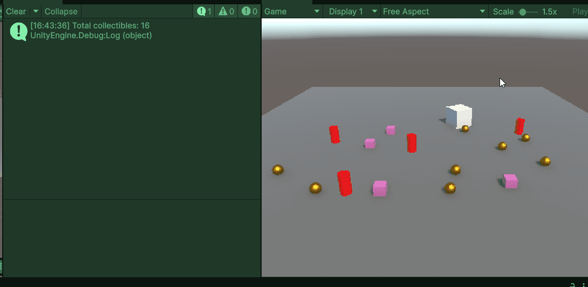

# PROG: OOP Abstractie

## Wat is Abstractie?

Abstractie is het concept van **complexe details verbergen** en alleen de **essentiële eigenschappen** van een object tonen. Denk eraan als het besturen van een auto: je hoeft niet de hele motor te begrijpen om te rijden. Je gebruikt gewoon het stuurwiel, pedalen en versnellingspook. Al het overige is verborgen.

In programmeren betekent abstractie:

- Verberg het **HOE** (implementatiedetails)
- Toon het **WAT** (interface/functionaliteit)

---

## Praktijkvoorbeeld: Een Game Character Systeem

Stel je voor dat je een game bouwt met verschillende karaktertypes: Strijders, Tovenaars en Boogschutters. Elk heeft andere vaardigheden, maar ze delen gemeenschappelijke acties zoals **schade nemen** en **aanvallen**.

### Zonder Abstractie (Het Probleem)

```csharp
public class Warrior {
    public void Attack() {
        Debug.Log("Warrior swings sword!");
    }

    public void TakeDamage(int damage) {
        health -= damage;
        Debug.Log("Warrior took " + damage + " damage!");
    }
}

public class Mage {
    public void Attack() {
        Debug.Log("Mage casts fireball!");
    }

    public void TakeDamage(int damage) {
        health -= damage;
        Debug.Log("Mage took " + damage + " damage!");
    }
}

public class Archer {
    public void Attack() {
        Debug.Log("Archer shoots arrow!");
    }

    public void TakeDamage(int damage) {
        health -= damage;
        Debug.Log("Archer took " + damage + " damage!");
    }
}
```

**Probleem:** Dezelfde code wordt herhaald in elke klasse. Als je wilt veranderen hoe schade werkt, moet je drie klassen aanpassen!

### Met Abstractie (De Oplossing)

Maak een **abstracte basisklasse** die de gedeelde methoden eigenschappen bepaalt:

```csharp
// Abstracte basis class - Wat kan elke class doen?
public abstract class Character : MonoBehaviour {
    protected int health = 100;
    protected string characterName;

    // Abstracte methode - MOET door de subklasse geimplement worden!
    public abstract void Attack();

    // virtual method - gedeeld door alle subclasses mogen een andere imolementatie krijgen maar hoeft niet
    public virtual void TakeDamage(int damage) {
        health -= damage;
        Debug.Log(characterName + " took " + damage + " damage! Health: " + health);

        if (health <= 0) {
            Die();
        }
    }

    // gedeelde functionaliteit
    private void Die() {
        Debug.Log(characterName + " has been defeated!");
        Destroy(gameObject);
    }
}

// Concrete implementaties - voor elk type character
public class Warrior : Character {
    void Start() {
        characterName = "Warrior";
        health = 120;
    }

    public override void Attack() {
        Debug.Log(characterName + " swings sword for 25 damage!");
        //Doe dingen met zwaarden en bloed
    }
}

public class Mage : Character {
    void Start() {
        characterName = "Mage";
        health = 60;
    }

    public override void Attack() {
        Debug.Log(characterName + " casts fireball for 40 damage!");
        // Doe dingen met vuur!!!!
    }
}

public class Archer : Character {
    void Start() {
        characterName = "Archer";
        health = 70;
    }

    public override void Attack() {
        Debug.Log(characterName + " shoots arrow for 20 damage!");
        // Doe dingen met pijlen en bogen
    }
}
```

### Hoe Abstractie Helpt

```csharp
// Al je characters passen nu in 1 lijst met hetzelfde type
List<Character> characters = new List<Character>();
characters.Add(Instantiate(warriorPrefab));
characters.Add(Instantiate(magePrefab));
characters.Add(Instantiate(archerPrefab));

// Loop door  ALLE characters en geef ze damage
foreach (Character character in characters) {
    character.Attack();
    //Alle characters vallen aan!
    character.TakeDamage(100);
    //Alle mages en archers zijn nu dood!

}
```

---

## Belangrijkste Concepten

### Abstracte Klasse (`abstract`)

- **Kan niet direct geïnstantieerd** worden
- Bepaalt het **contract** - welke methodes subklassen moeten implementeren
- Kan zowel abstracte als gewone methodes hebben

### Abstracte Methode (`abstract void Attack()`)

- Heeft **geen implementatie** in de abstracte klasse
- **Moet overschreven** worden in subklassen
- Forceert elk karaktertype om hun eigen aanval te definiëren

### Virtuele Methode (`virtual void TakeDamage()`)

- Heeft een **standaard implementatie**
- **Kan overschreven** worden door subklassen (optioneel)
- Kan aangeroepen worden vanuit subklassen met `base.TakeDamage()`

### Overschrijven (`override`)

- Vervangt de methode-implementatie van de parent klasse
- Elke subklasse geeft haar eigen specifiek gedrag

---

## Voordelen van Abstractie

**Code Hergebruik** - Gedeelde code op één plek (de basisklasse)  
**Eenvoudig Onderhoud** - Verander schadasysteeem eenmaal, beïnvloedt alle karakters  
**Flexibiliteit** - Eenvoudig nieuwe karaktertypes toevoegen  
**Typeveiligheid** - Behandel verschillende karakters uniform  
**Schonere Code** - Verberg complexe details achter eenvoudige methodes en eigenschappen

---

## Oefening: Pickup & Trap Systeem

Maak een abstractie voor verschillende soorten pickups en traps in je spel.

### Stap 1: Abstracte basisklasse maken

Maak een abstracte klasse `Collectable` met:

- Een abstracte methode `OnCollect()`
- Een `OnTriggerEnter()` die deze methode aanroept

### Stap 2: Implementeer verschillende types

Maak minstens 3 concrete klasses:

- **HealthPickup** - geeft 20 gezondheid en zegt "Health restored!" in de console
- **CoinPickup** - geeft 10 punten en zegt "Coin collected!" in de console
- **DamageTrap** - doet 5 schade en zegt "BOOM!!" in de console

Elke klasse moet `OnCollect()` op zijn eigen manier implementeren.

### Stap 3: Test het

1. Maak prefabs voor elke pickup/trap
2. Plaats ze in je scene (minstens 5-10 van elk type)
3. Als de speler (met een Rigidbody(isKinematic) en Collider) ze raakt, moet het juiste effect worden uitgevoerd via `OnCollect()`

### Stap 4: Collectibles tracken

Maak een **CollectibleManager** script dat:

- Een **List van alle Collectibles** bijhoudt
- Alle Collectibles in de scene vindt met `FindObjectsOfType<Collectable>()`
- De **totale hoeveelheid collectibles** in de wereld print in de Start()
- Elke keer als een collectible opgepakt wordt, het uit de list verwijdert en het nieuwe aantal items in de wereld print

Voorbeeld output in console:

```
Total collectibles: 18
Collectible collected! Remaining: 17
Collectible collected! Remaining: 16
```

**Tip:** Voeg een tag "Collectable" toe aan al je pickups en traps, dan kun je in `OnTriggerEnter()` checken: `other.CompareTag("Collectable")`

Zorg dat het CollectibleManager script kan communiceren met de Collectibles (misschien met action events?).



**Uitdaging:** Kun je een **StatsManager** maken die alle punten en gezondheid bijhoudt op de canvas?
