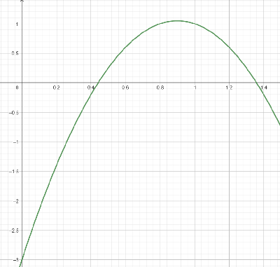
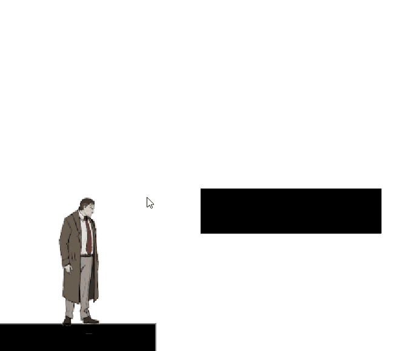

# Asymetrische sprong

# Quadratic function

Een quadratic function zit er in het algemeen zo uit:
$$ f(t) = at^2 + bt +c $$

Met deze functie kunnen de nulpunten worden gevonden met een quadratic equation

$$ at^2 + bt + c = 0$$


De nulpunten van deze functie kan je vinden met de quadratic formula

$$ x_{1,2} = \frac{-b \pm \sqrt{b^2 - 4ac}}{2a} $$

Bij een sprong kunnen wij de duur van de sprong vinden door de zwaartekracht, beginsnelheid en beginhoogte in te vullen. De eindhoogte moet wel nul blijven

| Variabele | Waarde  |
|-----------|--------|
| a         | $` - \frac{1}{2}g `$ |
| b         | $`v_b`$    |
| c         | $`h_0 `$    |


Zo luidt de formule om de duur van de sprong te bepalen:

$$ f(t) = -\frac{1}{2} g t^2 + v_0 t + h_0 $$

## de quadratic-class in C#
Wij kunnen van deze formule in C# een class maken die deze berekening uitvoert

``` CS
public class QuadraticFunction 
{
    public float a;
    public float b;
    public float c;

    public QuadraticFunction(float a, float b, float c)
    {
        this.a = a; this.b = b; this.c = c;
    }

    public float evaluteValue(float t)
    {
        return (a * t * t) + (b * t) + c;
    }

    public Vector2 findZero()
    {
        Vector2 isZero = new Vector2();
        float D = (this.b * this.b ) - (4 * this.a * this.c);
        if(D<0)
        {
            throw new InvalidOperationException("Geen reële oplossingen voor deze vergelijking.");
        }

        else
        {
            isZero.x = (-this.b + Mathf.Sqrt(D))/(2 * this.a);
            isZero.y = (-this.b - Mathf.Sqrt(D)) / (2 * this.a);
        }

        return isZero;
    }

}
```
## de opdracht
Gebruik een spritesheet om een sprong in unity uit te voeren. Je mag zelf de zwaartekracht, beginsnelnheid en beginhoogte instellen.

## voorbeeld
Een sprong in Unity met als parameters
$$ g = -10 \frac{m}{s^2} $$
$$v_b = 9  \frac{m}{s}$$
$$ h_0 = -3 m$$

Deze functie ziet er alsvolgt uit:


De nulpunten zijn t = 0.44 seconden en t = 1.36 seconden

de animatie van de sprong duurt 12 frames = 0.750 seconden

Dus de animatie-snelheid = 0.551



