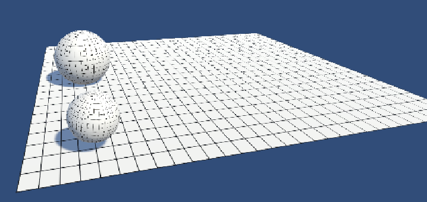

# Inertia: Uitleg en Betekenis

## Wat is Inertia?

Inertia (traagheid) is een fundamenteel begrip in de fysica dat verwijst naar de weerstand van een object tegen veranderingen in zijn bewegingstoestand. Dit betekent dat een object in rust wil blijven en een bewegend object in dezelfde snelheid en richting wil blijven bewegen, tenzij er een externe kracht op inwerkt.

## Wet van Inertia (Eerste Wet van Newton)

Isaac Newton formuleerde de wet van traagheid als de **eerste wet van de beweging**:

> *"Een object in rust blijft in rust en een object in beweging blijft in beweging met een constante snelheid en in een rechte lijn, tenzij er een externe kracht op inwerkt."*

Dit betekent dat als er geen resulterende kracht op een object werkt, het zijn huidige bewegingsstatus behoudt.

## Voorbeelden van Inertia

1. **In de auto**: Wanneer een auto plotseling stopt, beweegt je lichaam nog even naar voren. Dit komt doordat je lichaam de neiging heeft om door te gaan met de oorspronkelijke beweging.
2. **Op een tafel**: Als je plotseling een tafelkleed onder borden vandaan trekt, blijven de borden (als het snel genoeg gebeurt) op hun plaats door traagheid.
3. **In de ruimte**: Een object dat in de ruimte wordt geduwd, blijft zich bewegen zonder te stoppen, omdat er geen wrijving of luchtweerstand is die het vertraagt.

## Massa en Inertia

De mate van inertia hangt af van de **massa** van een object: 

- **Zware objecten** hebben meer traagheid en vereisen een grotere kracht om hun beweging te veranderen.
- **Lichte objecten** hebben minder traagheid en kunnen gemakkelijker van beweging veranderen.

## Wiskundige Weergave

De wet van inertia wordt vaak weergegeven met de tweede wet van Newton:

$$ F = m \cdot a $$

Waarbij:
- \( F \) = kracht (in Newton)
- \( m \) = massa (in kg)
- \( a \) = versnelling (in m/s²)

Als er **geen kracht** (\( F = 0 \)) op een object werkt, dan blijft de versnelling **nul**, en zal het object in rust blijven of met een constante snelheid blijven bewegen.

---

Door deze wetmatigheid kunnen we beter begrijpen waarom objecten blijven bewegen of juist stil blijven staan, tenzij een kracht hen dwingt om van toestand te veranderen.

## opdracht inertia
- Maak een nieuwe 3d scene aan in Unity
- plaats op de plain een Sphere met als naam Ball1
  - voeg een Rigid body toe aan de Ball1
  - voeg een texture toe aan de bal
  - de de Ball1 een massa van 1 kg
- plaats een tweede bal met als naam Ball2
  - voeg hier ook een RidgitBody aan toe
  - voeg hier ook een texture aan toe
  - maak Ball2 1.26 x zo groot als Ball1
  - Geef Ball2 een massa van 2 kg

Maak vervolgens een script dat op key- of mousclick beide ballen een addForce van 100 Newton in de x-richting (1,0,0) geven. Wat gebeurt er?

