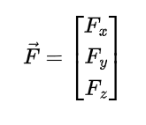
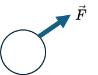
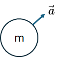
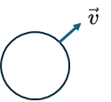
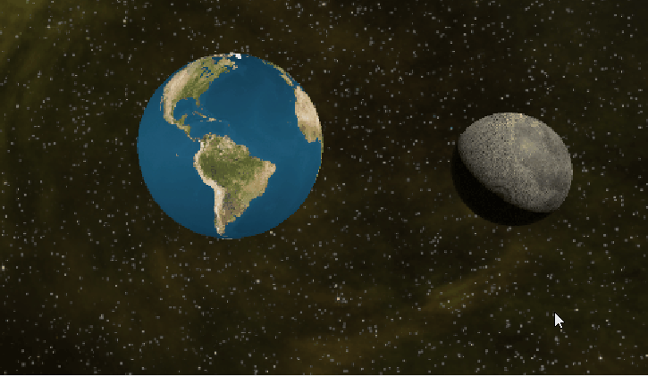

# Zwaartekracht in het Aarde-Maan systeem

## 🌍 Wat is zwaartekracht?
Zwaartekracht is de aantrekkingskracht tussen twee massa’s. Hoe groter de massa en hoe dichterbij ze zijn, hoe sterker de kracht.

---

## 🌕 Aarde en maan trekken aan elkaar

- De **aarde trekt aan de maan** → dit houdt de maan in een baan rond de aarde.
- De **maan trekt ook aan de aarde**, al is die kracht iets zwakker.

Samen draaien ze rond een gemeenschappelijk zwaartepunt.

---

## ⚖️ Het barycentrum

- Het **barycentrum** is het gezamenlijke zwaartepunt van aarde en maan.
- Dit punt ligt **niet precies in het midden van de aarde**, maar ongeveer 1700 km onder het aardoppervlak.
- De aarde draait dus een beetje om dit punt, net zoals de maan dat doet.

---

## 🌊 Gevolgen van de zwaartekracht tussen aarde en maan

1. **Getijden**  
   De zwaartekracht van de maan trekt aan het water op aarde → dit veroorzaakt **eb en vloed**.

2. **Maanbanen**  
   De zwaartekracht zorgt ervoor dat de maan netjes in een **baan** om de aarde blijft.

3. **Vertraagde rotatie**  
   Door de getijdenwerking wordt de **rotatie van de aarde vertraagd**, en de maan beweegt langzaam van de aarde af (ongeveer **3,8 cm per jaar**).

---

# 🧭 Beginselen van de Kinematica en Dynamica

**Kinematica** is het deel van de natuurkunde dat de beweging van objecten **beschrijft**, zonder rekening te houden met de krachten die deze beweging veroorzaken.

Als er krachten werkzaam zijn, spreekt met van Dynamica

---

## 🔑 Belangrijke grootheden

| Grootheid       | Symbool | Eenheid        | Beschrijving                          |
|-----------------|---------|----------------|---------------------------------------|
| Positie         | `x`     | meter (m)      | Waar een object zich bevindt          |
| Verplaatsing    | `Δx`    | meter (m)      | Verandering in positie                |
| Snelheid        | `v`     | meter per seconde (m/s) | Hoe snel iets beweegt         |
| Versnelling     | `a`     | meter per seconde² (m/s²) | Hoe snel de snelheid verandert |
| Verlopen tijd     | `Δt`     | seconde (s) | de verandering van tijd |

---

## 📐Causale verbanden

Er is een kracht F

Deze kracht werkt op een object, 

het object krijgt daardoor, afhankelijk van de massa van het object, een versnelling

$$ \vec{F} = m \vec{a} $$

of in ons geval, als je begint bij de kracht en de versnelling wil weten 

 $$ \vec{a} =\frac{1}{m} \vec{F} $$

**De versnelling is in de zelfde richting als de kracht!**

Door de versnelling krijgt het object een (andere) snelheid

 $$ \Delta \vec{v}  = a \Delta t$$

 Door de snelheid verandert het object van positie 

 

   $$ \Delta \vec{r} = v \Delta t $$

---

## simulatie zwaartekracht in de ruimte

De aarde en maan hebben beide een massa en oefenen beide een (aantrekkings)kracht op elkaar uit. Voor het gemak plaatsen wij de aarde even stil en laten we alleen de maan bewegen. 

De maan heeft een willekeurige beginsnelheid en wordt aangetrokken in de richting van de aarde

