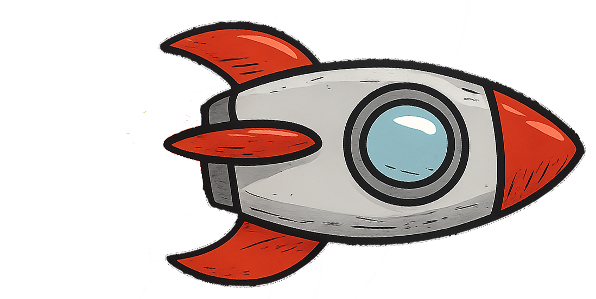
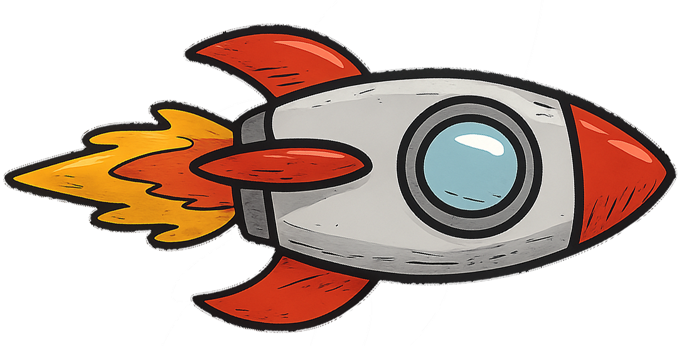
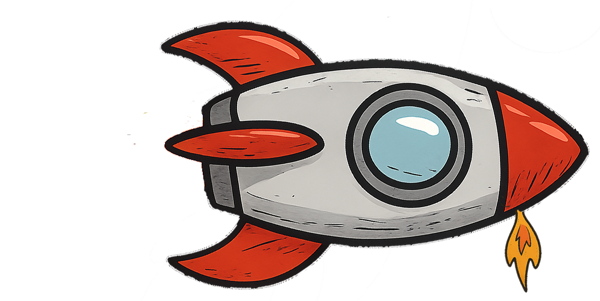
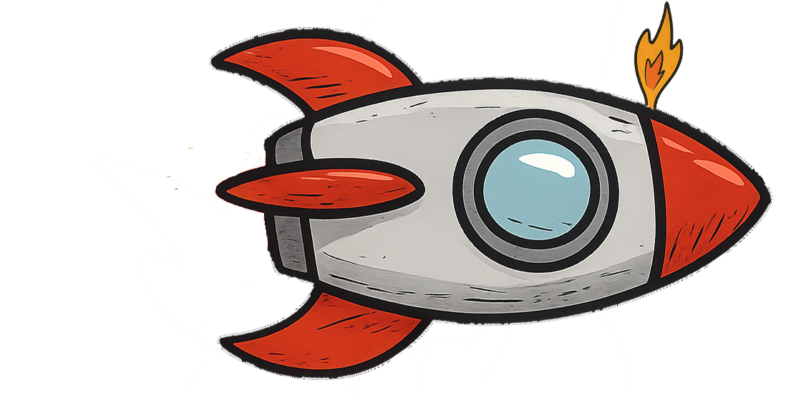

# Wat is Impuls?

Impuls is een natuurkundige grootheid die beschrijft hoeveel beweging een object heeft, en hoe moeilijk het is om dat object van snelheid te laten veranderen. Denk eraan als het product van "massa" en "snelheid". Dus als iets zwaar én snel is, heeft het veel impuls. Verrassend, ik weet.

## Formule

De formule voor impuls **p**  is:

$$ p = m \cdot v $$ 

Waarbij:
- `p` staat voor impuls (in kg·m/s),
- `m` de massa is (in kilogram),
- `v` de snelheid is (in meter per seconde).

## het belang van impuls
Impuls is een belangrijke natuurkunde grootheid, omdat dit voor een afgesloten systeem behouden blijft. Dit heet de **wet op behoud van impuls**

Dit is van belang bij collisions

## Voorbeeld

Stel, een bowler gooit een bowlingbal van 5 kg met een snelheid van 4 m/s. De impuls is dan:

$$ = = m \cdot v = 5 \cdot 4 = 20 ~ [kg \cdot ms^{-1}] $$

als je in een werkelijkheid of een 3d omgeving werkt is de impuls een vector dus

$$ \vec{p} = m \vec{v} $$

## Hoe beïnvloedt een kracht de impuls?

Een kracht verandert de impuls van een object. Deze relatie wordt beschreven door de tweede wet van Newton, in impuls-vorm:

### Impuls en kracht

De verandering van impuls is gelijk aan de kracht maal de tijd waarin die kracht werkt:

**F · Δt = Δp**

waarbij:
- **F** = kracht (in newton, N)
- **Δt** = tijdsduur waarin de kracht werkt (in seconden)
- **Δp** = verandering van impuls (in kg·m/s)

Deze vergelijking laat zien dat een kracht die gedurende een bepaalde tijd op een object werkt, de impuls van dat object verandert.

### Impuls en kracht in formulevorm

We kunnen dit ook schrijven als:

**Δp = F · Δt**

Of in afgeleide vorm van Newton's tweede wet:

**F = Δp / Δt**

### Voorbeeld

Een hockeystick oefent een kracht van 50 N uit op een bal gedurende 0,1 seconden. De verandering van impuls is dan:

**Δp = 50 · 0,1 = 5 kg·m/s**

De bal krijgt dus een impuls van 5 kg·m/s mee.

### Conclusie

Hoe groter de kracht of hoe langer de kracht werkt, hoe groter de verandering van impuls.

## Verband tussen kracht, impuls en versnelling

In de natuurkunde zijn **kracht (F)**, **impuls (p)** en **versnelling (a)** nauw met elkaar verbonden. Dit verband komt voort uit de tweede wet van Newton.

### 1. Impuls en kracht

De kracht die op een object werkt, is gelijk aan de **verandering van impuls per tijdseenheid**:

**F = Δp / Δt**

Aangezien impuls wordt gedefinieerd als:

**p = m · v**

kun je de verandering van impuls schrijven als:

**Δp = m · Δv**

Als de massa **m** constant is, dan geldt:

**F = m · (Δv / Δt) = m · a**

### 2. Kracht en versnelling

De klassieke vorm van Newton’s tweede wet is dus:

**F = m · a**

waarbij:
- **F** = kracht (in N)
- **m** = massa (in kg)
- **a** = versnelling (in m/s²)

### 3. Samenvattend verband

We kunnen het verband samenvatten als:

- Impuls: **p = m · v**
- Versnelling: **a = Δv / Δt**
- Kracht: **F = m · a = Δp / Δt**

Of in woorden:
> Een kracht zorgt voor een versnelling, wat een verandering in snelheid betekent. Omdat impuls afhankelijk is van snelheid, betekent dit dat een kracht ook de impuls verandert.

### Voorbeeld

Een object van 2 kg versnelt met 3 m/s². De kracht is:

**F = m · a = 2 · 3 = 6 N**

Als deze kracht 4 seconden blijft werken, dan is de verandering in impuls:

**Δp = F · Δt = 6 · 4 = 24 kg·m/s**

# opdracht Raket in de ruimte

Gebruik de afbeeldingen van (raketplaatjes)[images/rocket.zip] in een Unity-2d scene waarbij je met een propulsion-engine de raket in de ruimte snelheid met de spatiebalk in voorwaardse richting kan geven(thrust). Door middel van twee stuurraketten (arrow left en arrow right) kan de raket draaien.
Zorg dat de raket niet uit beeld verdwijnt

* 
* 
* 
* 

