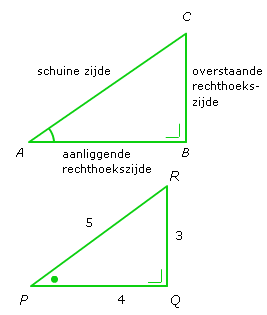
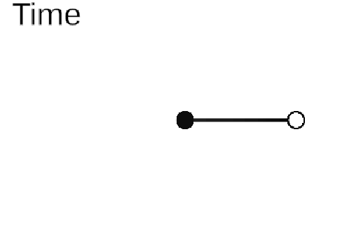

Natuurlijk! Hier is een beknopte uitleg over **periodieke functies** in één Markdown-pagina:

---

# Periodieke Functies

## Wat is een periodieke functie?

Een **periodieke functie** is een functie die zichzelf herhaalt na een vaste afstand of tijd. Dit betekent dat de functie een constante **periode** \( T \) heeft waarvoor geldt:

$$f(x + T) = f(x) \quad \text{voor alle x}$$

De kleinste positieve waarde van \( T \) waarvoor deze eigenschap geldt, noemen we de **fundamentele periode**.

## Voorbeelden van periodieke functies

- **Sinus en cosinus**:  
  $$\sin(x), \cos(x) \quad \text{met periode } 2\pi$$
  
- **Tangens**:
 $$\tan(x) \quad \text{met periode } \pi
 $$

  

- **Periodieke signalen** in techniek, zoals geluidsgolven of elektrische spanningen.

## Eigenschappen

- Herhalen zich op regelmatige intervallen.
- Veel gebruikt in **trillingen**, **golven**, en **signaalverwerking**.
- Kunnen worden voorgesteld met behulp van **Fourierreeksen**.

## Grafiek

Een grafiek van een periodieke functie vertoont een terugkerend patroon. Bijvoorbeeld:

- De grafiek van  f(x) = sin(x) )bestaat uit golven die elke 2pi  een cyclus voltooien.

## Toepassingen

Periodieke functies zijn van groot belang in onder andere:

- Muziek en geluid
- Elektrotechniek (wisselspanning)
- Wiskundige modellering van natuurlijke fenomenen zoals getijden of seizoenen

## De Sinus-functie

We weten nog de definities van de sinus en cosinus

Als wij een wijzer een rondje laten draaien, kun je van de wijzer (met lengte 1) steeds een rechthoekige driehoek maken. 

Omdat de lengte 1 is geldt dat de hoogte van de wijzer (het bolletje aan het uiteinde van de wijzer) gelijk is aan

$$ sin(t) = \frac{overstaande }{schuine} = y$$

en 

$$ cos(t) \frac{aanliggende}{aanliggende} = x$$   

