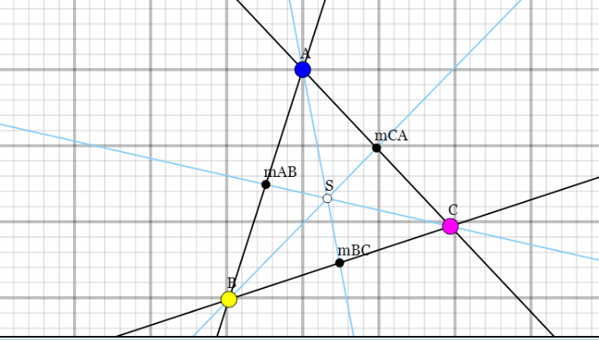

# Lineaire algebra

We gaan dit blok de lineaire algebra behandelen. Dat gaan we doen op twee manieren
1. volgen van een theoretisch college op youtube
2. het uitwerken van de theorie in Unity

## de essentie van de Lineaire algebra

Deel 1: de essence of Lineair algebra
https://www.youtube.com/playlist?list=PLZHQObOWTQDPD3MizzM2xVFitgF8hE_ab

## De opdracht

Vind het zwaartepunt (centroid) van een willekeurige driehoek in Unity door middel van het snijpunt van Rays



## het midden van een edge (ribbe) bepalen

Maak driehoek ABC op het scherm. Neem voor A, B en C een draggablePoint

Gebruik de classe DragablePoint die jullie vorig jaar gemaakt hebben. GameObject Draggeble point moet een Collision2d-component hebben

````csharp
using System.Collections;
using System.Collections.Generic;
using UnityEngine;

public class DragablePoint : MonoBehaviour
{
    private bool isDragging = false;

    void Update()
    {
        if (isDragging)
        {
            Vector2 worldPosition = Camera.main.ScreenToWorldPoint(Input.mousePosition);
            this.transform.position = worldPosition;
        }   
    }

    private void OnMouseDown()
    {
        isDragging = true;
    }

    private void OnMouseUp()
    {
        isDragging = false;
    }
}
````

Om het midden van een **edge** (ribbe) te vinden kan je het gemiddelde gebruiken:

neem 

$$ \vec{a} = A.transform.position $$ 

$$ \vec{b} = B.transform.position $$

$$ \vec{c} = C.transform.position $$


Dan is mAB (het midden van AB te vinden met):

$$ \vec{ab} = \vec{a} + \tfrac{1}{2} (\vec{b} - \vec{a}) $$

teken de lijn van het midden van AB naar punt A.

Doe hetzelfde voor het midden van een andere **edge**, bijvoorbeeld het midden van BC

$$ \vec{bc} = \vec{b} + \tfrac{1}{2} (\vec{c} - \vec{b}) $$

Het snijpunt is het zwaartepunt van de driehoek. Dit kan je vinden met het gemiddelde van de punten ABC

$$ \vec{p}_{centroid} = \tfrac{1}{3} (\vec{a} + \vec{b} + \vec{c}) $$
