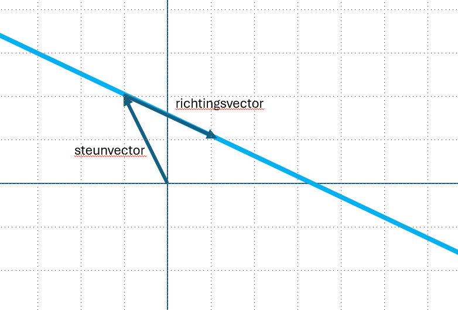
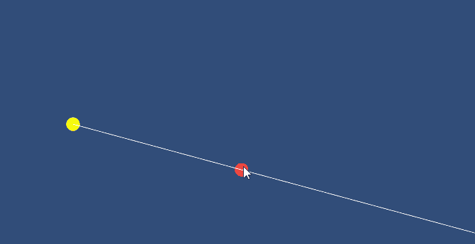

## Lineaire combinaties, span, and basis vectoren

Bekijk eerst deze aflevering van de essence of Lineair Algebra
<a href="https://youtu.be/k7RM-ot2NWY?feature=shared" target="_blank">Linear combinations, span, and basis vectors | Chapter 2, Essence of linear algebra</a>

Om deze aflevering uit te werken, gaan we in Unity onze eigen Ray tekenen met behulp van een vectorvergelijking.

Voor een Ray (halve lijn) heb je twee vectoren nodig: de steunvector en de richtingsvector

# Vergelijking van een lijn met steunvector en richtingsvector

In de vectoriële vorm wordt een lijn in de ruimte of in het vlak vaak beschreven aan de hand van:
- een **steunvector** (ook wel een punt op de lijn),
- een **richtingsvector** (die de richting van de lijn aangeeft).



## 1. Algemeen principe

De vergelijking van een lijn `l` door een punt **A** met een richtingsvector **r** is:


$$ l: \vec{x} = \vec{a} + \lambda \vec{}r $$

Waarbij:
- **x** een willekeurig punt op de lijn is,
- **a** de steunvector is (bijvoorbeeld **a** = (x₀, y₀, z₀)),
- **r** de richting(vector) is (bijvoorbeeld **r** = (r₁, r₂, r₃)),
- λ ∈ ℝ is een parameter die alle punten op de lijn doorloopt.

## 2. Voorbeeld in 2D

Stel we hebben het punt A(2, 3) als steunpunt, en een richtingsvector **r** = (4, 1).

Dan is de lijnvergelijking:

$$ \vec{x}(\lambda) = \begin{bmatrix}
2 \\
3 
\end{bmatrix} + \lambda \begin{bmatrix}
    4 \\
    1
\end{bmatrix}$$


Of uitgeschreven als parametervergelijkingen:

```
x = 2 + 4λ  
y = 3 + λ
```

Voor een "gewone" school-wiskunde vergelijking in de vorm van y = ax + b kunnen x uitdrukken als vorm van λ

$$ x = 2 + 4 \lambda \\  \lambda =\frac{x -2}{4}  $$

Dit invullen in y = 3 + λ

$$ y = 3 + \frac{x -2}{4} \\ y = 3 + \frac{x}{4} + \frac{-2}{4}$$

Dus:

$$ y = \frac{1}{4}x + 2 \frac{1}{2} $$


## Class MyRay

Nu ga je zelf een myRay-class maken. Om de class MyRay te testen maak je ook een class TestMyRay

Om de te testen gebruiken wij twee dragable objects: eentje die  de support- of steunvector aangeeft en een punt die aangeeft waar de direction- of richtingsvector is


In de Ray op het scherm te renderen onderzoek je de afmetingen van het scherm en bepaal je het meest nabije punt op de lijn, bepaal je de lijn-parameter en teken je met een LineRenderer de lijn. 