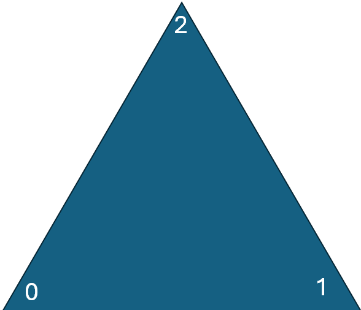

# Linear transformations and matrices

## Youtube
Bekijk:
<a href="https://www.youtube.com/watch?v=kYB8IZa5AuE&list=PLZHQObOWTQDPD3MizzM2xVFitgF8hE_ab&index=3" target="blanc">Linear transformations and matrices | Chapter 3, Essence of linear algebra</a>  

# opdracht

## doel
We gaan visueel maken hoe je een 2x2 matrix met een vector kan vermenigvuldigen 


## uitvoering
1. Maak een nieuwe 2D scene
2. Maak een nieuwe class Matrix2x2 met een methode om deze te vermenigvuldigen met een Vector3
````csharp
public class Matrix2x2
{
    // gebruik de matrix-vorm van c#
    public float[,] matrix = new float[2, 2];

    public Matrix2x2()
    {
        // maak bij initieren constructor identiteitsmatrix
        matrix[0,0] = 1;
        matrix[1,0] = 0;
        matrix[0,1] = 0;
        matrix[1,1] = 1;
    }

    public Vector3 Multiplication(Vector3 vector)
    {
        Vector3 image;
        image.x = vector.x * matrix[0,0] + vector.y * matrix[1,0];
        image.y = vector.x * matrix[0,1] + vector.y * matrix[1,1];
        image.z = vector.z;
        return image;
    }
}
````

3. Maak een leeg GameObject MyMesh
4. Maak een Mesh van een driehoek, met:

$$\text{vertices} = \begin{pmatrix}
    0 \\
    0\\
    0
\end{pmatrix},
\begin{pmatrix}
    0.5 \\
    1\\
    0
\end{pmatrix},
\begin{pmatrix}
    1 \\
    0\\
    0
\end{pmatrix}
$$

$$\text{triangles} = \{0,1,2\}  $$

Gebruik als UV


met als UV-mapping

$$\text{uvs} =  \begin{pmatrix}
    0 \\
    0\\
\end{pmatrix}
\begin{pmatrix}
    0.5 \\
    1\\
\end{pmatrix}

\begin{pmatrix}
    1 \\
    0\\
\end{pmatrix}
 $$