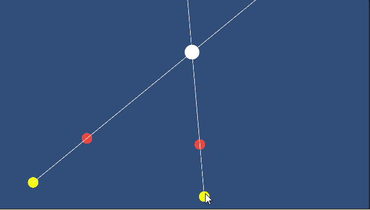

# Berekenen van een snijpunt van Rays

## Opdracht

Plaats twee Rays in een 2d Scene. Voeg een Circle-sprite toe. Bepaal het snijpunt van de rays en plaats de Circle-sprite daar. Gebruik de regel van Cramer


## Video

<a href="https://www.youtube.com/watch?v=jBsC34PxzoM&list=PLZHQObOWTQDPD3MizzM2xVFitgF8hE_ab&index=12" target="_blank">Cramer's rule, explained geometrically | Chapter 12, Essence of linear algebra</a>

## uitleg

Je kan een matrix gebruiken om bijvoorbeeld het snijpunt van twee rays te vinden. Dit kan op verschillende manieren, maar in dit geval gebruiken wij de regel van Cramer. 

Als we twee rays gebruiken, gebruiken wij de zogenaamde Vectorlijn, die bestaan uit een SupportVector (S) en een richtingVector (D). 

In een vorige les heb je een class gemaakt om een 2x2 vector op te stellen. Deze gaan we nu uitbreiden met een nieuwe methode: het berekenen van de determinant (zie voor meer informatie:
<a href="https://www.youtube.com/watch?v=Ip3X9LOh2dk&list=PLZHQObOWTQDPD3MizzM2xVFitgF8hE_ab&index=6" target="_blank" > The determinant | Chapter 6, Essence of linear algebra</a>)

Bij een matrix 

$$ \begin{bmatrix}
    a & b \\
    c & d
\end{bmatrix} $$

Bereken je de determinant met:

$$ a\cdot d - b \cdot c$$

Dus dan kunnen wij onze class Matrix2x2 uitbreiden met de methode Determinant. De Determinant() is een float die aangeeft hoeveel een matrix-transformatie vergroot of verkleint:

````csharp
public class Matrix2x2
{
    public float m00, m01;
    public float m10, m11;

    public Matrix2x2(float m00, float m01, float m10, float m11)
    {
        this.m00 = m00; this.m01 = m01;
        this.m10 = m10; this.m11 = m11;
    }

    public Vector3 Multiply(Vector3 v)
    {
        return new Vector3(
            m00 * v.x + m01 * v.y,
            m10 * v.x + m11 * v.y,
            0
        );
    }

    public float Determinant()
    {
        return (m00 * m11) - (m10 * m01);
    }
}
````
Nu gaan wij deze klasse gebruiken met twee VectorRays


In een vorige les heb je als het goed is een klasse gemaakt voor het maken van een **VectorRay**

````csharp
public class VectorRay
{
    public Vector3 supportVector;
    public Vector3 directionVector;
    public float lineParameter;

    public VectorRay(Vector3 supportVector, Vector3 directionVector)
    {
        this.supportVector = supportVector;
        this.directionVector = directionVector.normalized;
    }

    public Vector3 getPoint(float t)
    {
        return supportVector + directionVector * t;
    }
}
````

Hiermee kunnen wij twee Rays op het scherm tekenen

$$\vec{p_1}(t_1) = \vec{s_1} + t_1 \vec{d_1}$$

$$\vec{p_2}(t_2) = \vec{s_2} + t_2 \vec{d_2}$$

Bij het snijpunt zijn deze beide functies gelijk aan elkaar:

$$ \vec{s_1} + t_1 \vec{d_1} = \vec{s_2} + t_2 \vec{d_2} $$

Dit omschrijven (variabelen links):

$$   t_1 \vec{d_1} -t_2 \vec{d_2} = \vec{s_2}  - \vec{s_1}$$

En dit kun je schrijven als een matrixfunctie:

$$
\begin{bmatrix}
d_1.x & d_2.x \\
d_1.y & d_2.y 
\end{bmatrix} 
\begin{bmatrix}
    t_1 \\
    t_2
\end{bmatrix} = 
\begin{bmatrix}
   s_2.x - s_1.x \\
    s_2.y - s_1.y
\end{bmatrix}
$$

Met de Regel van Cramer (zie video) kunnen wij de lijn-parameters t₁ en t₂ vinden:

$$ t_1 = \frac{\begin{bmatrix}
s_2.x - s_1.x& d_2.x \\
s_2.y - s_1.y & d_2.y 
\end{bmatrix} 
}{\begin{bmatrix}
d_1.x & d_2.x \\
d_1.y & d_2.y 
\end{bmatrix} 
} 
$$

en 

$$ t_2 = \frac{\begin{bmatrix}
d_1.x & s_2.x - s_1.x \\
 d_1.y & s_2.y - s_1.y  
\end{bmatrix} 
}{\begin{bmatrix}
d_1.x & d_2.x \\
d_1.y & d_2.y 
\end{bmatrix} 
} 
$$

Als we de matrix hebben opgelost, kunnen we met de waarde van t₁ (of t₂) bepalen waar het snijpunt ligt met de methode ````getPoint(float t)```` 

met t₁ vinden we een punt via Ray1, met t₂ via Ray2. Maar beide punten zijn hetzelfde (het is een snijpunt)

## Eindproduct

